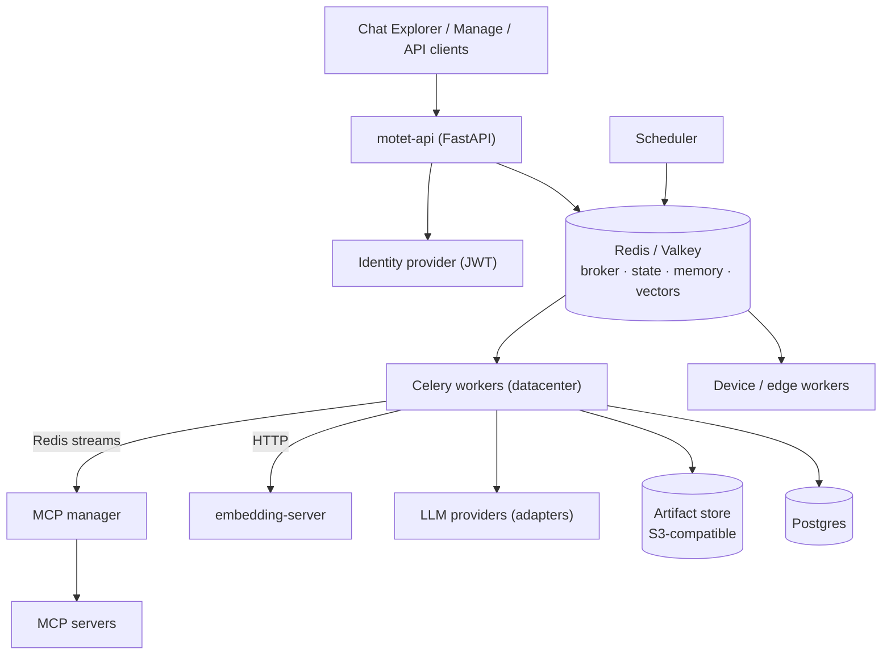

# Current-law architecture

This tree is **what Motet is**: names, paths, invariants, and mermaid. It has no decision history, no Status field, and no “superseded by.”

A published snapshot includes **this tree only** from `docs/architecture/`. Decision records, design notes, audits, and other architecture history stay in the private canonical repository.

Agents and humans start here. Load **this index plus the one chapter you need**. Do not glob this folder.

This tree is the **runtime contract**. Onboarding (`docs/developer_onboarding/`) is the **product surface** (how to build and operate). Package READMEs and Python headers are module-facing. Do not copy the same essay into all three. A missing chapter is not a missing system — read the matching onboarding page, then the code. Do not infer absence from the index.

## Topology

Life of a chat turn:

1. A client calls `/api/v1` with a JWT; the API stamps `tenant_id` / `principal_id` on the command and enqueues `agent_turn` ([commands.md](./commands.md), [auth-oauth.md](./auth-oauth.md)).
2. A worker that advertises the required capabilities picks it up; the turn gate and agentic loop run there ([agent-turn.md](./agent-turn.md)).
3. From the loop, model calls go through canonical adapters to providers ([llm-protocol.md](./llm-protocol.md)); tool calls run as commands — built-ins on workers, MCP through the manager ([mcp.md](./mcp.md)), host-bound tools on a device worker ([workers-redis.md](./workers-redis.md)).
4. Memory and artifacts persist ([memory-artifacts.md](./memory-artifacts.md)), usage becomes cost ([cost.md](./cost.md)), and events stream back to the client over SSE.

## Two clocks

| Surface | Job | When it updates |
|---|---|---|
| **This tree** | What the system is | Same PR as the code. Ships with each `vX.Y.Z` snapshot |
| **Decision archive** | Why we chose it | Private canonical repository only. Not published |

This tree on `main` describes HEAD toward the next snapshot. The export copies these files as they stand at cut. Do not maintain parallel version novels.

If a chapter and the code disagree, the chapter is wrong. Fix it in the same PR.

## Chapters

| Topic | Read |
|---|---|
| Commands / envelope | [commands.md](./commands.md) |
| Agent / turn | [agent-turn.md](./agent-turn.md) |
| LLM protocol | [llm-protocol.md](./llm-protocol.md) |
| Tools / discovery | [tools.md](./tools.md) |
| Skills | [skills.md](./skills.md) |
| Bundles / SDK | [bundles.md](./bundles.md) |
| Workflows | [workflows.md](./workflows.md) |
| Execution / workspaces | [execution-workspaces.md](./execution-workspaces.md) |
| Memory / artifacts | [memory-artifacts.md](./memory-artifacts.md) |
| Embeddings / RAG | [embeddings-rag.md](./embeddings-rag.md) |
| Cost / budget | [cost.md](./cost.md) |
| Scheduling | [scheduling.md](./scheduling.md) |
| Observability | [observability.md](./observability.md) |
| MCP | [mcp.md](./mcp.md) |
| Workers / Redis | [workers-redis.md](./workers-redis.md) |
| Hosting / edge | [hosting-edge.md](./hosting-edge.md) |
| Auth / OAuth | [auth-oauth.md](./auth-oauth.md) |
| Versioning / FSL | [versioning-fsl.md](./versioning-fsl.md) |

## Size

Keep the index plus all chapters small enough that an agent can load the index and one chapter. Add a chapter only for a new system; do not grow a chapter into a novel. Decision diaries stay private.

## Not here

- Decision records, design notes, and architecture audits (private canonical repository)
- `docs/developer_onboarding/` — how to build with Motet
- Agent process rules (tests, headers, wire-name checklists) — private canonical repository only
