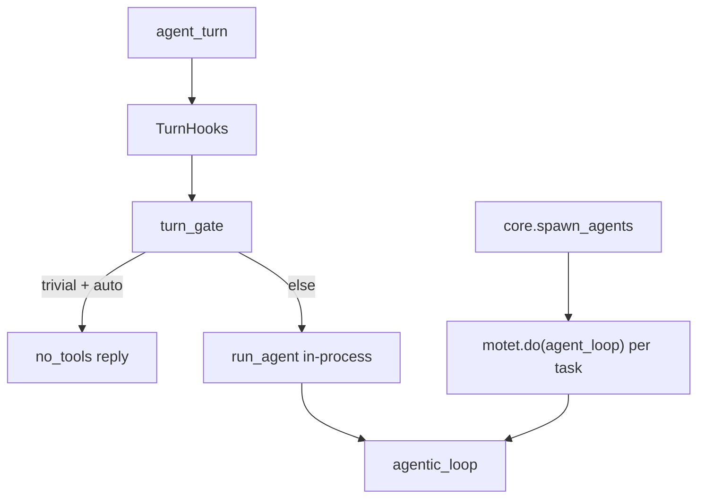

# Agent / turn

There is one executor: the agentic loop. The turn does not pick among reasoning strategies. Fan-out is a tool the loop calls, not a destination the turn escalates into.

## Entry points

| Surface | What it is |
|---|---|
| `agent_turn` | Chat-turn entry. Hooks, memory, persist, a registered agent. Runs the loop **in-process** via `run_agent`. |
| `run_agent` | Builds `LoopContext` + `AgenticLoopData`, then calls `agentic_loop` on this worker. |
| `core.agent_loop` | Distributed entry for the same loop: workflow steps, `core.spawn_agents` children, OpenAI-compat `hosted_tools`. Do **not** nest this under `agent_turn`. |

## Turn gate and modes

`resolve_turn_mode` in `motet/core/orchestration/turn/gate.py` resolves a forced mode and the trivial-turn verdict.

Forced mode is `context["mode"]` only:

- `auto` (default): loop. Trivial turns get a direct reply.
- `no_tools`: direct reply, no tools.
- `agentic`: skips the trivial gate; same executor as `auto`. Do not pin in product code.

Any other value runs as `auto`. There is no `strategy`, `react`, `direct`, `cot`, or `tot` product key.

## Loop

`agentic_loop` (`motet/core/reasoning/react/agentic_loop.py`) is the loop body: LLM → tools/workflows → continue. It is not a distributed command. Model, tool, and workflow calls stay distributed via `motet.do`.

- Tool schemas: frozen sticky prefix (`core.help` / `core.tools_search` / `core.tool_call` plus keyword pins). Catalog reachability is `tools_search` → `tool_call`. No per-turn embedding shortlist.
- Fan-out: `core.spawn_agents`. Width cap 8 (reject over cap, do not truncate). Children cannot spawn again (`exclude_tools`). Handback tools are not inherited. Partial failure degrades the observation, not the turn.
- Suspend/resume: Turn Runtime owns checkpoint write, start, resume, continue-after-budget. Checkpoints live in `motet/core/checkpoints/`. Handback tools checkpoint and return `stop_reason="suspended"`.
- Budget wrap-up and forced finalize live in the loop, not in a second executor.

## Agent contract

`TurnHooks` slots resolve through `command_type_registry`. `None` skips. An unregistered name warns and skips, except `finalize`: that slot falls back to `core.finalize_turn` and logs an error.

Default slot values (YAML / `TurnHooks`, not hardcoded equality in `hooks.py`):

- `conversation_analysis` → `core.conversation_analysis`
- `memory_reset` → `core.memory_reset`
- `context_prepare` → `core.prepare_context`
- `finalize` → `core.finalize_turn`
- `context_inject` / `after_finalize` — additive lists

Analysis is observation only. It does not pick a turn mode (`turn_gate` stays local). It is forwarded read-only to `context_inject`.

`AgentConfig` carries `output_contract` and `handoffs`. Agent-to-agent from the model is `core.handoff`. `core.agent_turn` stays out of function discovery.

## Paths

- Turn: `motet/core/orchestration/turn/agent_turn.py`, `gate.py`, `runtime/`
- Loop: `motet/core/reasoning/react/agent.py`, `agentic_loop.py`, `agentic_loop_data.py`
- Fan-out: `core.spawn_agents` tool
- Onboarding (author-facing): `docs/developer_onboarding/07a-agent-loop.md`
