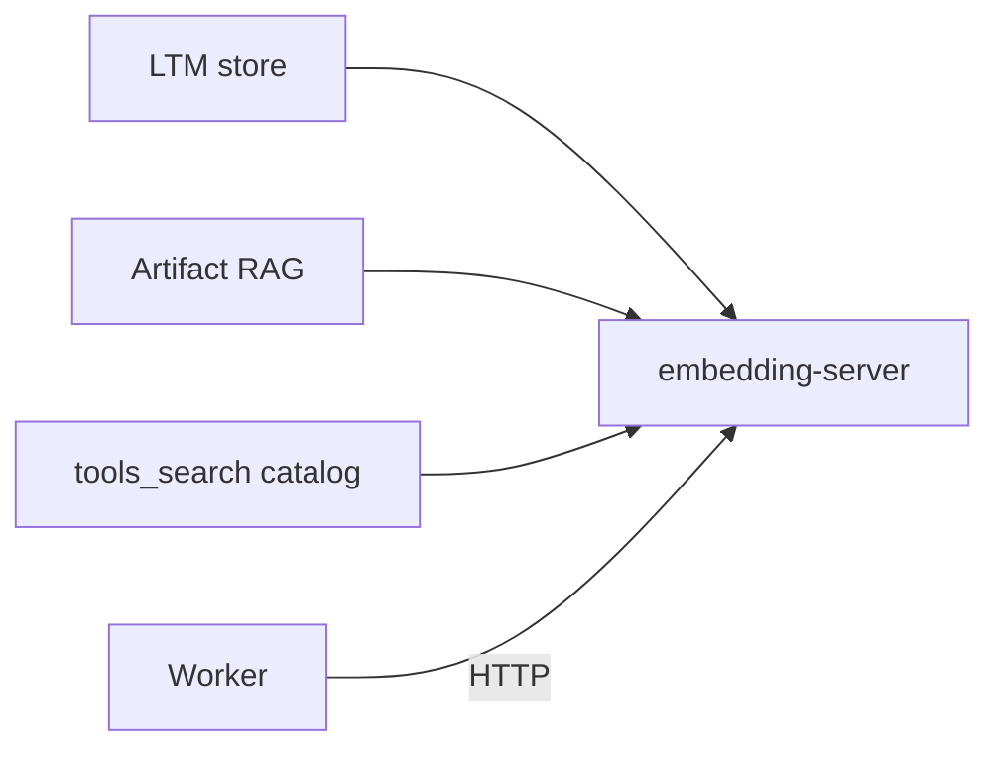

# Embeddings / RAG

Embeddings are a **local sibling service**, not a cloud API and not something each worker loads. Default model is `all-MiniLM-L12-v2`, baked into the embedding-server image at build time. There is no cloud embedding backend in the tree — indexing a document or writing LTM does not ship text to a third party.

Workers talk to the service over HTTP (`HttpEmbeddingServiceClient`). A process without that sibling can still embed in-process (`InProcessEmbeddingService`) and advertises the `embeddings` capability only when a backend is actually there. The router will not send embedding work to a worker that does not advertise it.

## Three consumers, one service

| Consumer | When it embeds | Default |
|---|---|---|
| **LTM memory** | After `store` with `ltm` — KV write is sync; `core.memory_vector_index` embeds async into Valkey Search | On when vector memory is enabled |
| **Artifact RAG** | Chunks derived text and indexes it; a turn can pull citation-ready passages | **Off** (`MOTET_ARTIFACT_RAG_ENABLED`) |
| **Tool catalog** | `FunctionDiscoveryVectorStore` ranks tools/workflows by meaning | Used **on demand** by `core.tools_search`, not as a per-turn schema shortlist |

Do not conflate these. Semantic memory recall is not artifact RAG. `tools_search` is not “the loop embeds the user message and picks twenty tools.” The loop’s frozen prefix is sticky meta tools plus keyword pins; catalog reachability is `tools_search` → `tool_call`. See [tools.md](./tools.md) and [memory-artifacts.md](./memory-artifacts.md).

## Artifact RAG

When the flag is on, uploads and other eligible artifacts can be prepared, chunked, and indexed. Context assembly may pull passages into a turn, scoped to conversation or principal. Indexing every upload is the wrong default, which is why the flag starts off.

Operators: `/api/v1/artifacts/indexing-status`, `reindex`, `indexing-policy`, preparation strategy list/plan. Preparation is type-specific (e.g. structure-aware DOCX).

## Invariants

- One embedding identity per stack (override via `MOTET_EMBEDDING_TEXT_MODEL` / `MOTET_EMBEDDING_MODEL`).
- Vector index holds embeddings and retrieval metadata; **KV is source of truth** for memory content.
- Artifact bytes stay in the artifact store; RAG indexes derived text, not raw uploads inlined into the prompt.

## Paths

- Service / client: `motet/core/embedding/`
- Memory vectors: `motet/core/memory/` (Valkey Search), `core.memory_vector_index`
- Artifact RAG: `motet/core/rag/`, artifacts API under `/api/v1/artifacts`
- Tool catalog: `FunctionDiscoveryVectorStore`, `core.tools_search`
- Onboarding: `docs/developer_onboarding/20-memory-management.md`, `20a-artifacts-and-multimodal-context.md`
