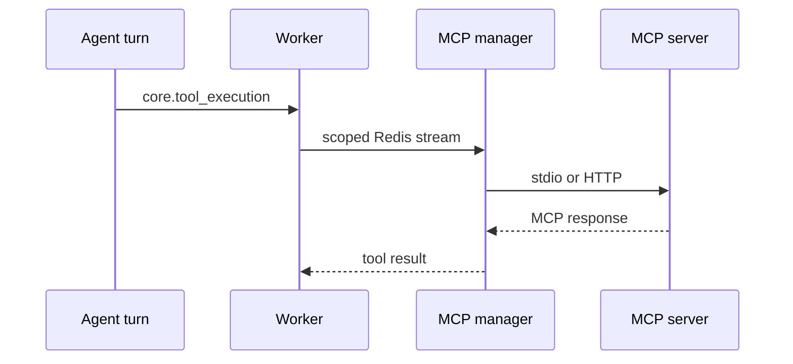

# MCP

A sibling **MCP manager** process owns MCP server children. Workers do not spawn or recycle those processes. Tool calls are worker commands; workers talk to the manager over Redis streams; the manager’s transports call the server (stdio or HTTP).

Worker restart does not recycle MCP servers. One server failing must not take every MCP tool offline.



## Config and isolation

Services live in `config/mcp_instance_manager.yaml`.

- Transport: `stdio`, `http`, or `streamable-http`
- Lifecycle: Motet-managed (`command`/`args`, or HTTP `start_server: true`) vs external HTTP (`start_server: false`, `base_url`)
- Isolation fields: `state_model`, `credential_scope`, `visibility`, `lifecycle_duration`
- `instances`: `0` = discovery-only; omit or `1` = one identity-keyed instance. Values `> 1` are ignored (not a replica pool)

OAuth token keys (vault):

```
oauth:tokens:{service_id}:{tenant_id}:{motet_id}:{principal_id}
```

Lookup walks most-specific to global. The manager injects vault credentials as env vars when it starts a child. Workers never hand tokens to MCP servers themselves.

## Names

Inside Motet (registry, `command_data`, code): `mcp.server_id.tool_name`.

At the LLM provider boundary: `mcp__server_id__tool_name`. Convert once outbound in `model.py`, once inbound via `inbound_tool_call_request`. See [llm-protocol.md](./llm-protocol.md).

Workflows are `workflow_<id>` and do not use this transform.

## Ops

- Per-service health: ops **MCP Servers** page and `GET /api/v1/mcp/servers`
- Local manager health: `http://localhost:9191/health`
- Control plane keys are Redis-scoped per manager id

## Paths

- Manager: `mcp_motet/manager/`
- Worker startup / registration: `motet/core/workers/` MCP startup helpers
- Tool execution command: `core.tool_execution`
- Config: `config/mcp_instance_manager.yaml`
