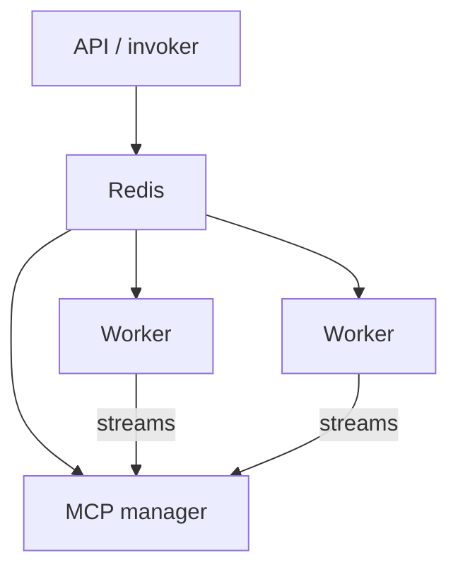

# Workers / Redis

Work is enqueued on Redis and executed on Celery workers. Routing matches a command’s required capabilities to what workers advertise. Callers do not pick a worker by id.

## Pools

- **eventlet / gevent**: default for I/O (model calls, HTTP, Redis, most tools)
- **fork**: CPU-bound work that must not block an event loop
- **threads**: available; use pool-agnostic primitives so the same code runs on all pools

Concurrency in worker code comes from `motet.core.workers.concurrency_primitives` (`WorkerLock`, `WorkerEvent`, `WorkerExecutor`, `worker_sleep`, …). Do not use `threading.Lock` / `time.sleep` on the worker path. SDK bundles see the same names via `motet_sdk.concurrency`; the runtime injects the pool-aware implementations.

## Redis

Always include a database number in Redis URLs (`redis://localhost:6379/0`).

Use `UnifiedRedisManager` — `store_structured_data` / `retrieve_structured_data` (async) and the `_sync` variants. Default format is `"hash"`; use `"json_string"` only when required.

Distributed coordination uses `DistributedLock` (`create_distributed_lock`, `acquire_distributed_lock`, sync variants). Always release in `try`/`finally`. TTL typically 30–300s.

Worker registration and readiness keys follow the worker key hierarchy (`worker:registration:*`, readiness hashes). Do not invent a second key vocabulary for the same facts.

## Datacenter vs device

Most tasks run on **datacenter workers** (same deployment as the API and shared state).

A **device / edge worker** runs on a registered machine (laptop, workstation, app-builder host). Tools bound to the host (`core.file_read`, `core.file_write`, host exec) route there. Attach with `motet-cli device`.

Location-aware routing as a general policy is **not** shipped. Edge affinity exists for registered devices; there is no location dimension on artifacts.

## Cancel

Product cancel is the **task**. Honor uses inherited `cancel_scopes`. Cooperative checks live at loop heads and wait paths.

## Paths

- Invoker / tasks: `motet/core/workers/command_invoker.py`, `command_tasks.py`
- Router: `motet/core/workers/worker_router.py`
- Redis: `motet/core/distributed/redis_manager.py`
- Concurrency: `motet/core/workers/concurrency_primitives.py`
- Cancel: `motet/core/workers/task_control.py`
