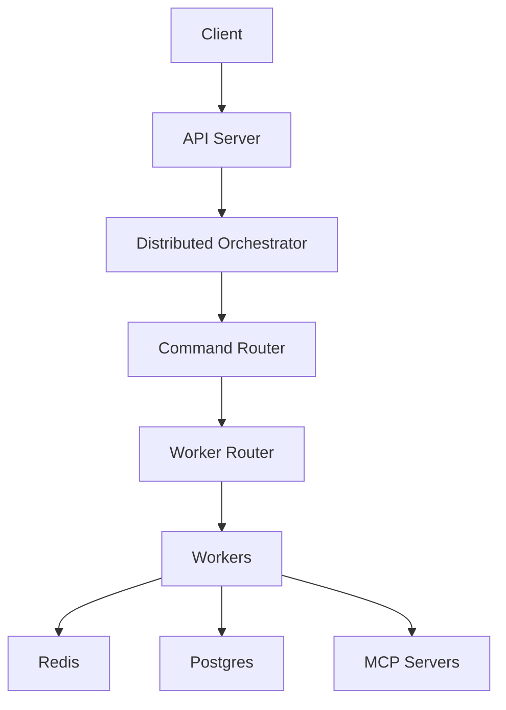
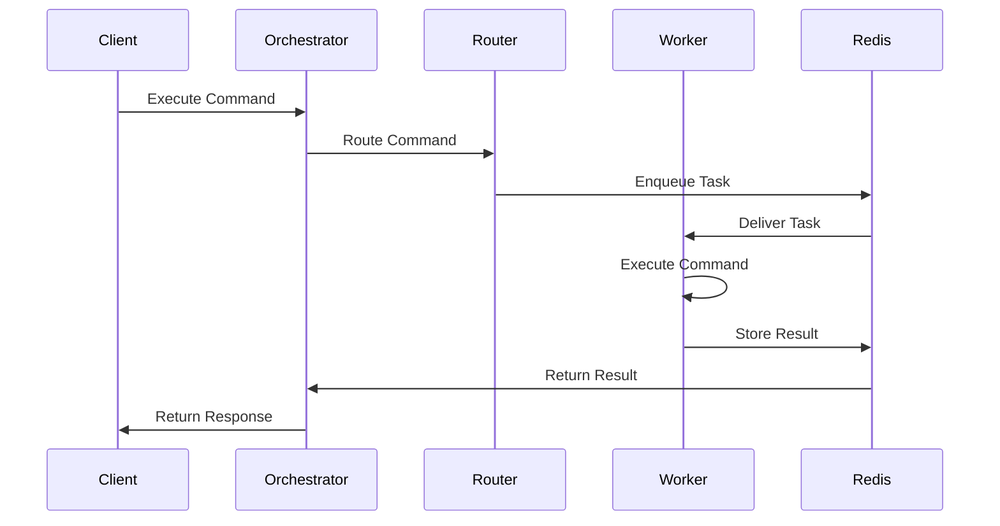
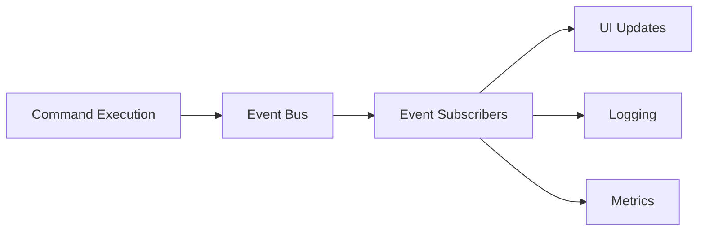

# Core Concepts Overview

Five ideas carry most of the system: commands, workers, events, identity, and the context object that ties them together. Everything else is detail built on these.

## The shape of the system

A request enters through the FastAPI server, which hands it to the orchestrator. The orchestrator decides what work is needed; the routers decide which worker does it. Workers execute and reach Redis for coordination and state, Postgres for durable storage and vectors, and MCP servers for external tools.

The part worth noticing is that the orchestrator never picks a worker. It says what needs doing and the router matches that against what workers advertise, which is why adding a worker requires no change anywhere else.

## Commands

A command is a typed function that runs on a worker, and it is the only unit of work. Model inference, tool calls, memory writes, and your own code are all commands, which is why they compose without adapters between them.

The families you will meet are the [agent loop](./07a-agent-loop.md), which is the tool-using loop (`core.agent_loop`; chat turns enter through `agent_turn`); reasoning commands, which run a strategy; tool commands, which execute built-ins, MCP tools, or bundle tools; memory commands; model commands for inference and embeddings; and workflow commands for multi-step compositions.

That round trip through Redis is also the cost. A command hop is milliseconds to tens of milliseconds, which is cheap next to a model call and expensive next to a function call.

## Workers and capabilities

Workers do not come in fixed types. Each one detects what it can do at startup and advertises a set drawn from 32 capabilities — `model_inference`, `tool_execution`, `memory_operations`, `browser_operations`, `edge_file_read`, and so on. Routing matches a command's required capabilities against those advertisements.

This matters because specialization is a deployment decision rather than a class of worker. A host with a GPU advertises inference; a laptop running `motet-cli device` advertises the edge capabilities. You never write code that names a worker, and you never maintain a registry of worker kinds.

Workers keep their capabilities, current load, health, and readiness in Redis, so routing decisions are made against live state rather than a static config.

One distinction is worth carrying forward: **datacenter workers** run in the deployment and take ordinary command traffic, while **device (edge) workers** run on a registered host to reach local files and host bridges. See [Worker System & Routing](./08-worker-system-routing.md#datacenter-workers-and-device-workers).

## Events

Components publish events rather than calling each other.

Commands emit started, completed, and failed events; workflows emit per-step events; workers emit registration and health events. A UI subscribes to get live updates without the orchestrator knowing it exists, which is the same mechanism that makes token streaming and progress indicators possible.

## Identity

Every command carries a principal ID and a tenant ID, derived from a verified JWT rather than from anything a caller supplies. They travel automatically, so a command several hops deep still knows who asked, and Redis keys are namespaced by tenant so separation is physical rather than a filter.

Roles are the exception and are worth stating clearly, because it is an easy wrong assumption: roles live on the `Principal` at the API boundary and do **not** travel on the command context. There is no `motet.roles`. Check permissions where the request arrives, and pass what a command needs as ordinary input.

For how far the isolation actually goes — and which enforcement filters ship off by default — read [Security & Multi-Tenancy](./22-security-multi-tenancy.md) before serving untrusted tenants.

## MotetContext

Every command receives a `motet` argument that is its whole interface to the runtime. Resources hang off it: `motet.memory`, `motet.tools`, `motet.vault`, `motet.artifact_store`, `motet.event_bus`, plus helpers like `motet.models`, `motet.agents`, and `motet.workflows`. Identity and correlation come from the same object through `motet.task_id`, `motet.conversation_id`, `motet.principal_id`, and `motet.tenant_id`.

Composition lives there too — `motet.do` for one command, `motet.join` for several in parallel, `motet.apply` for one command over many inputs.

Note the plural: `motet.agents` is the helper for listing and invoking agents. There is no `motet.agent` and no `motet.llm`; model access goes through the model commands.

## Model access is provider-agnostic

Orchestration speaks a canonical request and stream protocol, and per-vendor adapters translate at the boundary. Your code stays on the same commands and types when you switch provider or model profile, and the adapter absorbs the difference in wire format, tool-call encoding, and streaming events.

See [Supported Models](./03a-supported-models.md) for the catalog, [Canonical LLM Protocol](./09a-canonical-llm-protocol.md) for the protocol, and [API Reference](./28-api-reference.md) for request and response shapes.

## Next steps

- **[Design Principles](./06-design-principles.md)** — what these choices buy and cost
- **[Distributed Command System](./07-distributed-command-system.md)** — commands in depth
- **[Agent Loop](./07a-agent-loop.md)** — the tool-using loop
- **[Worker System & Routing](./08-worker-system-routing.md)** — how routing decides

For how Motet compares to other frameworks, see [Why Motet](./02-why-motet.md).

## Navigation

- **[← Back to Documentation Home](./00-landing-page.md)**

---

**Last Updated**: 2026-08-25
