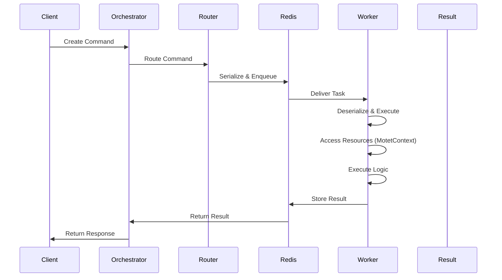

# Distributed Command System

Commands are the only unit of work in Motet. This page covers how one executes, what it can reach, and how they compose.

## Lifecycle



A command is created with its data, routed to a worker that advertises the capabilities it requires, serialized onto a Redis queue, executed, and its result written back for the caller to collect.

Two consequences follow from that path. Command data must be serializable, because it crosses a queue. And the round trip costs milliseconds to tens of milliseconds, which is negligible beside a model call and significant beside a function call.

## Writing a command

```python
from motet_sdk import motet, MotetContext, BaseCommandData
from pydantic import Field
from typing import Dict, Any

class MyCommandData(BaseCommandData):
    """Command input data."""
    input_value: str = Field(..., description="Input description")

@motet.command(
    timeout_seconds=60,
    required_capabilities=[WorkerCapability.TOOL_EXECUTION]
)
def my_command(data: MyCommandData, motet: MotetContext) -> Dict[str, Any]:
    """
    Command description.

    Args:
        data: Command parameters
        motet: Resource access

    Returns:
        Command results
    """
    # Access resources
    tools = motet.tools
    memory = motet.memory

    # Execute logic (use canonical tool name: core.* for built-ins, mcp.* for MCP)
    result = tools.execute("core.web_search", {"query": "Motet"})

    # Return data (automatically wrapped in standard response format)
    return {"result": result}
```

Three things are doing work here. The Pydantic model gives you validation at the boundary rather than a `KeyError` deep inside the body. `required_capabilities` is how routing finds a worker that can actually run this. And returning a plain dict is enough — the decorator wraps it in the standard envelope, so commands return domain data or raise, and never build a response by hand.

## MotetContext

### Resource helpers versus command composition

- **Resource helpers** (`motet.tools`, `motet.memory`, `motet.agents`, `motet.models`, `motet.workflows`, `motet.schedules`, `motet.commands`, `motet.conversations`) are for **single operations**: one tool run, one memory store or recall, one agent turn, one model inference. When task context is present these delegate to the matching distributed command, so you get the same observability without calling `motet.do` yourself.
- **Command composition** (`motet.do`, `motet.join`, `motet.apply`, `motet.maybe`, `motet.dispatch`) is for **multi-step or mixed flows**: several commands in sequence, several in parallel, one command over many inputs, or fire-and-forget.

Prefer the helper for the common case and reach for composition when you are chaining or combining.

### Available properties

```python
# Resource helpers (single operations; delegate to commands when context exists)
motet.memory         # store, recall, tag, forget
motet.tools          # execute, get, list (use canonical tool names: core.*, mcp.*)
motet.agents         # list, get, turn
motet.models         # list, get, infer, stream
motet.workflows      # list, get, run
motet.schedules      # create, list
motet.commands       # list, get, run (by command type string)
motet.conversations  # list, get, clear, register, rename

# Model inference: use motet.models.infer/stream or motet.do(model_inference, ...) — no motet.agent
motet.vault          # Vault client for credentials
motet.redis          # Redis client (lazy-loaded)
motet.event_bus      # Event bus for publishing custom events

# Command Metadata
motet.command_id     # Current command ID
motet.task_id        # Current task ID
motet.conversation_id # Current conversation ID
motet.tenant_id      # Current tenant ID
motet.principal_id   # Current principal (user) ID

# Command composition (multi-step, parallel, or mixed flows)
motet.do(cmd, data)                 # Execute and unwrap data
motet.join([...])                   # Parallel execution
motet.apply(cmd, inputs)            # Apply to multiple inputs
motet.maybe(cmd, data)              # Optional error handling
motet.dispatch([...])               # Fire-and-forget
```

### Resource access examples

```python
@motet.command()
def my_command(data: MyData, motet: MotetContext) -> Dict[str, Any]:
    # Single operations: use helpers (they delegate to commands when context exists)
    tool_result = motet.tools.execute("core.web_search", {"query": "Motet"})

    motet.memory.store(
        content="Important information",
        tags=["important", "reference"]
    )
    memories = motet.memory.recall(tags=["important"])

    # Conversations: list or get (helpers delegate to conversation commands)
    convs = motet.conversations.list(limit=20)

    # Model inference takes provider and model explicitly
    response = motet.models.infer(
        "openai", "gpt-4o-mini",
        messages=[{"role": "user", "content": "Hello"}]
    )
    # Or: motet.do(model_inference, data=ModelInferenceData(messages=[...]))

    # Credentials: the vault client resolves per principal and tenant
    api_key = motet.vault.get_api_key("openai", motet.distributed_context)

    return {"result": tool_result}
```

## Composition

### Sequential (motet.do)

```python
@motet.command()
def parent_command(data: ParentData, motet: MotetContext) -> Dict[str, Any]:
    from motet_sdk import CommandExecutionError

    try:
        # Execute and unwrap data automatically
        result1 = motet.do(first_command, data=FirstData(...))

        # Use result directly (already unwrapped)
        result2 = motet.do(second_command, data=SecondData(
            input=result1["output"]
        ))

        return {"final_result": result2}
    except CommandExecutionError as e:
        logger.error("Command failed", error=str(e))
        raise
```

### Parallel (motet.join)

```python
@motet.command()
def parallel_command(data: ParallelData, motet: MotetContext) -> Dict[str, Any]:
    from motet_sdk import GatherExecutionError

    try:
        # Execute in parallel, unwrap all results
        results = motet.join([
            (scrape_reviews, ProductData(product_id=data.id)),
            (scrape_pricing, ProductData(product_id=data.id)),
            (scrape_specs, ProductData(product_id=data.id))
        ])

        # Results are already unwrapped
        reviews, pricing, specs = results

        return {"aggregated": {"reviews": reviews, "pricing": pricing, "specs": specs}}
    except GatherExecutionError as e:
        logger.error("Parallel execution failed", error=str(e))
        raise
```

### Many inputs (motet.apply)

```python
@motet.command()
def batch_command(data: BatchData, motet: MotetContext) -> Dict[str, Any]:
    from motet_sdk import ApplyExecutionError

    try:
        # Apply command to multiple inputs in parallel
        results = motet.apply(
            extract_text,
            inputs=[{"file": f"doc{i}.pdf"} for i in range(100)],
            command_template={"format": "markdown"},
            batch_size=10  # Optional: limit concurrency
        )

        # Results are already unwrapped
        return {"documents": results, "count": len(results)}
    except ApplyExecutionError as e:
        logger.error("Batch processing failed", error=str(e))
        raise
```

### Tolerated failure (motet.maybe)

```python
@motet.command()
def optional_operation(data: OptionalData, motet: MotetContext) -> Dict[str, Any]:
    # Graceful error handling
    cached_data, error = motet.maybe(get_cache, data=CacheData(key=data.key))

    if error:
        logger.info("Cache miss, using fresh data")
        cached_data = compute_fresh_data()

    return {"data": cached_data}
```

### Fire-and-forget (motet.dispatch)

```python
@motet.command()
def trigger_background(data: TriggerData, motet: MotetContext) -> Dict[str, Any]:
    # Dispatch without waiting
    task_ids = motet.dispatch([
        (send_email, EmailData(to="user@example.com")),
        (update_cache, CacheData(key="results"))
    ])

    return {"dispatched_tasks": task_ids}
```

These differ mainly in what happens on failure — `do` and `join` raise, `apply` returns the successes, `maybe` hands you the error. [Common Patterns](./25-common-patterns.md) has a table for choosing between them.

## Responses and errors

The decorator wraps whatever you return:

```python
# Your command returns data
return {"result": "success"}

# Decorator wraps it as:
{
    "status": "success",
    "data": {"result": "success"},
    "command_id": "...",
    "execution_time_ms": 123
}
```

Raise to fail. Converting to `CommandExecutionError` gives the caller a typed error rather than a generic one:

```python
@motet.command()
def my_command(data: MyData, motet: MotetContext) -> Dict[str, Any]:
    from motet_sdk import CommandExecutionError

    try:
        result = risky_operation()
        return {"result": result}
    except ValueError as e:
        # Re-raise as CommandExecutionError for proper wrapping
        raise CommandExecutionError(
            message=str(e),
            error_type="ValueError"
        ) from e
```

Which arrives as:

```python
{
    "status": "error",
    "error": {
        "message": "Error description",
        "error_type": "ValueError",
        "command_id": "..."
    }
}
```

## Serialization and context

Command data crosses a queue, so it must serialize:

```python
from motet.core.commands.base_command_data import BaseCommandData
from typing import Dict, Any

# Command data must be serializable (use BaseCommandData for distributed commands)
class MyCommandData(BaseCommandData):
    value: str  # ✅ Serializable
    data: Dict[str, Any]  # ✅ Serializable
    # Non-serializable types will fail
```

This is the constraint people hit first: no open file handles, sockets, or database cursors between commands. Pass a reference and reopen on the other side.

Task ID, conversation ID, principal ID, tenant ID, and parent command ID propagate on their own, including into child commands:

```python
@motet.command()
def my_command(data: MyData, motet: MotetContext) -> Dict[str, Any]:
    # Context automatically available
    task_id = motet.task_id
    conversation_id = motet.conversation_id
    principal_id = motet.principal_id
    tenant_id = motet.tenant_id

    # Context automatically propagated to child commands
    result = motet.do(other_command, data=OtherData(...))
    # other_command automatically gets same context
```

That propagation is what makes a correlation ID usable across a whole request, and it is why identity should never be a field on your input model.

## Registration

Commands under `motet/core/commands/builtin/` that use the decorator are discovered automatically. Register explicitly when a command lives elsewhere:

```python
from motet.core.commands.command_type_registry import CommandTypeRegistry
from my_command import my_command

CommandTypeRegistry.register("my_command", my_command)
```

Bundle commands and tools are registered by the bundle loader; see [Your First Bundle](./15a-your-first-bundle.md).

## Next steps

- **[Agent Loop](./07a-agent-loop.md)** — the tool-using loop (`core.agent_loop`)
- **[Conversations](./07b-conversations.md)** — chat sessions and the conversations helper
- **[Building Your First Command](./15-building-your-first-command.md)** — hands-on tutorial
- **[Command Composition Patterns](./16-command-composition-patterns.md)** — composition in depth
- **[Worker System & Routing](./08-worker-system-routing.md)** — how a command finds a worker

## Navigation

- **[← Back to Documentation Home](./00-landing-page.md)**

---

**Last Updated**: 2026-08-21
