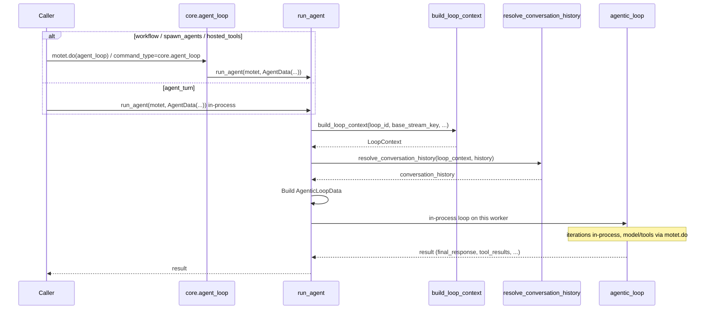

# Agent Loop

The **Agent Loop** command (`core.agent_loop`) builds loop context and runs the **agentic loop** on the current worker (one or more iterations: LLM → tools → continue). Model calls, tools, and workflows are still distributed commands.

It is **not** the chat-turn entry point. Chat and the OpenAI-compatible **agent** mode use **`agent_turn`** (hooks, memory, finalize). That path runs the loop **in-process** so it does not park a second worker for the whole turn.

`core.agent_loop` is the distributed entry for:

- **Workflow steps** that need a loop over a prompt (analyze, summarize, score) without a chat turn. The step payload is `AgentData`: `input` is required; `agent_id` names this run (default `"agent"`) and does **not** load a registry agent.
- **Parallel sub-agents**, spawned by the `core.spawn_agents` tool, where overlapping workers are the point.
- **OpenAI-compatible `hosted_tools`**, which needs one HTTP→worker hop but not chat-turn hooks. That dispatch does **not** select a registry agent (`cursor.backend` is agent mode). The loop gets `inject_meta_tools=False` so it does not inject Motet's fallback system prompt, and resume has no owning `agent_id` to attach memory hooks.

## Overview

- **What it is**: Builds `LoopContext` + loop data from `AgentData`, then runs the agentic loop. Callers pass `agent_id`, `input`, and optional overrides.
- **Where it lives**: `motet/core/reasoning/react/agent.py` (builder + command) and `agent_data.py` (input model).
- **When to `motet.do(agent_loop)` / `core.agent_loop`**: a workflow step that should run the loop, or a parallel sub-agent (`core.spawn_agents` does one per task). The OpenAI-compatible API also dispatches this command for **`hosted_tools`**. Do **not** use it from `agent_turn` — that calls `run_agent` on the same worker. A full chat turn (hooks, persist, a registered agent) is `agent_turn`.

## How It Works

### Flow



1. **Caller** either:
   - calls `run_agent(motet, AgentData(...))` in-process (`agent_turn`), or
   - `motet.do(agent_loop, data=AgentData(...))` / a workflow step `command_type="core.agent_loop"` so the loop runs as its own command (workflow step or `core.spawn_agents` child).
2. **run_agent**:
   - Builds a **LoopContext** via `build_loop_context(loop_id=data.agent_id, base_stream_key=..., conversation_history=..., parent_agent_id=data.parent_agent_id, metadata=...)`.
   - Resolves **conversation history** with `resolve_conversation_history(loop_context, data.conversation_history)`.
   - Builds **AgenticLoopData** (input, conversation_history, tools, max_iterations, stream_key, model settings, etc.). If `data.tools` is provided, discovery is skipped; otherwise the agentic loop will run **registry-based tool discovery** on the first iteration.
   - Runs the **agentic loop** in-process and returns its result. Each iteration may `motet.do` model inference, tools, or workflows.
3. **agentic_loop** runs one or more iterations (LLM → tools/workflows → continue) and returns the final response, tool results, and metadata. Iteration boundaries are stream events, not separate commands. Child model/tool/workflow commands carry `agentic_loop_iteration` so task flow can group work by round.

### Relationship to agentic_loop

- **agentic_loop** is the **loop body**: one iteration (LLM call → tool/workflow execution → maybe continue). It is not a distributed command and not the "agent" object; it is the engine the agent runs on the same worker.
- **Chat turn**: `agent_turn` runs hooks, then `run_agent` on the same worker. The loop never sits behind a nested `agent_loop` worker.
- **Workflow step**: `command_type="core.agent_loop"` runs the same loop as a command. No registry agent, no turn hooks, no transcript finalize. Use `agent_turn` on a step only when you want a full chat turn.
- **Sub-agents**: `core.spawn_agents` does `motet.do(agent_loop)` once per task so those runs overlap on different workers. Each uses a distinct `agent_id` (`{parent}.spawn-N`) and writes to the parent task stream so the chat UI can attribute each slice.

### Stream keys

- **Chat turn and `core.spawn_agents` children**: `use_task_stream=True` writes to the task-level stream (`task:{task_id}:response`) so the chat UI receives every slice. Frames carry `agent_id` so the parent and each `{parent}.spawn-N` child stay distinct inside one turn. Child frames also carry `parent_agent_id`.
- **Other `core.agent_loop` runs** (default): events go to a loop-scoped stream key derived from `agent_id`.

## AgentData (Input Model)

Defined in `motet/core/reasoning/react/agent_data.py`. Key fields:

| Field | Type | Default | Description |
|-------|------|--------|-------------|
| `agent_id` | str | `"agent"` | Loop label (`loop_id`), not a registry lookup. Default `"agent"`. Spawn children use `{parent}.spawn-N`. Passing `core.default` does not load that agent's config. |
| `use_task_stream` | bool | `False` | When `True`, write events to the task-level stream instead of a scoped per-agent key. Set by `agent_turn` and `core.spawn_agents`. |
| `input` | str | required | The input to the agent: user message, sub-task prompt, or instruction. |
| `conversation_history` | list | `[]` | Conversation history; copied into the loop context for isolation. |
| `parent_agent_id` | str \| None | None | Parent agent for nested sub-agents (same field on LoopContext and the loop). |
| `base_stream_key` | str \| None | None | Base stream key; when None, derived from `motet.task_id`. |
| `metadata` | dict \| None | None | Opaque metadata passed into LoopContext. |
| `tools` | list \| None | None | When provided: passed to AgenticLoopData, **skip registry discovery**. When None: discovery runs in agentic_loop. |
| `max_iterations` | int | 20 | Max iterations for the agentic loop. |
| `max_tools` | int | 20 | Max schemas in the frozen tools prefix. |
| `model_provider` | str | `"openai"` | Provider for discovery/inference (stack default). |
| `model_name` | str | `"gpt-4.1-mini"` | Model name for discovery/inference (stack default). |
| `model_profile_name` | str \| None | None | Optional model profile for routing. See [Canonical LLM Protocol](./09a-canonical-llm-protocol.md). |
| `temperature` | float | 0.2 | Sampling temperature. |

## Usage

### Using the agents helper (recommended from commands)

From inside another command, the preferred way to run a single agent turn or to discover agents is the **agents helper** on MotetContext. It delegates to the agent_turn path when task context exists and keeps the call site simple.

- **`motet.agents.list()`** – List configured agent ids (e.g. for UI or routing).
- **`motet.agents.get(agent_id)`** – Resolve agent config by id (or `None` if not found).
- **`motet.agents.turn(agent_id, messages, **kwargs)`** – Run one turn with that agent; delegates to the agent_turn command and returns the result.

When you do not have task context (e.g. outside a command), use `motet.do(agent_turn, data=AgentTurnData(...))` instead. For more on when to use helpers vs composition, see [Distributed Command System – Resource helpers vs command composition](./07-distributed-command-system.md#resource-helpers-vs-command-composition) and the [SDK Reference](./38-sdk-reference.md).

### From a workflow

A workflow step can run the loop with `command_type="core.agent_loop"`. The step payload is `AgentData`: `input` is required. Omit `agent_id` unless you want a label other than `"agent"` — it names the run and does not load a registry agent. Use `core.agent_turn` on a step only when you want a full chat turn (hooks, persist, a registered agent). See [Building Workflows](./17-building-workflows.md).

```python
from motet.core.workflow import WorkflowStep

analyze = WorkflowStep(
    step_id="analyze",
    name="Analyze",
    command_type="core.agent_loop",
    command_data={
        "input": "Analyze: {{extract.content}}"
    },
    dependencies=["extract"],
)
```

### From code (e.g. another command)

Prefer **`motet.agents.turn(...)`** / `agent_turn` for a chat turn. Call `core.agent_loop` when you need the **loop without a registered agent** — a workflow step, or a **parallel sub-agent**:

```python
from motet.core.reasoning.react import agent_loop, AgentData

# Parallel sub-agent: the extra worker is intentional
result = motet.do(agent_loop, data=AgentData(
    agent_id="agent.spawn-1",
    input="Gather live pricing for this product",
    conversation_history=[Message(role="user", content="Gather live pricing for this product")],
))

# Constrained tool set (skip discovery)
result = motet.do(agent_loop, data=AgentData(
    agent_id="agent.spawn-1",
    input="Summarize this document",
    tools=my_tool_schemas,
    max_iterations=20,
    model_name="gpt-4.1",
))
```

### Sub-agents

When the agent loop calls `core.spawn_agents`, each task in the list becomes one
sub-agent: the tool dispatches `core.agent_loop` per task with a distinct
`agent_id` (`{parent}.spawn-N`) on the parent task stream, so the runs overlap on
different workers and the chat UI can attribute each slice. Sub-agents get the parent's tool filter minus
`core.spawn_agents` itself. Tools the task declared become that child's
catalog. Set `discover: true` on a task to leave catalog search on; that
is opt-in, not the default. They also get a short worker system prompt —
not the parent
transcript and not the Motet assistant fallback — that names the child's
iteration, tool-call, and 60-second tool-time caps. The loop's last-two-rounds wrap-up is the
same notice a parent turn gets. The user instruction is the rest of the
brief. Successful child write-ups are stored on the parent conversation
as non-root transcript rows (`{parent}.spawn-N`) so Chat Explorer can
rebuild the nested turn after a refresh. Thinking traces stay live-session
only. See [Reasoning](./10-reasoning.md).

`core.agent_loop` is reused for those sub-agents; only `agent_id`, `input`,
tools, and stream options change. The top-level chat turn does **not** go
through this hop.

### How the chat turn uses it

`agent_turn` calls `run_agent` in-process (same builder, no nested worker):

```
agent_turn → run_agent (same worker) → agentic_loop
```

Fan-out no longer changes that shape. `core.spawn_agents` runs as an ordinary tool inside the loop and does `motet.do(agent_loop)` per task, so the sub-agents overlap while the parent loop waits on one tool result.

## Tool provisioning: registry-based discovery

A key differentiator of Motet is **registry-based tool discovery**:

- If you **do not** pass `tools` in `AgentData`, the agentic loop will run **semantic search over the tool registry** (and workflows) on the first iteration. No fixed tool list is required to "start" the agent.
- If you **do** pass `tools`, that list is used and discovery is skipped (useful for testing or constrained tool sets).

So callers can invoke `core.agent_loop` with only `agent_id` and `input` (and optional conversation history); tools are resolved from the registry by the agentic loop.

## Turn hooks

**Turn hooks** are optional orchestration phases that run around each chat turn. They are configured per agent (e.g. in `agents/agents.yaml` under `turn_hooks`). Each hook is a **registered command name**; when set, that command is looked up and run at a specific point in the turn. When a hook is omitted or null, that phase is skipped. An unknown name is rejected when the agent is loaded, and at turn time it warns and skips — except `finalize`, which falls back to `core.finalize_turn` so a typo cannot drop the transcript.

### Execution order

For each incoming turn, hooks run in this order:

1. **conversation_analysis** — Analyze the conversation (e.g. intent, complexity). Off by default; no dimension runs unless you ask for one. The result is attached to the turn for your own commands to read.
2. **context_inject** — Run one or more commands (in order) that can add system messages and merge context into the turn. Used to inject dynamic context (e.g. user preferences, retrieved docs) before reasoning.
3. **memory_reset** — Reset working memory (e.g. clear short-lived state before this turn). Often run as fire-and-forget.
4. **context_prepare** — Recall and prepare context (e.g. relevant memory, conversation summary). The returned “prepared messages” replace the conversation history passed into the core reasoning step.
5. **Core reasoning** — `agent_turn` calls `run_agent` on this worker (not `motet.do(agent_loop)` — that hop would park a second slot for the whole turn). Same loop engine as `core.agent_loop`. Nothing inspects the message beforehand to pick a different executor. If the work splits into independent lines of inquiry, the loop fans them out with `core.spawn_agents` — those children *do* use `core.agent_loop` on other workers — and synthesizes the results.
6. **finalize** — After the response is produced, persist the turn (e.g. store transcript, update long-term memory).
7. **after_finalize** — Run one or more commands (in order) after the turn is finalized, for optional export and observability (e.g. push the turn's usage and cost to an external system). These run only on completed turns, and they are **fail-soft**: a failure is logged and the turn still succeeds.

There is no hook for choosing a reasoning strategy, and that is deliberate. Predicting how a request should be executed from its first sentence means deciding before the evidence arrives — the tool results, the file contents, the search hits. Every chat turn starts the loop and decides for itself once it knows something — including whether to fan out. If you need to override that from the outside, set `context["mode"]` on the request — `auto`, `no_tools`, or `agentic` — rather than configuring the agent. See [Reasoning](10-reasoning.md).

### Hook reference

| Hook | Type | Purpose | Typical command |
|------|------|---------|------------------|
| **conversation_analysis** | single command | Intent/complexity analysis before reasoning. All dimensions are opt-in; the output is informational and does not steer execution. | `core.conversation_analysis` |
| **context_inject** | **list** of commands | Run in order; each may add system messages and/or a context patch. Commands receive messages and context; return `system_messages` (or `system_prompt`) and/or `context_patch` (or `context`). | Custom or bundle commands |
| **memory_reset** | single command | Reset working memory before this turn. | `core.memory_reset` |
| **context_prepare** | single command | Recall memory and return prepared messages used as the conversation history for reasoning. | `core.prepare_context` |
| **finalize** | single command | After the assistant response, store the turn and update memory. | `core.finalize_turn` |
| **after_finalize** | **list** of commands | Run in order after the turn is finalized, for optional export/observability. Commands receive the messages, assistant response, agent id, token usage, cost, model, and turn context. Return values are ignored. Fail-soft. | Custom or bundle commands |

- **context_inject** and **after_finalize** are the two hooks that take a **list**. Each entry is a command name, invoked in order.
  - For **context_inject**, returned `system_messages` are inserted into the conversation history and `context_patch` is merged into the turn context. Use this to add per-turn context (e.g. from a RAG or user-settings command) without replacing the main agent logic.
  - For **after_finalize**, output is discarded — the hook exists for side effects. It never replaces `finalize`: persisting the turn is still that hook's job.
- All other hooks take a **single** command name string. Use the core commands above for default behavior, or point to your own command if you need custom logic (e.g. a different memory backend).

**after_finalize is fail-soft, on purpose.** An export that is down, misconfigured, or missing credentials must not cost the user their answer, so failures are logged and swallowed. The flip side is that a broken export is quiet — check worker logs if data stops arriving, rather than expecting a failed turn.

Your command only needs the fields it uses; declare them on its data class and omit the rest. A usage exporter might take just `messages`, `assistant_response`, `usage`, `cost_usd`, and `model`. Note that `cost_usd` is absent (not `0.0`) when a turn's model calls are unpriced, so treat a missing cost as "unknown" rather than free.

### Using turn hooks in agent YAML

In `agents/agents.yaml`, set `turn_hooks` on an agent to enable the phases you need. Omit a key to leave that phase as default or skipped:

```yaml
agents:
  - agent_id: "support"
    system_prompt: "You are a support specialist."
    turn_hooks:
      conversation_analysis: "core.conversation_analysis"
      memory_reset: "core.memory_reset"
      context_prepare: "core.prepare_context"
      finalize: "core.finalize_turn"
    # context_inject not set = no extra context injection
```

To add custom context (e.g. from a bundle command) before reasoning:

```yaml
turn_hooks:
  context_inject: ["my-bundle.inject_user_prefs", "my-bundle.inject_retrieved_docs"]
  context_prepare: "core.prepare_context"
  # ... other hooks
```

To export each turn's usage and cost after the turn completes:

```yaml
turn_hooks:
  finalize: "core.finalize_turn"
  after_finalize: ["my-bundle.record_turn_usage"]
```

Your context-inject commands should accept the turn’s messages and context and return `system_messages` (list of system message contents or dicts with `content`) and/or `context_patch` (dict merged into the turn context). The same payload includes a read-only `analysis` field when conversation analysis ran, so a context-inject command can act on that verdict without classifying the turn a second time.

## Structured output

When an agent should return JSON (or any schema-constrained shape) instead of free prose, set `output_contract` on the agent. After the loop stops, Motet makes **one** constrained model call against that contract. A per-call `output_contract` on `AgentTurnData` wins if you pass one. A turn with no contract makes no extra call.

If the result does not validate, the turn **errors** — it does not silently fall back to prose. One retry is allowed, with the validation error in context. A `no_tools` turn attaches the contract to its single model call so it does not pay a second hop.

Put the contract on the agent when that agent always returns that shape. Put it on the call when a workflow step or test needs a one-off override without editing YAML.

```yaml
output_contract:
  name: ticket_triage
  json_schema:
    type: object
    required: [priority, summary]
    properties:
      priority: { type: string, enum: [low, medium, high] }
      summary: { type: string }
```

## Handoffs

`handoffs` is a list of **qualified teammate ids** this agent may delegate to (`my-bundle.reviewer`). That list is the **grant**. The tool is `core.handoff`, and it lives in the catalog the same way `core.spawn_agents` does — a discovery agent can find it. The schema is also **pinned** when the list is non-empty and depth is under 2, so a declared facilitator does not need a search hop first. It is not always-sticky: agents without teammates do not carry the schema.

The handler fail-closes if this agent declared no teammates, the target is not on the list, depth has hit 2, or the target is already on the path (no A→B→A). The child turn shares principal, tenant, and conversation; the result comes back as one observation with usage rolled into the parent. This is not impersonation, and it is not `core.spawn_agents` — spawn is a task list on parallel workers; a handoff is a named peer, sequential, same conversation.

```yaml
handoffs:
  - my-bundle.reviewer
  - my-bundle.researcher
```

The model calls `core.handoff(agent_id="my-bundle.reviewer", message="...")`.

## Command configuration

`core.agent_loop` is registered as a distributed command with:

- **Timeout**: 300 seconds
- **Priority**: High (`EventPriority.HIGH`)
- **Capabilities**: `WorkerCapability.REASONING`, `WorkerCapability.TOOL_EXECUTION`
- **Streaming**: Enabled (`streaming_enabled=True`)

So it runs on workers that support reasoning and tool execution, and supports task-level streaming for the UI.

## Configuring agents in a bundle (YAML)

You can define agents for a bundle using a single **YAML file** that lists agent configurations. Each entry is merged into the agent config registry and namespaced as `{bundle_id}.{agent_id}` when the bundle is loaded.

### File location

Place the file in the bundle at:

- `agents/agents.yaml` or `agents/agents.yml`

Only one agents file is loaded per bundle.

### YAML structure

Top-level key **`agents`** must be a **list** of objects. Each object is an agent configuration. The deploy pipeline sets `bundle_id` automatically; you only define the per-agent fields.

| Field | Required | Description |
|-------|----------|-------------|
| `agent_id` | Yes | Bare agent name (e.g. `support`, `research_agent`). At runtime the agent is registered as `{bundle_id}.{agent_id}`. Prefer that qualified ID when calling the agent. |
| `system_prompt` | Yes | System prompt defining the agent's identity, behavior, and constraints. |
| `display_name` | No | Human-readable name for the UI. Default `""`. |
| `description` | No | Short description of what the agent does. Default `""`. |
| `allowed_roles` | No | Roles allowed to invoke this agent. Default `["*"]` (any authenticated principal). |
| `tool_filter` | No | How tools are selected for this agent. Default `{ mode: "discovery" }`. See below. |
| `turn_hooks` | No | Command names for orchestration phases (e.g. conversation_analysis, context_prepare, finalize, after_finalize). Optional; omit or leave null to skip a phase. See [Turn hooks](#turn-hooks) for order, purpose, and usage. |
| `output_contract` | No | Structured-output contract for this agent's turns. Constrains one finalize model call after the loop stops. A per-call `output_contract` on `AgentTurnData` wins when set. |
| `handoffs` | No | Qualified agent ids this agent may delegate to. `core.handoff` is in the tool catalog; this list is the grant (and the schema is pinned when the list is non-empty). Depth is capped at 2; an agent already on the path is not offered again. |
| `model_provider` | No | LLM provider override. Default null (stack default: `openai`). |
| `model_name` | No | Model name override. Default null (stack default: `gpt-4.1-mini`). |
| `model_profile_name` | No | Model profile for routing. Default null. |
| `temperature` | No | Sampling temperature (0–2). Default `0.2`. |
| `max_iterations` | No | Maximum ReAct loop iterations. Default `20`. |
| `max_tools` | No | Maximum tools per iteration. Default `20`. |
| `enable_thinking` | No | Enable extended thinking for capable models. Default `false`. |
| `reasoning_effort` | No | `"low"`, `"medium"`, `"high"`, `"xhigh"`, or `"max"` when enable_thinking is true. Default `"medium"`. Providers support different subsets and the value is clamped to the closest supported level, so no request fails because a model lacks the level you asked for. |
| `conversation_id_prefix` | No | Prefix for auto-generated conversation IDs. Default null. |
| `aliases` | No | Optional **global** bare shortcuts (e.g. `["helpdesk"]`) that resolve to this agent's qualified ID. Bare `agent_id` is **not** claimed automatically — two bundles may both use `agent_id: planner` as long as they do not both list the same bare alias. First deployer wins on collision. |
| `metadata` | No | Opaque metadata passed through to the agent context. |

**tool_filter** (optional) controls which tools the agent can use:

- **`mode`**: `"discovery"` (semantic discovery), `"explicit"` (fixed list), `"prefix"` (tool name prefix), or `"category"` (registry category).
- **`explicit_tools`**: List of tool names when `mode: "explicit"`.
- **`prefix`**: Tool name prefix when `mode: "prefix"` (e.g. `"admin."`).
- **`category`**: Registry category when `mode: "category"`.

**turn_hooks** (optional): each key is a phase name, each value is a command name (or for `context_inject` and `after_finalize`, a list of command names). See [Turn hooks](#turn-hooks) for what each phase does, execution order, and examples.

### Example

```yaml
# agents/agents.yaml
agents:
  - agent_id: "support"
    aliases: ["helpdesk"]
    display_name: "Support Agent"
    description: "Example support-oriented bundle agent."
    allowed_roles: ["*"]
    system_prompt: "You are a support specialist. Be concise and solution-oriented."
    tool_filter:
      mode: "discovery"
    turn_hooks:
      conversation_analysis: "core.conversation_analysis"
      memory_reset: "core.memory_reset"
      context_prepare: "core.prepare_context"
      finalize: "core.finalize_turn"
```

After deploy, this agent is available as `my-bundle.support` (assuming the bundle name is `my-bundle`) and can be used with `motet.agents.turn("my-bundle.support", messages=[...])` or via the chat API with `agent_id: "my-bundle.support"`. The optional alias `helpdesk` also resolves to that qualified ID in chat. Prefer qualified IDs in code and APIs; use `aliases` only when you want a short global chat name.

### References

- For bundle layout and deploy, see [Your First Bundle](./15a-your-first-bundle.md) and [Bundle Scoping and Visibility](./15b-bundle-scoping-and-visibility.md).
- The full config model is `AgentConfig` in the agent registry (same fields as above).

## Turn budgets and Continue

Each agent turn has hard safety rails: `max_iterations` (Motet-tool recursion) and
`max_model_calls` (model inference calls). When either is exhausted the turn
**ends** with `stop_reason` of `max_iterations` or `max_model_calls` — it does
**not** suspend, and the budget is **not** silently extended.

The loop also tells the model when those rails are almost gone. On the last two
Motet-tool rounds it appends a short trailing note — iteration N of M, write up
what you have — so the model can finish instead of spending the last calls
fetching. The note is a user message, not a rewrite of the system prompt, and
it is replaced (not stacked) if the turn continues into the final round.
`hosted_tools` turns do not get it.

If a rail still fires, the loop makes one last model call with tools turned off
and asks for a write-up of what it already has. The stop reason stays the rail
— Continue still works — but the response is findings, not "Maximum iterations
reached."

| Signal | Meaning | Next step |
|--------|---------|-----------|
| `stop_reason: max_iterations` / `max_model_calls` | Turn budget exhausted | **Continue**: start a **new** turn (fresh budget) |
| `stop_reason: suspended` | Client/workflow handback | **Resume** the same turn (same remaining budget) |

**Continue** (consent to spend another budget chunk):

- Chat API: set `continue_after_budget: true` (requires `conversation_id`), or send
  the typed user message `Continue working on this task.`
- Streaming: read `stop_reason` on the SSE `end` event
- Non-streaming chat: `ChatResponse.stop_reason`
- OpenAI-compatible facade: `X-Motet-Stop-Reason` on non-streaming replies; streaming
  replies append a short Continue tip before the Motet session banner
- Continuity: the prior turn soft-persists the same loop snapshot used for
  handback resume; Continue rehydrates it with a **fresh** iteration /
  model-call budget and a short steering note so work resumes from the latest
  tool observations instead of re-discovering from scratch

**Resume** is a different path used when the model called a client-owned tool and
the turn paused for tool results. Resume must not reset or grow the iteration /
model-call counters.

Raise agent-level `max_iterations` / `max_model_calls` in the agent config when
long tool loops should finish in one turn; use Continue when a stop is expected
and the user/client consents to another chunk.

## Related documentation

- **[Distributed Command System](./07-distributed-command-system.md)** – Command lifecycle, decorator pattern, MotetContext
- **[Reasoning](./10-reasoning.md)** – the agent loop and when `core.agent_loop` is used
- **[Workflow System](./11-workflow-system.md)** – `core.agent_loop` as a workflow step
- **[Chat Explorer](./36-chat-explorer.md)** – Continue button after budget stops

## Navigation

- **[← Distributed Command System](./07-distributed-command-system.md)** – Command system fundamentals
- **[Conversations](./07b-conversations.md)** – Chat sessions and the conversations helper
- **[Reasoning →](./10-reasoning.md)** – How the agent fits into reasoning
- **[Documentation Home](./00-landing-page.md)** – Main documentation hub

---

**Last Updated**: 2026-08-26
