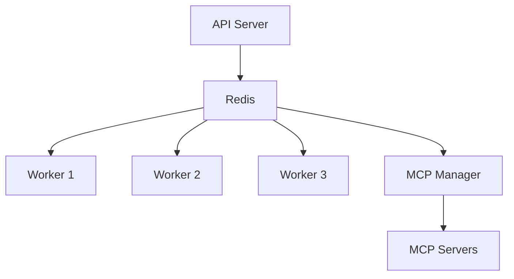
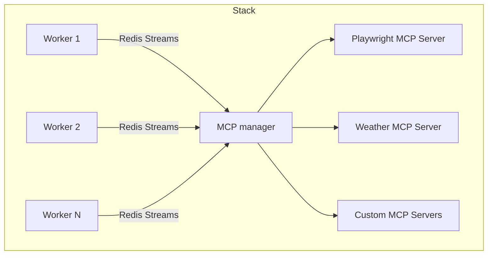

# Worker System & Routing

Workers execute commands. Routing decides which worker gets which command, and you never make that choice directly — you declare what a command needs and the router matches it against what workers advertise.

## Worker architecture



### MCP manager (sibling process)

MCP servers run in a **dedicated manager process** shared across all workers. Workers do not spawn or own those children.

- **Thin workers**: A worker's memory does not grow with the number of MCP servers, so worker density is not bounded by MCP
- **Shared resources**: One MCP server process serves every worker rather than one copy per worker
- **Fault isolation**: Worker restart does not recycle MCP servers; one MCP server crash should not take down the others
- **Faster worker start**: No MCP subprocess spawning on the worker startup path



### Worker footprint

A worker's footprint depends mostly on its **pool type**, which you choose per worker:

- **`eventlet` / `gevent`** pools are the cheapest per unit of concurrency. They are the right default for I/O-bound work — model calls, HTTP, Redis, most tool execution — and let one worker hold many concurrent tasks.
- **`fork`** pools cost the most per process because each child carries a full interpreter and imported stack. Use them for CPU-bound work that must not block an event loop.

Independently of pool choice, keeping MCP servers out of the worker means the footprint stays flat as you attach more MCP servers. Adding a tenth MCP server does not make every worker larger.

Measure on your own workload before sizing a fleet; per-worker memory varies with which bundles and models a worker loads.

### Datacenter workers and device workers

Most tasks run on **datacenter workers** (workers that live in the same deployment as your API and shared queue/state). They handle model calls, most tool execution, memory, MCP attached to that environment, and so on.

A **device worker** runs **on a specific machine** that you register with the deployment—often a developer laptop or a workstation. The platform routes work there when something must execute in *that* environment: paths you allowed on the host, optional clipboard/shell/process bridges, and other host-specific behavior. From a bundle perspective, tools such as **`core.file_read`** and **`core.file_write`** are bound to the device worker and are **not** sent to datacenter workers; see [Tool ecosystem](./21-tool-ecosystem.md).

To attach a device worker to a remote deployment from your machine, use **`motet-cli device`** (register, start, doctor, stop). Step-by-step setup is in [Local development setup](./14-local-development-setup.md#option-3-edge-worker-for-a-remote-motet-deployment).

## Capabilities and state

For how to **use** capabilities and worker targeting when writing commands, tools, and bundles (e.g. `required_capabilities`, BundleTargeting), see the [Worker Targeting Guide](08a-worker-targeting-guide.md).

Workers advertise a capability set drawn from 32 values — `model_inference`, `reasoning`, `tool_execution`, `memory_operations`, `browser_operations`, `embeddings`, the `edge_*` family, and more. Commands declare what they require, and the router intersects the two.

Alongside capabilities, each worker keeps its current load, health, readiness, and location in Redis, so routing decisions are made against live state rather than a static config:

```python
# Worker state stored in Redis
{
    "worker_id": "worker-1",
    "capabilities": ["MODEL_INFERENCE", "REASONING"],
    "load": 0.75,
    "health": "healthy",
    "readiness": "ready",
    "location": "us-east-1"
}
```

Readiness is worth calling out separately, because a worker that is running is not necessarily ready. It moves through `not_ready` and `warming_up` before `ready`, and the router skips it until then — which is why a freshly started stack can look idle while tasks queue.

## Routing


Routing runs in two stages. **Filters** remove workers that must not receive the command; **strategies** choose among those that remain.

The filters are capability, readiness, load, geographic, tenant, circuit breaker, and edge worker affinity. A composite filter chains them. The circuit breaker one matters most in practice: a worker that keeps failing is taken out of rotation rather than being handed more work.

The strategies are capability, load-based, cost, geographic, performance, tenant, and specific (direct targeting). Capability-based selection is the common case, and most commands never need more than declaring what they require:

```python
# Command specifies required capabilities
@motet.command(
    required_capabilities=[WorkerCapability.MODEL_INFERENCE]
)
def model_command(data: ModelData, motet: MotetContext):
    # Automatically routes to worker with MODEL_INFERENCE capability
    ...
```

Custom strategies are a supported extension point. Subclass `RoutingStrategy` and implement both abstract methods:

```python
from motet.core.workers.routing.strategies.base import RoutingStrategy

class CustomRoutingStrategy(RoutingStrategy):
    def select_worker(self, command, available_workers):
        # Custom selection logic
        return selected_worker

    def get_strategy_name(self) -> str:
        return "custom"
```

To pin specific work to specific workers, prefer command-level targeting (`target_worker_id`, `preferred_worker_ids`, `worker_affinity`, `avoid_worker_ids`) over writing a strategy.

## Worker specialization

Capabilities are **detected at startup**, not declared on the command line.
A worker inspects what it actually has — a runtime stack, registered tools, an
embedding service, edge configuration — and advertises the matching capability
set to the router. There is no `--capabilities` flag.

You specialize a worker by changing what it can reach:

```bash
# Edge worker: advertises a restricted set (edge_execution, model_inference,
# text_generation) so orchestration and memory work is not routed to it
export MOTET_EDGE_WORKER_ID=edge-mac-01

# Lifecycle worker: handles bundle deploy orchestration only
export MOTET_WORKER_LIFECYCLE_WORKER_ID=cloud_lifecycle_management
```

Because detection is automatic, a worker without an embedding service simply
never advertises embedding capability, and the router stops sending it that
work — no configuration drift between what a worker claims and what it can do.

## Scaling

Add workers to add capacity:

```bash
# Scale workers via the local stack manager
motet-cli local manage

# Kubernetes scaling
kubectl scale deployment motet-worker --replicas=10
```

Nothing in a command body changes when you do this, which is the payoff of never addressing a worker directly.

## Worker-to-worker

Workers reach each other through commands, events, shared Redis state, and the MCP stream proxy. In practice that means calling a command:

```python
@motet.command()
def worker_a(data: DataA, motet: MotetContext):
    # Worker A calls Worker B via command
    result = motet.do(worker_b_command, data=DataB(...))
    return result
```

You are not choosing worker B's host — you are asking for work that some worker advertising the right capability will pick up.

## Monitoring

```bash
motet-cli workers health       # health of the fleet
motet-cli workers readiness    # who is ready to take work
motet-cli workers managers     # MCP manager status
motet-cli version              # API + worker + sibling Motet versions (skew if mixed)
```

The same data is available at `/api/v1/workers/health`, `/api/v1/workers/readiness`, and `/api/v1/version`. For terminating or restarting a specific worker, `motet-cli workers terminate|start|stop|restart` maps to the corresponding endpoints.

Workers log with structured fields, so filtering by `worker_id` or `task_id` is the fastest way to follow one task across the fleet:

```python
logger.info(
    "worker_task_started",
    worker_id="worker-1",
    task_id="task-123",
    command_type="model_inference"
)
```

## Troubleshooting

**Tasks queued but not executing.** Usually readiness or a capability mismatch. Check `motet-cli workers readiness` first — a warming-up worker takes no tasks. If workers are ready, compare the command's `required_capabilities` against what they advertise, since a command requiring a capability nobody has will queue indefinitely rather than fail.

**Workers overloaded.** Scale horizontally, or split the work: give the slow command its own worker pool so it stops competing with latency-sensitive traffic.

**Workers crashing or unhealthy.** Check logs for the failing command first. A worker that dies repeatedly on the same command type is usually hitting memory limits from a `fork` pool or a bundle that loads a large model, not a fault in the worker itself.

## Next steps

- **[Worker Targeting Guide](./08a-worker-targeting-guide.md)** — capabilities and targeting when writing commands
- **[MCP Integration](./09-mcp-integration.md)** — attaching tool servers
- **[Reasoning](./10-reasoning.md)** — how a turn decides what to do
- **[Building Your First Command](./15-building-your-first-command.md)** — practical tutorial

## Navigation

- **[← Back to Documentation Home](./00-landing-page.md)**

---

**Last Updated**: 2026-08-26
