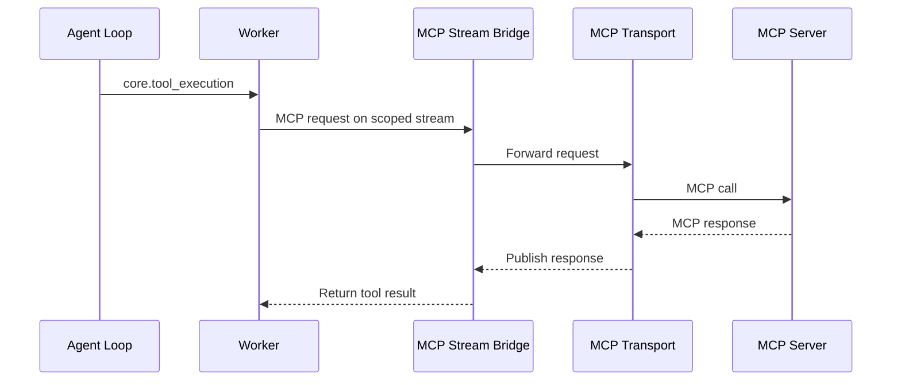

# MCP Integration and Configuration

Motet integrates MCP servers through a stream bridge so tools can be discovered and executed consistently across workers. This guide focuses on practical MCP configuration choices: `stdio` vs `http`, internal vs external lifecycle ownership, and scope/lifecycle behavior.

## How MCP fits in Motet

A dedicated **MCP manager** process owns MCP server children (stdio containers or HTTP sidecars). Workers do not start those processes. Motet routes tool calls through worker commands; workers talk to the manager over Redis streams, and the manager’s transports call the server using stdio or HTTP.

Worker restart does not recycle MCP servers. One MCP server failing should not take every MCP tool offline. Operators can inspect per-service health on the ops **MCP Servers** page or `GET /api/v1/mcp/servers` (local manager health is `http://localhost:9191/health`).



## Tool naming

Use canonical MCP tool names in Motet code and configs:

- `mcp.<server_id>.<tool_name>`
- Example: `mcp.playwright.browser_navigate`

## Choose the right MCP mode

Use this decision table when adding a new MCP service.

| Scenario | Transport | Lifecycle ownership | Key config |
|---|---|---|---|
| Local process launched by the MCP manager | `stdio` | Motet-managed | `command`, `args` |
| HTTP server launched by the MCP manager | `http` | Motet-managed | `start_server: true`, `base_url`, `port` |
| HTTP server managed outside Motet | `http` | External | `start_server: false`, `base_url` |

## Core configuration fields

All services live in `config/mcp_instance_manager.yaml` under `services`.

- `service_id`: unique server id used in tool names
- `transport`: `stdio`, `http`, or `streamable-http`
- `command`, `args`, `env`: process launch fields (used when Motet starts the server)
- `start_server`: only for HTTP transport; controls whether Motet launches the HTTP server process
- `base_url`: HTTP MCP endpoint (commonly `/mcp` for streamable HTTP)
- `port`: local bind port for Motet-managed HTTP server subprocesses
- `health_check_interval`, `restart_on_failure`, `instance_timeout`: runtime controls

### Isolation and sharing fields

These fields define logical routing and sharing behavior:

- `state_model`: `stateless` or `stateful`
- `credential_scope`: `motet`, `tenant`, `user`, `global`
- `visibility`: who can share an instance key (`motet`, `tenant`, `user`, `global`)
- `lifecycle_duration`: `permanent`, `idle_timeout`, `conversation`, `task`, or `session`
- `instances`: `0` = discovery-only (no long-lived child); omit or `1` = one identity-keyed instance. Values greater than `1` are ignored (treated as `1`). This is not a replica pool.

## Configuration patterns

### 1) Stdio, Motet-managed (most local servers)

```yaml
services:
  - service_id: "playwright"
    transport: "stdio"
    command: "npx"
    args:
      - "-y"
      - "@playwright/mcp"
    env:
      PLAYWRIGHT_HEADLESS: "true"
      PLAYWRIGHT_BROWSERS_PATH: "/tmp/playwright-browsers"

    state_model: "stateful"
    credential_scope: "motet"
    visibility: "motet"
    lifecycle_duration: "permanent"
    instances: 1

    health_check_interval: 15
    restart_on_failure: true
    instance_timeout: 3600
```

### 2) HTTP, Motet-managed (internal local HTTP MCP)

```yaml
services:
  - service_id: "everything_http_test"
    transport: "http"
    start_server: true
    command: "npx"
    args:
      - "-y"
      - "@modelcontextprotocol/server-everything"
      - "streamableHttp"
    env:
      PORT: "3301"
    base_url: "http://127.0.0.1:3301/mcp"
    port: 3301
    streamable_http_sse: true

    state_model: "stateless"
    credential_scope: "motet"
    visibility: "motet"
    lifecycle_duration: "permanent"
    instances: 0
```

Notes:
- For fixed-port HTTP servers, the MCP manager keeps a single process owner per service.
- Additional scoped logical instances (for example a real tenant after discovery) attach to that owner instead of binding the same port again.
- In Docker, `base_url` may say `127.0.0.1`; the manager rewrites the client URL to the Docker host (`host.docker.internal` by default) so attach does not probe the manager container’s own loopback.
- After `docker restart` of the MCP manager, leftover sidecars for the same service or published port are removed before bind so the service does not stay failed.

### 3) HTTP, externally managed (recommended for production SaaS/self-hosted MCP)

```yaml
services:
  - service_id: "external_docs"
    transport: "http"
    start_server: false
    base_url: "https://mcp.example.com/mcp"
    streamable_http_sse: true

    state_model: "stateless"
    credential_scope: "motet"
    visibility: "motet"
    lifecycle_duration: "permanent"
    instances: 1

    health_check_interval: 15
    restart_on_failure: false
    instance_timeout: 3600
```

In this mode, Motet does not start/stop the MCP server process. It only routes requests and handles MCP protocol traffic.

## Scope and lifecycle recipes

Use these practical combinations:

- Shared service for all users in one Motet:
  - `visibility: motet`, `lifecycle_duration: permanent`
- Per-tenant separation:
  - `visibility: tenant`, `lifecycle_duration: permanent`
- Per-user OAuth-style separation:
  - `credential_scope: user`, `visibility: user`, `lifecycle_duration: idle_timeout`
- Short-lived task-specific state:
  - `visibility: user` or `tenant`, `lifecycle_duration: task`

## Networking guidance for HTTP servers

When workers run in containers:

- `127.0.0.1` points to the worker container itself
- For external MCP endpoints, use a routable hostname/IP from worker containers
- Confirm connectivity from the worker network, not just from your host shell

## Quick validation checklist

After configuration changes:

1. Recreate the **MCP manager** (local compose: restart `mcp-manager`) so YAML changes load. Bundle `config/mcp.yaml` is applied through the manager control plane and does not require recycling workers or the manager process.
2. Check per-service health:
   - `curl http://localhost:8000/api/v1/mcp/servers`
   - `curl http://localhost:9191/health`
3. Check tool registration:
   - `motet-cli tools list --json-output`
4. Execute a simple tool call:
   - `motet-cli tools call --name "mcp.<server_id>.<tool_name>" --params '{"...":"..."}'`

## Common failure signatures

### `Port <n> is already in use`

- Cause: duplicate launch attempts for fixed-port Motet-managed HTTP subprocess.
- Fix:
  - keep one local process owner per worker/service
  - use `start_server: false` for external endpoints
  - avoid multiple independently managed processes binding same port

### `Request ... timed out after 30.0 seconds`

- Cause: no active consumer path to the configured service (startup failure, bad endpoint, auth/network issue).
- Fix:
  - check transport startup logs
  - verify `base_url` reachability from workers
  - verify credentials/token setup (see [MCP OAuth & Vault Credentials](./09b-mcp-oauth-credentials.md))
  - re-run with a simple tool and observe logs

## Next Steps

- **[MCP OAuth & Vault Credentials](./09b-mcp-oauth-credentials.md)** - Setting up OAuth credentials and vault keys for authenticated MCP servers
- **[Canonical LLM Protocol](./09a-canonical-llm-protocol.md)** - Provider-agnostic tool call and streaming model
- **[Reasoning](./10-reasoning.md)** - How the agent uses tools
- **[Tool Ecosystem](./21-tool-ecosystem.md)** - Tool discovery and execution patterns
- **[Configuration Reference](./29-configuration-reference.md)** - Broader platform configuration

## Navigation

- **[← Back to Documentation Home](./00-landing-page.md)** - Main documentation hub

---

**Last Updated**: 2026-08-13
