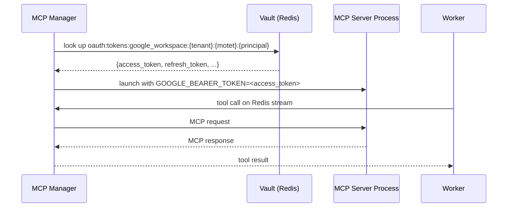

# MCP OAuth & Vault Credentials

MCP servers that call external APIs — Google Workspace, GitHub, Slack, etc. — need credentials at runtime. Motet stores all credentials in a distributed vault backed by Redis and injects them into MCP server processes automatically. This guide explains the credential key naming convention, how to populate the vault, and how to access credentials from commands.

## How credential injection works

When the **MCP manager** starts an MCP server process it calls `VaultMCPIntegration.get_mcp_environment_variables()`, which reads the configured `auth` block from `config/mcp_instance_manager.yaml` for that service, looks up the relevant credentials in the vault, and injects them as environment variables into the subprocess. Workers only call tools over Redis streams. Your MCP server code never touches the vault directly — it just reads environment variables.



## Credential key naming

All OAuth-related vault keys use a colon-separated naming convention. There are two kinds of keys:

### OAuth token keys

Stored after a user completes the login flow. The key is scoped to the most specific identity available:

```
oauth:tokens:{server_id}:{tenant_id}:{motet_id}:{principal_id}   # user scope (most specific)
oauth:tokens:{server_id}:{tenant_id}:{motet_id}                   # motet scope
oauth:tokens:{server_id}:{tenant_id}                              # tenant scope
oauth:tokens:{server_id}:global                                   # global fallback
```

At lookup time the system tries all candidates from most specific to most general and uses the first match. For example, for a user `matt@motet.dev` in tenant `default_tenant`:

```
oauth:tokens:google_workspace:default_tenant:default:matt@motet.dev   ← tried first
oauth:tokens:google_workspace:default_tenant:default
oauth:tokens:google_workspace:default_tenant
oauth:tokens:google_workspace:global                                   ← tried last
```

### OAuth client credentials key

Stores the OAuth application's `client_id` and `client_secret` — the credentials registered in the provider's developer console. Used to initiate the OAuth flow, not per-user.

```
oauth:client_credentials:{server_id}
# e.g. oauth:client_credentials:google_workspace
```

The value stored at this key is a dict with at minimum:
```json
{"client_id": "...", "client_secret": "..."}
```

## Declaring auth in mcp_instance_manager.yaml

Each service that requires credentials has an `auth` block in `config/mcp_instance_manager.yaml`:

```yaml
services:
  - service_id: "google_workspace"
    transport: "stdio"
    # ...transport config...

    auth:
      type: "oauth2"
      provider: "google"
      vault_credential_key: "oauth:tokens:google_workspace"   # base key; actual key built with scoping above
      env_var: "GOOGLE_BEARER_TOKEN"                          # env var injected into the subprocess
      token_field: "access_token"                             # which field from the token dict to inject
      display_name: "Google Workspace"
      description: "Access Gmail, Drive, Calendar, and other Google services"
      scopes:
        - "https://www.googleapis.com/auth/gmail.send"
        - "https://www.googleapis.com/auth/calendar"
        - "https://www.googleapis.com/auth/drive"
      auth_url: "https://accounts.google.com/o/oauth2/v2/auth"
      token_url: "https://oauth2.googleapis.com/token"
      revoke_url: "https://oauth2.googleapis.com/revoke"
      tokeninfo_url: "https://www.googleapis.com/oauth2/v3/tokeninfo"
```

The `auth.type` field determines the credential lookup strategy. Currently `oauth2` is the primary type. Services without an `auth` block receive no credential injection.

## Populating the vault

There are three ways to get credentials into the vault.

### 1. Environment variables at startup (recommended for local dev)

The `vault-init` Docker service reads credential env vars and stores them automatically when the stack starts. Add these to your `.env`:

```bash
# Required vault config
MOTET_VAULT_ENABLED=true
MOTET_VAULT_MASTER_KEY=your-master-key
MOTET_REDIS_URL=redis://redis:6379/0

# Google Workspace — bearer token approach
GOOGLE_ACCESS_TOKEN=ya29.a0...
GOOGLE_REFRESH_TOKEN=1//04...
GOOGLE_TOKEN_TYPE=Bearer

# Google Workspace — service account approach (alternative)
GOOGLE_SERVICE_ACCOUNT_KEY_JSON='{"type":"service_account",...}'
GOOGLE_SERVICE_ACCOUNT_EMAIL=sa@project.iam.gserviceaccount.com
GOOGLE_IMPERSONATE_USER=user@yourdomain.com

# GitHub
GITHUB_TOKEN=ghp_...
```

After adding env vars, restart the stack to re-run `vault-init`:

```bash
motet-cli local down
motet-cli local up
```

Credentials stored by `vault-init` are written under the `system_admin` principal at global scope. Workers look these up as a fallback when no user-scoped credential exists.

### 2. Browser OAuth flow (for user-scoped tokens)

The dashboard at `http://localhost:8000/` includes an **OAuth** tab. This flow:

1. Reads the `oauth:client_credentials:google_workspace` key from the vault to get the app's `client_id` and `client_secret`
2. Opens a Google OAuth consent screen in a popup window
3. Exchanges the authorization code for tokens
4. Stores the result at `oauth:tokens:google_workspace:{tenant_id}:{motet_id}:{principal_id}`

For this flow to work the client credentials must already be in the vault. If they're missing, store them directly via the CLI:

```bash
motet-cli vault store \
  --key oauth:client_credentials:google_workspace \
  --data '{"client_id": "YOUR_CLIENT_ID", "client_secret": "YOUR_CLIENT_SECRET"}'
```

### 3. The setup script

`scripts/setup_mcp_vault_credentials.py` stores credentials programmatically and is useful for scripted environments:

```bash
GOOGLE_ACCESS_TOKEN=ya29... \
GOOGLE_REFRESH_TOKEN=1//04... \
python scripts/setup_mcp_vault_credentials.py
```

## Google authentication: bearer token vs service account

Choose the approach that matches your environment:

| | Bearer token | Service account |
|---|---|---|
| **Works with personal Gmail** | Yes | No |
| **Requires Google Workspace domain** | No | Yes |
| **Requires admin access** | No | Yes (for domain-wide delegation) |
| **Token expiry** | 1 hour (auto-refreshed) | No expiry |
| **Setup complexity** | Low | Higher |
| **Best for** | Local dev, personal use | Production, enterprise |

### Bearer token setup (quick start)

Get an access token and refresh token from [Google OAuth Playground](https://developers.google.com/oauthplayground/), then set `GOOGLE_ACCESS_TOKEN` and `GOOGLE_REFRESH_TOKEN` in `.env`. The vault stores them and the MCP server picks them up on start. Tokens auto-refresh via the background `OAuthTokenRefresher` task on workers.

### Service account setup

1. Create a service account in [Google Cloud Console](https://console.cloud.google.com/) (IAM & Admin → Service Accounts)
2. Enable **Domain-Wide Delegation** on the service account
3. In [Google Admin Console](https://admin.google.com/), go to Security → API Controls → Domain-wide Delegation → Add new, and authorize the client ID with the required scopes:
   ```
   https://www.googleapis.com/auth/gmail.send,https://www.googleapis.com/auth/gmail.readonly,
   https://www.googleapis.com/auth/calendar,https://www.googleapis.com/auth/drive,
   https://www.googleapis.com/auth/documents,https://www.googleapis.com/auth/spreadsheets
   ```
4. Download the JSON key and set in `.env`:
   ```bash
   GOOGLE_SERVICE_ACCOUNT_KEY_JSON='{"type":"service_account",...}'
   GOOGLE_SERVICE_ACCOUNT_EMAIL=sa@project.iam.gserviceaccount.com
   GOOGLE_IMPERSONATE_USER=you@yourdomain.com
   ```

## Accessing vault credentials from a command

Use `motet.vault` inside any decorated command to read credentials:

```python
from motet import motet
from motet.core.commands.decorator import MotetContext

@motet.command()
def my_command(data: MyData, motet: MotetContext) -> dict:
    vault = motet.vault

    # Get OAuth tokens for google_workspace
    tokens = vault.get_oauth_tokens("google_workspace", motet._command.distributed_context)
    if tokens:
        access_token = tokens.get("access_token")

    # Get an API key (e.g. for OpenAI)
    api_key = vault.get_api_key("openai", motet._command.distributed_context)

    # Get a bearer token
    token = vault.get_bearer_token("google_workspace", motet._command.distributed_context)

    # Retrieve an arbitrary credential by key
    cred = vault.get_credential(
        credential_key="oauth:client_credentials:google_workspace",
        context=motet._command.distributed_context
    )

    return {"ok": True}
```

Available `VaultClient` methods:

| Method | Returns | Use for |
|--------|---------|---------|
| `get_oauth_tokens(service, ctx)` | `dict \| None` | Full token dict (`access_token`, `refresh_token`, etc.) |
| `get_api_key(service, ctx)` | `str \| None` | Raw API key string |
| `get_bearer_token(service, ctx)` | `str \| None` | Raw bearer token string |
| `get_credential(key, ctx)` | `dict \| None` | Any credential by exact vault key |
| `store_credential(key, data, ctx)` | `bool` | Write a credential to the vault |

## Verifying vault state

Use `motet-cli vault` to inspect credentials without touching Redis directly:

```bash
# List all credentials visible to your principal
motet-cli vault list

# Retrieve a specific credential by key
motet-cli vault get oauth:tokens:google_workspace:global
motet-cli vault get oauth:client_credentials:google_workspace

# Check what environment variables would be injected for a given MCP server
motet-cli vault mcp-env google_workspace

# List all MCP servers and their auth/credential status
motet-cli vault mcp-servers

# Check vault service health
motet-cli vault health

# View vault usage stats
motet-cli vault stats
```

Check that Google Workspace tools are actually registered on workers after credentials are loaded:

```bash
motet-cli tools list | grep google_workspace
```

Check worker health (tokens are loaded at worker startup):

```bash
motet-cli workers health
```

Expected worker log lines after successful credential injection (visible via `motet-cli local logs`):

```
🔐 Pre-populating workspace-mcp credential store from vault...
✅ Wrote credential to: /app/.google_workspace_credentials/matt@motet.dev.json
✅ Pre-populated workspace-mcp credentials
🔄 Starting OAuth token refresher...
✅ OAuth token refresher started
```

## Common failures

### "No client credentials in vault"

The browser OAuth flow needs `oauth:client_credentials:google_workspace` to exist before it can start. Check:

```bash
motet-cli vault get oauth:client_credentials:google_workspace
```

If the key is missing, re-run `update_desktop_creds_simple.py` inside the worker container, or store the credentials manually:

```bash
motet-cli vault store \
  --key oauth:client_credentials:google_workspace \
  --data '{"client_id": "YOUR_CLIENT_ID", "client_secret": "YOUR_CLIENT_SECRET"}'
```

### Tools not discovered after auth

If Google Workspace tools don't appear after OAuth:

```bash
# Confirm the tools are registered
motet-cli tools list | grep google_workspace

# Confirm the MCP server credential env would be populated
motet-cli vault mcp-env google_workspace
```

If `mcp-env` shows empty values, the token isn't in the vault under a key the server is looking up — check `motet-cli vault list` and compare against the expected key names above.

### OAuth callback returns 400

The redirect URI registered in Google Cloud Console must match exactly:
```
http://localhost:8000/mcp/oauth/google_workspace/callback
```

### Token not refreshing

Check worker health and inspect logs via the local stack log viewer:

```bash
motet-cli workers health
motet-cli local logs
```

Look for `OAuth token refresher started` in the worker output. If missing, the worker may have started before tokens were available — restart the worker after confirming the vault contains a valid token:

```bash
motet-cli vault get oauth:tokens:google_workspace:global
motet-cli workers restart
```

## Next Steps

- **[MCP Integration](./09-mcp-integration.md)** — Transport, lifecycle, and scoping configuration
- **[Security & Multi-Tenancy](./22-security-multi-tenancy.md)** — Principal model and tenant isolation
- **[Tool Ecosystem](./21-tool-ecosystem.md)** — Tool discovery and execution patterns
- **[Configuration Reference](./29-configuration-reference.md)** — Full environment variable reference

## Navigation

- **[← MCP Integration](./09-mcp-integration.md)**
- **[← Back to Documentation Home](./00-landing-page.md)**

---

**Last Updated**: 2026-08-13
