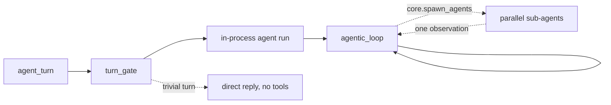
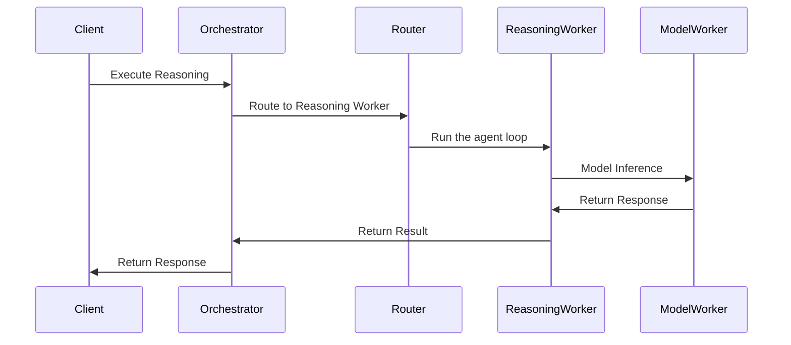

# Reasoning

Motet runs every turn the same way: **one agent loop**. There is no strategy
menu and nothing predicts an execution shape from your request before the model
has read it. When work splits into independent parts, the loop fans out by
calling a tool — the same way it does anything else.

## Current Architecture



- **Entry point**: `agent_turn` → `run_agent` on the same worker (or a
  no-tools reply when the gate says so).
- **Default path**: `run_agent` builds loop context and runs **agentic_loop**.
  The loop is self-contained: it discovers tools on the first iteration, uses
  native function calling, and repeats until done or out of budget. See
  [Agent Loop](./07a-agent-loop.md).
- **Fan-out**: the loop calls `core.spawn_agents` with a list of tasks. Each
  runs as a sub-agent on its own worker, and the results come back as a single
  observation the loop reads like any other tool result.
- **Turn gate**: greetings and acknowledgements skip tools entirely. Always
  on, local, not a hook. A confirmation answering a pending proposal
  (`"ok"` after `"Should I send it?"`) re-enters the loop.

The gate chooses between those last two. It does not choose *how* to
reason — that is the loop's job, made with the tool results in front of it.

## Parallel work: `core.spawn_agents`

Give it independent work items and it runs them at the same time:

```python
core.spawn_agents(tasks=[
    "Find current pricing for the Acme enterprise tier",
    "Summarize published Acme outage postmortems from 2026",
    "List Acme's stated SLA commitments and any exclusions",
])
```

Each task becomes one sub-agent. All three results return together, in task
order, and the loop synthesizes them holding everything else it knows about the
turn.

**What to put in a task.** Each instruction is the sub-agent's work — it does
not see the conversation, the other tasks, or their results. Write it as a
standalone instruction, and name the tools that slice needs. Those names
are the child's catalog — it cannot search for more. Set `discover: true`
on a task only when that slice may need tools you cannot name; declared
names are still pinned, but the child can search. Sub-agents share a
short worker brief for their mode (caged: stay on the listed tools;
discovery: search if needed; at most 10 rounds / 8 tool calls / 60
seconds of tool time) so they
do not inherit the parent assistant
prompt. The loop itself tells any agent — parent or child — when it is on
its last two rounds, so the model can write up instead of fetching once
more. If a rail still fires, the loop asks for one tools-off write-up
so a budget stop can return findings instead of silence. Repeating a
web fetch or search with the same arguments while the last result is
still fresh returns a short cached notice instead of hitting the
network again. A successful fan-out comes back as each child's full
write-up (status, stop reason, and the text it returned) so you can
synthesize immediately. Repeating a child's exact same web fetch or
search this turn is refused and pointed back at that observation —
the parent does not have the child's page text. Use
fan-out for work that genuinely does not depend on the other items; for
steps that must happen in order, just call the tools in order, or use a
[workflow](./11-workflow-system.md).

**Limits worth knowing:**

| Limit | Behavior |
|---|---|
| Width | At most 8 tasks. More is rejected with the limit stated, never silently truncated. |
| Recursion | Sub-agents cannot fan out again — they do not receive the tool. |
| Scope | Sub-agents inherit the parent agent's tool filter, so they can never reach a tool the parent was denied. |
| Failure | One failed branch comes back marked as an error; the others still return. |
| Child tool time | Sub-agents stop after 60 seconds of tool work. One in-flight page may overshoot. The parent turn has no such cap. |

Fan-out is available to agents that use tool **discovery**. An agent pinned to
an explicit tool list or a prefix has a fixed grant that cannot be handed down
faithfully, so the call is refused rather than guessed at.

## Modes

Most callers never set one. `auto` is the default.

| Mode | Behavior |
|---|---|
| `auto` | The agent loop. Trivial turns get a direct reply. |
| `no_tools` | Answer directly from the model, no tool discovery and no loop. Useful for safety, compliance, and tests. |

`agentic` skips the trivial gate and otherwise runs the same loop as `auto`
— useful in tests, not something to pin in product code. Forced mode is
`context["mode"]` only. Any other value runs as `auto`. Parallel work is
`core.spawn_agents` from inside the loop.

```python
from motet import motet
from motet.core.orchestration.turn import agent_turn
from motet.core.commands.command_data_classes import AgentTurnData

# Default: the agent loop
result = motet.do(
    agent_turn,
    data=AgentTurnData(messages=[{"role": "user", "content": "What's the weather in Paris?"}]),
)

# Answer without tools
result = motet.do(
    agent_turn,
    data=AgentTurnData(
        messages=[{"role": "user", "content": "Summarize this text"}],
        context={"mode": "no_tools"},
    ),
)
```

## Distributed Execution

Reasoning runs as distributed commands:



The loop itself runs in-process on the turn's worker. Model calls, tool
executions, and `core.spawn_agents` sub-agents are the parts that fan out to
other workers.

## Extending Reasoning

There is no strategy plugin registry, and adding one is not how you extend
reasoning. You extend it by giving the agent more to reason *with*:

- **Add a tool.** The loop discovers registered tools, so a new `@motet.tool`
  is immediately available. See [Tool Ecosystem](./21-tool-ecosystem.md).
- **Add a command and call it from a tool.** Deterministic multi-step logic
  belongs in a command you invoke with `motet.do()`.
- **Encode a fixed process in a workflow.** For a known sequence of steps, a
  [workflow](./11-workflow-system.md) is a better fit than asking a model to
  rediscover the sequence each time.

## Best Practices

### 1. Leave the mode alone

`auto` is right for nearly everything. Pin a mode only when you need a
guaranteed shape — most often `no_tools`, when you want an answer and nothing
else.

```python
from motet.core.orchestration.turn import agent_turn
from motet.core.commands.command_data_classes import AgentTurnData

messages = [{"role": "user", "content": "Complex decision"}]

# Let Motet route
result = motet.do(agent_turn, data=AgentTurnData(messages=messages))
```

`AgentTurnData` takes **`messages`**, a list of `{role, content}` items — there
is no `prompt` field. Any unrecognized `context["mode"]` value falls through
to the agent loop.

### 2. Skip tools when you only want an answer

```python
from motet.core.orchestration.turn import agent_turn
from motet.core.commands.command_data_classes import AgentTurnData

result = motet.do(
    agent_turn,
    data=AgentTurnData(messages=messages, context={"mode": "no_tools"}),
)
```

### 3. Observe reasoning through traces

Reasoning emits trace events rather than a metrics API. Inspect a run with
`motet-cli traces list` and `motet-cli traces show <trace_id>`, or watch it live
with `motet-cli traces watch`. Fan-out shows up as a `core.spawn_agents` tool
call with its sub-agents nested underneath. See
[Observability & Debugging](./23-observability-debugging.md).

## Next Steps

- **[Agent Loop](./07a-agent-loop.md)** - `core.agent_loop`, YAML config, hooks, handoffs
- **[Workflow System](./11-workflow-system.md)** - Learn workflow orchestration
- **[Building Your First Command](./15-building-your-first-command.md)** - Practical tutorial
- **[Command Composition Patterns](./16-command-composition-patterns.md)** - Advanced composition

## Navigation

- **[← Back to Documentation Home](./00-landing-page.md)** - Main documentation hub

---

**Last Updated**: 2026-08-26
