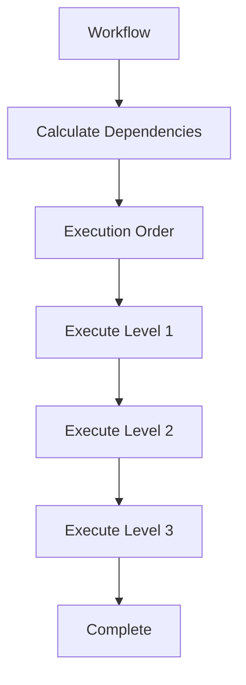

# Workflow System

Workflows are structured command compositions that define multi-step processes with dependencies, conditional execution, and state management. This section covers the unified workflow architecture, workflow patterns, and building workflows.

## What are Workflows?

**Workflows** are declarative specifications for multi-step command executions. Every workflow step is a distributed command execution.

### Key Concepts

- **Workflow**: Template — collection of steps with dependencies
- **Run**: One execution of a workflow (`workflow_run_id`); may pause, resume, or cancel
- **WorkflowStep**: Individual command execution within workflow
- **Dependencies**: Execution order determined by step dependencies
- **Context**: State passed between steps
- **Execution**: Distributed execution via WorkflowExecutor

### Unified Architecture

Motet uses a **unified workflow architecture** where:
- Every workflow step is a distributed command
- No distinction between "tool steps" and "module steps"
- All operations use the same command pattern
- Workflows can compose other workflows

## Workflow Model

### Workflow Structure

```python
from motet.core.workflow import Workflow, WorkflowStep

workflow = Workflow(
    workflow_id="my_workflow",
    name="My Workflow",
    description="Description of what this workflow does",
    steps={
        "step1": WorkflowStep(
            step_id="step1",
            name="Search",
            command_type="core.tool_execution",
            command_data={"tool_name": "core.web_search", "parameters": {"query": "Motet"}}
        ),
        "step2": WorkflowStep(
            step_id="step2",
            name="Analyze",
            command_type="core.agent_loop",
            command_data={"input": "Analyze results"},
            dependencies=["step1"]  # Runs after step1
        )
    }
)
```

### WorkflowStep

Each step defines:
- **step_id**: Unique identifier (required)
- **name**: Human-readable label shown in run views and logs (required)
- **command_type**: Command to execute (e.g., `"core.tool_execution"` or `"core.agent_loop"` for a loop step; `"core.agent_turn"` for a full chat turn — see [Agent Loop](./07a-agent-loop.md))
- **command_data**: Command parameters
- **dependencies**: Step ids that must finish first (optional)
- **skip_condition**, **continue_on_failure**, **fallback_step_id**, **step_retry_attempts**: Execution control (optional)

## Workflow Execution

### WorkflowExecutor

The `WorkflowExecutor` executes workflows:

```python
from motet.core.workflow import WorkflowExecutor

executor = WorkflowExecutor()
result = executor.execute_workflow(workflow, motet)
```

### Execution Flow



### Automatic Dependency Resolution

WorkflowExecutor automatically:
1. **Calculates Dependencies**: Builds dependency graph
2. **Determines Execution Order**: Levels for parallel execution
3. **Executes in Order**: Sequential within levels, parallel across levels
4. **Manages Context**: Passes results between steps

### Using the workflows helper (from a command)

From inside another command, the preferred way to run a single workflow by id or to discover workflows is the **workflows helper** on MotetContext. It delegates to the workflow_execution command when task context exists.

- **`motet.workflows.list()`** – List workflow ids from the workflow registry.
- **`motet.workflows.get(workflow_id)`** – Resolve workflow definition by id (or `None` if not found).
- **`motet.workflows.run(workflow_id, context={...})`** – Run the workflow with the given context; delegates to the workflow_execution command and returns the result.

When you do not have task context, use `motet.do(workflow_execution, data=WorkflowExecutionData(...))` instead. For more on when to use helpers vs composition, see [Distributed Command System – Resource helpers vs command composition](./07-distributed-command-system.md#resource-helpers-vs-command-composition) and the [SDK Reference](./38-sdk-reference.md).

## Workflow Patterns

### 1. Sequential Workflows

Steps execute one after another:

```python
workflow = Workflow(
    workflow_id="sequential",
    steps={
        "step1": WorkflowStep(step_id="step1", ...),
        "step2": WorkflowStep(step_id="step2", dependencies=["step1"], ...),
        "step3": WorkflowStep(step_id="step3", dependencies=["step2"], ...)
    }
)
```

### 2. Parallel Workflows

Independent steps execute in parallel:

```python
workflow = Workflow(
    workflow_id="parallel",
    steps={
        "step1": WorkflowStep(step_id="step1", name="One", ...),
        "step2": WorkflowStep(step_id="step2", name="Two", ...),  # No dependency
        "step3": WorkflowStep(step_id="step3", name="Three", ...)  # No dependency
        # All execute in parallel
    }
)
```

### 3. Conditional Workflows

Steps execute conditionally:

```python
workflow = Workflow(
    workflow_id="conditional",
    steps={
        "check": WorkflowStep(step_id="check", ...),
        "if_true": WorkflowStep(
            step_id="if_true",
            name="If True",
            dependencies=["check"],
            skip_condition="if_equals:check.ok:False"
        ),
        "if_false": WorkflowStep(
            step_id="if_false",
            name="If False",
            dependencies=["check"],
            skip_condition="if_equals:check.ok:True"
        )
    }
)
```

### 4. Sub-Workflows

Workflows can call other workflows:

```python
workflow = Workflow(
    workflow_id="parent",
    steps={
        "sub_workflow": WorkflowStep(
            step_id="sub_workflow",
            name="Sub Workflow",
            command_type="workflow_execution",
            command_data={"workflow_id": "child_workflow", ...}
        )
    }
)
```

## Workflow Context and State Management

### Context Passing

Results from steps are automatically available to subsequent steps:

```python
workflow = Workflow(
    workflow_id="context_example",
    steps={
        "extract": WorkflowStep(
            step_id="extract",
            name="Extract",
            command_type="core.tool_execution",
            command_data={"tool_name": "my_bundle.extract_data", ...}  # bundle-namespaced tool
        ),
        "process": WorkflowStep(
            step_id="process",
            name="Process",
            command_type="core.tool_execution",
            command_data={
                "tool_name": "my_bundle.process_data",
                "input": "{{extract.result}}"  # MCP envelope; unwrap with mcp_text
            },
            dependencies=["extract"]
        )
    }
)
```

### Context Structure

Workflow context contains:
- **Step Results**: Results from each step (keyed by step_id)
- **Workflow Inputs**: Initial workflow parameters
- **Metadata**: Workflow execution metadata

### Workflow runs (pause, resume, cancel)

A **workflow** is the template (graph of steps). A **run** is one execution of
that template, identified by `workflow_run_id`. Runs may pause mid-graph for
client tools or human input, then continue later — the worker is not held across
the pause. Operators can also pause or cancel a run via the HTTP API.

| Action | Endpoint | CLI |
|--------|----------|-----|
| List paused runs | `GET /api/v1/workflows/runs?status=paused` | `motet-cli workflows runs list` |
| Get run summary | `GET /api/v1/workflows/runs/{workflow_run_id}` | `motet-cli workflows runs get <id>` |
| Resume | `POST /api/v1/workflows/runs/{workflow_run_id}/resume` | `motet-cli workflows runs resume <id> --kind …` |
| Operator pause | `POST /api/v1/workflows/runs/{workflow_run_id}/pause` | `motet-cli workflows runs pause <id>` |
| Cancel | `POST /api/v1/workflows/runs/{workflow_run_id}/cancel` | `motet-cli workflows runs cancel <id>` |

Authoring pause (handback, elicitation, confirmation) and operator pause/cancel
details are in [Building Workflows](./17-building-workflows.md). Endpoint overview
is in [API Reference](./28-api-reference.md). CLI group summary is in
[Motet CLI Reference](./37-motet-cli-reference.md).

A step may nest another workflow (or the same one) via
`command_type: core.workflow_execution`. That starts a **child run**; if the child
pauses, the parent pauses with a pointer to it, and resume always finishes the
leaf before continuing the parent. Full pattern and diagrams:
[Building Workflows §7](./17-building-workflows.md#7-call-another-workflow-or-yourself).

## Workflow Registry

### Registering Workflows

```python
from motet.core.workflow import WorkflowRegistry

# Register workflow
WorkflowRegistry.register(workflow)

# Retrieve workflow
workflow = WorkflowRegistry.get("my_workflow")

# List all workflows
all_workflows = WorkflowRegistry.list_all()
```

### Scope and Visibility

Workflow visibility is context-aware. A workflow may be registered, but still not be visible
or executable in a given request context if scope does not match.

Key points:
- Workflows use namespaced IDs: bare/core for built-ins, `{bundle_id}.*` for bundle workflows, and `user.<owner>.<local>` for runtime-authored workflows (HTTP, CLI, or the `core.workflow_builder` tool)
- Visibility is filtered by request context (tenant/motet/role/principal)
- Discovery output should be treated as the source of truth for what a caller can use
- Execution can still fail if a caller bypasses discovery and requests a non-visible workflow directly

Practical examples:

```python
from motet.core.workflow import WorkflowRegistry
from motet.core.registry import ScopeFilter

# Full registry (no visibility filtering)
all_workflows = WorkflowRegistry.list_items()

# Context-filtered view (what this request should see)
scope_filter = ScopeFilter(
    tenant_id="tenant-a",
    motet_id="motet-sales",
    principal_id="user-123",
    roles=["ops"]
)
visible_workflows = WorkflowRegistry.list_visible(scope_filter)
```

Bundle authoring guidance:
- Use namespaced workflow IDs in bundle files (for example: `calculator.multi_step_calc`)
- Avoid generic IDs like `my_workflow` without a namespace
- Keep workflow IDs stable over time so discovery and automation integrations do not break

### Bundle workflows (YAML)

You can define workflows for a bundle using **YAML files** in the bundle’s `workflows/` directory. Each `.yaml` file (except names starting with `_`) is loaded on deploy and registered with the workflow registry. The workflow ID is automatically namespaced as `{bundle_id}.{workflow_id}`, so use a local id in the file (e.g. `multi_step_calc`); at runtime the workflow is exposed as `my-bundle.multi_step_calc`.

#### Location and loading

- **Directory:** `workflows/` in the bundle root (next to `commands/`, `tools/`, `config/`).
- **Files:** Any `*.yaml` file whose name does not start with `_`.
- **One workflow per file:** The filename (without `.yaml`) is used as the local workflow id if `workflow_id` is omitted in the YAML.

#### YAML structure

Top-level fields:

| Field | Required | Description |
|-------|----------|-------------|
| `workflow_id` | Recommended | Local workflow id; becomes `{bundle_id}.{workflow_id}` when loaded. Defaults to filename stem if omitted. |
| `name` | Recommended | Human-readable name. |
| `description` | Recommended | Description used for discovery and LLM tool schema. |
| `required_inputs` | No | List of parameter names the LLM must provide (e.g. `["url", "query"]`). |
| `input_parameters` | No | Map of parameter name → JSON Schema (type, description, examples, default). |
| `use_for` | No | List of use cases: `tool` (discoverable as tool, indexed for semantic search), `facilitation` (for facilitator-only orchestration). Default when omitted or empty is `["tool"]`. Use `["facilitation"]` for workflows that should not appear in the tool list or search index. |
| `keywords` | No | Extra discovery terms (e.g. `browser`, `playwright`, `url`). Combined with tokens from the workflow id, name, and step tool names when agents search the catalog. Use this when the composed workflow should rank for words that live on the nested tools. |
| `output_field` | No | Name of the field in the final step's output that contains the primary presentable content (e.g. `digest_markdown`, `summary`, `report`). When set, the agentic loop surfaces this field in full so the LLM can present it directly rather than synthesizing from partial context. Omit if the final step's `result` key is the intended output. |
| `steps` | Yes | Map of step_id → step definition (see below). |

Each step under `steps` supports:

| Field | Required | Description |
|-------|----------|-------------|
| `step_id` | Yes | Unique step id (often matches the map key). |
| `name` or `description` | Recommended | Step name. |
| `command_type` | Yes | Command type (e.g. `core.tool_execution`, or a bundle command like `my-bundle.calculate`). |
| `command_data` | Yes* | Command payload. Use `parameters` as a synonym; it is mapped to `command_data` when loading. |
| `dependencies` | No | List of step_ids that must complete before this step runs. |
| `execution_context` | No | Optional timeout, capabilities, etc. (e.g. `timeout_seconds`, `required_capabilities`). |
| `continue_on_failure` | No | If true, workflow continues when this step fails. |
| `fallback_step_id` | No | Step to run if this step fails. |
| `skip_condition` | No | Condition expression to skip this step. |
| `step_retry_attempts` | No | Number of retries for this step. |
| `step_retry_delay_seconds` | No | Delay between retries (exponential backoff). |
| `foreach` | No | Context path to a list; when set, the step runs once per item sequentially (see below). |
| `loop_var` | No | Name bound to the current foreach item in templates (default `item`). |
| `max_loop_iterations` | No | Hard cap on loop iterations (default `20`); a longer `foreach` list fails the step. |
| `until` | No | Break condition checked after each iteration (see below). Without `foreach`, the step repeats until it holds. |

\* If `command_data` is omitted, `parameters` is used as the step’s command payload.

Placeholders in `command_data` (or `parameters`):

- **Workflow inputs:** `{param_name}` or `{{param_name}}` (e.g. `{url}`, `{{query}}`). Filled from the context passed at execution time.
- **Step results:** `{{step_id.field}}` or array indexing like `{{step_id.results[0].final_response}}`.
- **Foreach overlays:** `{{chunk}}` (or your `loop_var`), `{{loop.index}}`, `{{loop.previous.final_response}}`.

##### MCP tool results and `core.transform`

`core.tool_execution` stores MCP payloads as an envelope. `{{step_id.result}}` is that envelope (`content[]` / `structuredContent`), not the inner JSON. Do not `json_parse` the envelope.

Use named `core.transform` ops:

| Op | What it does |
|----|----------------|
| `mcp_text` | Unwrap MCP `content[]` / `structuredContent` (and `tool_execution` wrappers) to text |
| `playwright_result` | Take the `### Result` body from a Playwright MCP markdown report; no-op if that heading is absent |
| `json_parse` | Parse a JSON **string** (not a dict). Use after the unwrap ops. |

GitHub-style MCP (JSON already in `content[0].text`):

```yaml
command_type: core.transform
command_data:
  input: "{{search.result}}"
  operations:
    - type: mcp_text
      output_key: raw
    - type: json_parse
      output_key: parsed
```

Playwright `browser_evaluate` (markdown report). Return the JS value; do not `JSON.stringify` it in page code:

```yaml
command_type: core.transform
command_data:
  input: "{{extract_links.result}}"
  operations:
    - type: mcp_text
      output_key: raw
    - type: playwright_result
      output_key: result_body
    - type: json_parse
      output_key: result_links
```

#### Sequential foreach (loop over a list)

Use `foreach` when a step should run once per item in a previous step’s list — for example, implement each plan chunk in order. Iterations are sequential (later iterations can see `{{loop.previous}}`). The step’s context result is `{"results": [...], "count": n, "stopped_reason": ...}`. A failed iteration fails the whole step (fail-fast). Nested foreach over `core.workflow_execution` is not supported.

```yaml
implement:
  step_id: implement
  command_type: core.agent_turn
  foreach: parse_plan.chunks
  loop_var: chunk
  max_loop_iterations: 8
  command_data:
    agent_id: "my-bundle.engineer"
    messages:
      - role: user
        content: |
          Execute this chunk only.
          Chunk: {{chunk}}
          Previous summary: {{loop.previous.final_response}}
  dependencies: [parse_plan]
```

#### Repeat until a condition holds (`until`)

`until` stops a loop early. It is checked **after** each iteration against that iteration’s result, bound to the reserved name `result` — so `if_equals:result.passed:True` means “stop once the step reports `passed: true`”. The body always runs at least once.

Set `until` **without** `foreach` to retry a step until it succeeds: it runs up to `max_loop_iterations` times, with `loop_var` bound to the 0-based attempt number.

Conditions use the same operators as `skip_condition`: `if_empty:<path>`, `if_not_empty:<path>`, `if_equals:<path>:<value>`, `if_contains:<path>:<value>`, and `if_failed:<step_id>`. An unrecognized operator is rejected when the workflow loads.

The loop reports how it ended in `stopped_reason`: `until_met`, `items_exhausted` (a `foreach` list ran out), `max_iterations` (a counted repeat ran out), or `failed`. Check it downstream to handle a loop that gave up:

```yaml
fix:
  step_id: fix
  command_type: core.agent_turn
  until: "if_equals:result.tests_passed:True"
  max_loop_iterations: 3
  loop_var: attempt
  command_data:
    agent_id: "my-bundle.engineer"
    messages:
      - role: user
        content: |
          Attempt {{attempt}}: fix the failing tests, then re-run them.
          Report tests_passed in your result.

ship:
  step_id: ship
  command_type: my-bundle.open_pr
  skip_condition: "if_equals:fix.stopped_reason:max_iterations"
  dependencies: [fix]
```

A loop holds its worker for its entire duration, so set the workflow’s timeout to roughly the per-iteration budget times `max_loop_iterations`.

#### Example: tool-visible workflow

```yaml
# workflows/navigate_and_capture.yaml
workflow_id: navigate_and_capture
name: Navigate and Capture
description: Navigate to a URL and take a screenshot.
keywords: [browser, playwright, url, screenshot]
output_field: screenshot_url  # The final step returns { screenshot_url: "...", ... }

required_inputs:
  - url

input_parameters:
  url:
    type: string
    description: URL to open and capture.
  screenshot_name:
    type: string
    description: Name for the screenshot file.
    default: page_screenshot

steps:
  navigate:
    step_id: navigate
    name: Navigate to URL
    command_type: core.tool_execution
    command_data:
      tool_name: mcp.playwright.browser_navigate
      parameters:
        url: "{url}"
    execution_context:
      required_capabilities: [BROWSER_OPERATIONS]
      timeout_seconds: 30
    dependencies: []

  screenshot:
    step_id: screenshot
    name: Take Screenshot
    command_type: core.tool_execution
    command_data:
      tool_name: mcp.playwright.browser_take_screenshot
      parameters:
        name: "{screenshot_name}"
    dependencies: [navigate]
```

This workflow is exposed as a tool (default `use_for`), so the LLM can discover and invoke it. After deploy, its registered id is `my-bundle.navigate_and_capture` (assuming the bundle name is `my-bundle`).

#### Example: facilitation-only workflow

Workflows used only by a facilitator agent (not as user-facing tools) should set `use_for` so they are not indexed or offered as tools:

```yaml
# workflows/parallel_briefing.yaml
workflow_id: parallel_briefing
name: Parallel briefing
description: Internal workflow for facilitator; fans out to participants.
use_for: [facilitation]

steps:
  fan_out:
    step_id: fan_out
    name: Fan out to participants
    command_type: core.agent_turn
    command_data:
      # ... participant selection and turn data
    dependencies: []
```

#### References

- Step field names and loading behavior match the Python `Workflow` / `WorkflowStep` model (see [Building Workflows](./17-building-workflows.md)).
- For bundle layout and deploy, see [Your First Bundle](./15a-your-first-bundle.md) and [Bundle Scoping and Visibility](./15b-bundle-scoping-and-visibility.md).

### Runtime-authored workflows (`user.*`)

Besides Python registration and bundle YAML, Motet can **validate and register** a workflow definition at runtime from YAML or JSON. Registered definitions become callable tools named `workflow_<workflow_id>` (same convention as other workflows).

**When to use this path**
- An agent or operator wants a reusable multi-step tool without shipping a bundle
- You want to dry-run validate YAML before promoting it into a bundle’s `workflows/` directory

**Id namespace**
- Runtime registrations are stored as `user.<owner>.<local_id>` (for example `user.acme.competitor_brief`)
- The local id in the YAML may be bare (`competitor_brief`); Motet prefixes `user.<owner>.` on register
- You cannot unregister or overwrite core/bundle workflows through this path

**Surfaces (same pipeline)**
- **HTTP**: `POST /api/v1/workflows/validate`, `POST /api/v1/workflows/register`, `DELETE /api/v1/workflows/{workflow_id}`, `GET /api/v1/workflows/{workflow_id}/export`
- **CLI**: `motet-cli workflows validate|register|unregister|export`
- **Agent tool**: `core.workflow_builder` with modes `validate`, `execute`, `register`, `unregister`, `export`. For the YAML contract and placeholders, call `core.docs_read` with `doc_id=11-workflow-system` and `section` `YAML structure` (do not treat the tool description as the full manual).

**Durability**
- Register writes the full definition to Redis and updates live workers so other workers can run the new `workflow_*` tool
- Workers also reload registered `user.*` workflows on startup
- Unregister removes the Redis entry and the local registry entry (subject to ownership checks)

**Constraints (product-facing)**
- Steps are limited to common building blocks such as tool execution, transforms, and nested workflow execution
- Replace/unregister/export of an existing `user.*` workflow require the same principal that authored it (when ownership metadata is present)
- Prefer bundle YAML for product-shipped, versioned workflows; use `user.*` for experimentation and agent-authored reuse, then `export` to promote into a bundle

See [API Reference — Workflows HTTP](./28-api-reference.md#workflows-http) and [Building Workflows](./17-building-workflows.md#runtime-register-via-api-or-cli).

### LLM Function Calling

Workflows can be discovered via native LLM function calling:

```python
# Export workflows as function schemas
schemas = WorkflowRegistry.export_for_llm_function_calling()

# LLM can discover and call workflows (use model_inference)
response = motet.do(model_inference, data=ModelInferenceData(
    messages=[{"role": "user", "content": "Run the data processing workflow"}]
))
# LLM automatically discovers and calls workflow
```

## Workflow Events

Workflows emit events for real-time visibility:

- **workflow_started**: Workflow execution started
- **workflow_step_started**: Step execution started
- **workflow_step_completed**: Step execution completed
- **workflow_completed**: Workflow execution completed
- **workflow_failed**: Workflow execution failed

### Event Structure

```python
{
    "kind": "workflow_step",
    "source": "workflow",
    "workflow_id": "my_workflow",
    "workflow_name": "My Workflow",
    "step_id": "step1",
    "step_name": "Step 1",
    "command_type": "core.tool_execution",
    "status": "started"  # or "completed", "failed"
}
```

## When to Use Workflows vs Command Composition

### Use Workflows When:

- **Multi-Step Processes**: Complex multi-step operations
- **Declarative Definition**: Want declarative workflow specification
- **Dependency Management**: Need automatic dependency resolution
- **Conditional Execution**: Need skip conditions and fallbacks
- **Reusability**: Want reusable workflow templates
- **LLM Discovery**: Want LLM to discover workflows

### Use Command Composition When:

- **Simple Operations**: Simple sequential or parallel operations
- **Programmatic Control**: Need programmatic control flow
- **Dynamic Logic**: Need complex conditional logic
- **Performance**: Need fine-grained performance control

## Best Practices

### 1. Use Descriptive Step IDs

```python
# ✅ CORRECT: Descriptive step IDs
"extract_data": WorkflowStep(...),
"process_data": WorkflowStep(...),
"store_results": WorkflowStep(...),
```

### 2. Define Clear Dependencies

```python
# ✅ CORRECT: Clear dependencies
"process": WorkflowStep(
    dependencies=["extract"],  # Clear dependency
    ...
)
```

### 3. Use Context References

```python
# ✅ CORRECT: Reference step results
command_data={
    "input": "{{extract.result}}"  # MCP envelope; unwrap with mcp_text
}
```

### 4. Handle Errors

```python
# ✅ CORRECT: Include error handling
steps = {
    "main": WorkflowStep(
        step_id="main",
        name="Main",
        command_type="core.agent_loop",
        command_data={"input": "Do the main work"},
        fallback_step_id="error_handler",   # Run this step if "main" fails
        step_retry_attempts=2,              # Retry before falling back
    ),
    "error_handler": WorkflowStep(
        step_id="error_handler",
        name="Error Handler",
        command_type="core.agent_loop",
        command_data={"input": "Explain the failure and what to try next"},
    ),
}
```

## Next Steps

Now that you understand workflows:

- **[Building Workflows](./17-building-workflows.md)** - Practical tutorial
- **[Building Your First Command](./15-building-your-first-command.md)** - Command tutorial
- **[Command Composition Patterns](./16-command-composition-patterns.md)** - Composition patterns

## Navigation

- **[← Back to Documentation Home](./00-landing-page.md)** - Main documentation hub

---

**Last Updated**: 2026-08-13
