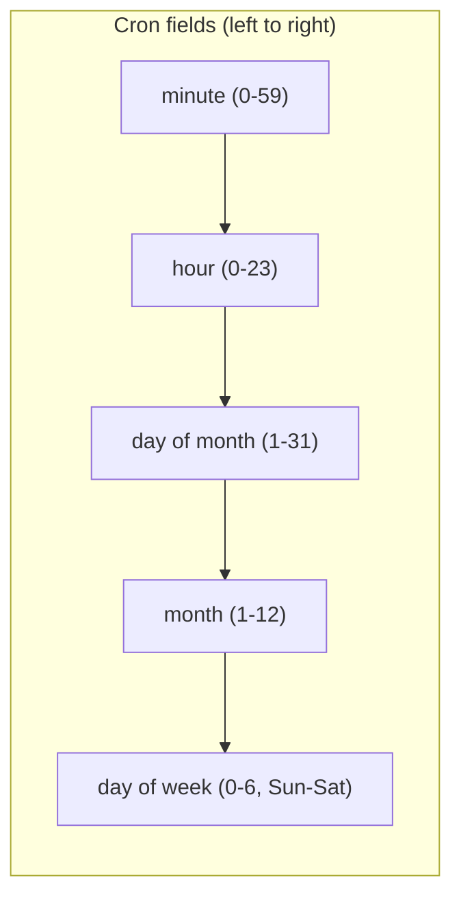

# Scheduled Commands

Scheduled commands allow you to execute distributed commands at specific times, on recurring schedules, or when conditions are met. This powerful feature enables time-based workflows, automated maintenance tasks, delayed processing, and event-driven automation.

## Overview

The scheduled command system extends Motet's distributed command architecture with comprehensive scheduling capabilities:

- **Delayed Execution**: Execute commands at a specific future time
- **Recurring Schedules**: Run commands on cron-like schedules
- **Conditional Execution**: Execute when system conditions are met
- **Worker Targeting**: Control which workers execute scheduled commands
- **Schedule Management**: Create, modify, suspend, resume, and cancel schedules
- **Full Observability**: Complete integration with tracing and monitoring

## Schedule Types

Motet supports four types of command scheduling:

### 1. Immediate (Default)

Execute the command right away (standard behavior).

```python
from motet.core.commands.distributed import ScheduleType
from motet.core.orchestration.turn import agent_turn
from motet.core.commands.command_data_classes import AgentTurnData

result = motet.do(
    agent_turn,
    data=AgentTurnData(messages=[{"role": "user", "content": "What is AI?"}]),
    schedule_type=ScheduleType.IMMEDIATE  # Default, can be omitted
)
```

### 2. Delayed (One-Time)

Execute the command at a specific future datetime.

```python
from datetime import datetime, timedelta

# Execute in 2 hours
execute_at = datetime.now() + timedelta(hours=2)

schedule_id = motet.do(
    ScheduleCommand,
    data=ScheduleData(
        target_command_type="agent_turn",
        target_command_data={
            "messages": [{"role": "user", "content": "Daily summary"}],
        },
        schedule_type="delayed",
        scheduled_at=execute_at
    )
)
```

### 3. Recurring (Cron-Based)

Execute the command on a recurring schedule using cron expressions or intervals.

```python
# Run every weekday at 9 AM
schedule_id = motet.do(
    ScheduleCommand,
    data=ScheduleData(
        target_command_type="agent_turn",
        target_command_data={
            "messages": [{"role": "user", "content": "Daily report"}]
        },
        schedule_type="recurring",
        cron_expression="0 9 * * MON-FRI",  # Cron expression
    )
)
```

`ScheduleData` carries no end date or execution cap. To bound a recurring
schedule, schedule the command **directly** and pass the bounds as
`motet.do()` arguments — they live on the command's distributed context,
not on the payload:

```python
motet.do(
    agent_turn,
    data=AgentTurnData(messages=[{"role": "user", "content": "Daily report"}]),
    schedule_type=ScheduleType.RECURRING,
    cron_expression="0 9 * * MON-FRI",
    recurring_until=datetime(2026, 12, 31),  # end date
    max_executions=260,                      # execution cap
)
```

**Interval-based recurring:**

```python
# Run every 30 minutes
schedule_id = motet.do(
    ScheduleCommand,
    data=ScheduleData(
        target_command_type="monitoring_check",
        target_command_data={"system": "production"},
        schedule_type="recurring",
        interval_seconds=1800,  # 30 minutes
    )
)
```

### 4. Conditional (Event-Driven)

Execute when a system condition is met.

```python
# Execute when queue depth exceeds threshold
schedule_id = motet.do(
    ScheduleCommand,
    data=ScheduleData(
        target_command_type="scale_up",
        target_command_data={"resource": "workers"},
        schedule_type="conditional",
        condition_expression="queue_depth > 1000",
    )
)
```

## Creating Scheduled Commands

### Using ScheduleCommand

The recommended way to schedule commands:

```python
from motet.core.commands.builtin.schedule import ScheduleCommand, ScheduleData

# Schedule an agent turn for tomorrow at 9 AM
tomorrow_9am = datetime.now().replace(hour=9, minute=0) + timedelta(days=1)

result = motet.do(
    ScheduleCommand,
    data=ScheduleData(
        name="Daily Analysis",  # Optional name for identification
        target_command_type="agent_turn",
        target_command_data={
            "messages": [
                {"role": "user", "content": "Analyze yesterday's metrics"}
            ],
        },
        schedule_type="delayed",
        scheduled_at=tomorrow_9am,
        timeout_seconds=300,
        priority=5,
        max_retries=3
    )
)

schedule_id = result["schedule_id"]
logger.info(f"Scheduled command: {schedule_id}")
```

### Schedule with Worker Targeting

Control which workers execute your scheduled command:

```python
result = motet.do(
    ScheduleCommand,
    data=ScheduleData(
        name="GPU Analysis",
        target_command_type="agent_turn",
        target_command_data={
            "messages": [{"role": "user", "content": "Process images"}],
        },
        schedule_type="delayed",
        scheduled_at=tomorrow_9am,
        # Worker targeting
        target_worker_id="gpu-worker-01",  # Force specific worker
        preferred_worker_ids=["gpu-worker-01", "gpu-worker-02"],  # Preference order
        worker_affinity="image-processing",  # Affinity key for consistency
        avoid_worker_ids=["cpu-worker-01"]  # Workers to avoid
    )
)
```

## Cron Expressions

Cron expressions allow flexible recurring schedules:

### Cron Format



Example: `* * * * *` means every minute (all fields are wildcards).

### Common Examples

```python
# Every day at midnight
"0 0 * * *"

# Every hour
"0 * * * *"

# Every 15 minutes
"*/15 * * * *"

# Weekdays at 9 AM
"0 9 * * MON-FRI"

# First day of month at noon
"0 12 1 * *"

# Every Monday and Friday at 6 PM
"0 18 * * MON,FRI"
```

### Cron Validation

```python
from motet.core.orchestration.scheduling.cron_utils import (
    validate_cron_expression,
    describe_cron_expression,
    get_next_execution_from_cron
)

cron = "0 9 * * MON-FRI"

# Validate
if validate_cron_expression(cron):
    # Get human-readable description
    description = describe_cron_expression(cron)
    print(f"Schedule: {description}")
    # Output: "At 09:00 AM, Monday through Friday"
    
    # Calculate next execution
    next_run = get_next_execution_from_cron(cron)
    print(f"Next execution: {next_run}")
```

## Schedule Management

### List Schedules

```python
from motet.core.orchestration.scheduling.manager import ScheduledCommandManager
from motet.core.orchestration.scheduling.models import ScheduleFilter, ScheduleStatus

manager = ScheduledCommandManager()

# Get all active schedules
schedules = manager.list_schedules(
    ScheduleFilter(status=ScheduleStatus.ACTIVE)
)

for schedule in schedules:
    print(f"Schedule: {schedule.name or schedule.schedule_id}")
    print(f"  Type: {schedule.schedule_type}")
    print(f"  Next execution: {schedule.next_execution_at}")
    print(f"  Executions: {schedule.execution_count}")
```

### Filter Schedules

```python
from motet.core.commands.distributed import ScheduleType

# Filter by type
recurring_schedules = manager.list_schedules(
    ScheduleFilter(schedule_type=ScheduleType.RECURRING)
)

# Filter by tenant
tenant_schedules = manager.list_schedules(
    ScheduleFilter(tenant_id="acme-corp")
)

# Filter by time range
recent_schedules = manager.list_schedules(
    ScheduleFilter(created_after=datetime.now() - timedelta(days=7))
)
```

### Suspend Schedule

Pause a schedule without deleting it:

```python
success = manager.suspend_schedule(schedule_id)
if success:
    logger.info(f"Schedule {schedule_id} suspended")
```

### Resume Schedule

Resume a suspended schedule:

```python
success = manager.resume_schedule(schedule_id)
if success:
    logger.info(f"Schedule {schedule_id} resumed")
```

### Cancel Schedule

Permanently cancel and delete a schedule:

```python
success = manager.cancel_schedule(schedule_id)
if success:
    logger.info(f"Schedule {schedule_id} cancelled")
```

### Modify Schedule

Update schedule parameters:

```python
success = manager.modify_schedule(
    schedule_id,
    updates={
        "cron_expression": "0 10 * * *",  # Change to 10 AM
        "max_executions": 100
    }
)
```

## Worker Targeting

Scheduled commands support comprehensive worker targeting to ensure execution on appropriate workers:

### Target Specific Worker

Force execution on a specific worker:

```python
data=ScheduleData(
    # ... other fields ...
    target_worker_id="gpu-worker-01"
)
```

### Preferred Workers

Specify preferred workers in priority order:

```python
data=ScheduleData(
    # ... other fields ...
    preferred_worker_ids=["fast-worker-01", "fast-worker-02", "backup-worker"]
)
```

### Worker Affinity

Use affinity keys for consistent worker selection:

```python
data=ScheduleData(
    # ... other fields ...
    worker_affinity="user-session-abc123"
)
```

### Avoid Workers

Exclude specific workers:

```python
data=ScheduleData(
    # ... other fields ...
    avoid_worker_ids=["maintenance-worker", "slow-worker-01"]
)
```

### Combined Targeting

Use multiple targeting options together:

```python
data=ScheduleData(
    name="Stateful Processing",
    target_command_type="data_processing",
    target_command_data={"dataset": "large"},
    schedule_type="recurring",
    cron_expression="0 2 * * *",  # 2 AM daily
    # Prefer GPU workers, avoid CPU-only workers, use affinity for consistency
    preferred_worker_ids=["gpu-worker-01", "gpu-worker-02"],
    worker_affinity="batch-processing",
    avoid_worker_ids=["cpu-worker-01", "cpu-worker-02"]
)
```

## Schedule Lifecycle

### Schedule States

Schedules transition through these states:

- **ACTIVE**: Schedule is active and will execute
- **SUSPENDED**: Schedule is paused
- **COMPLETED**: Schedule finished (delayed or max executions reached)
- **CANCELLED**: Schedule was manually cancelled
- **FAILED**: Schedule failed repeatedly

### Execution Tracking

```python
# Get schedule details
schedule = manager.get_schedule(schedule_id)

print(f"Status: {schedule.status}")
print(f"Execution count: {schedule.execution_count}")
print(f"Last execution: {schedule.last_execution_at}")
print(f"Next execution: {schedule.next_execution_at}")
print(f"Consecutive failures: {schedule.consecutive_failures}")
```

### Execution History

The schedule record itself carries the last outcome, which is enough for most
checks:

```python
schedule = manager.get_schedule(schedule_id)

print(f"Executions: {schedule.execution_count}")
print(f"Last run: {schedule.last_execution_at}")
print(f"Last error: {schedule.last_error}")
print(f"Consecutive failures: {schedule.consecutive_failures}")
```

For the full run-by-run history, read `execution_history` off the schedule
detail response (`GET /api/v1/schedules/{schedule_id}`, or `motet-cli schedules
get <id>`). The manager records results but does not expose a history getter.

## Complete Examples

### Example 1: Daily Report Generation

```python
from datetime import datetime, time
from motet.core.commands.builtin.schedule import ScheduleCommand, ScheduleData

# Generate report every weekday at 9 AM
result = motet.do(
    ScheduleCommand,
    data=ScheduleData(
        name="Daily Sales Report",
        target_command_type="agent_turn",
        target_command_data={
            "messages": [
                {"role": "user", "content": "Generate daily sales summary for yesterday"}
            ],
        },
        schedule_type="recurring",
        cron_expression="0 9 * * MON-FRI",
        # Execute on analytics worker
        preferred_worker_ids=["analytics-worker-01"],
        worker_affinity="daily-reports",
        timeout_seconds=600,
        priority=7
    )
)

logger.info(f"Daily report scheduled: {result['schedule_id']}")
```

### Example 2: Delayed Data Processing

```python
# Process data in 2 hours
process_time = datetime.now() + timedelta(hours=2)

result = motet.do(
    ScheduleCommand,
    data=ScheduleData(
        name="Batch Data Processing",
        target_command_type="data_processing",
        target_command_data={
            "dataset": "customer_transactions",
            "operation": "aggregate"
        },
        schedule_type="delayed",
        scheduled_at=process_time,
        # Use GPU worker for processing
        target_worker_id="gpu-worker-01",
        timeout_seconds=3600,
        max_retries=2
    )
)
```

### Example 3: Recurring Maintenance

```python
# Run maintenance every 30 minutes
result = motet.do(
    ScheduleCommand,
    data=ScheduleData(
        name="Cache Cleanup",
        target_command_type="maintenance",
        target_command_data={
            "operation": "clear_expired_cache"
        },
        schedule_type="recurring",
        interval_seconds=1800,  # 30 minutes; recurring schedules run until cancelled
        # Use any available worker
        priority=3
    )
)
```

### Example 4: Conditional Scaling

```python
# Auto-scale when queue depth is high
result = motet.do(
    ScheduleCommand,
    data=ScheduleData(
        name="Auto Scale Workers",
        target_command_type="scale_workers",
        target_command_data={
            "action": "scale_up",
            "resource": "worker_pool"
        },
        schedule_type="conditional",
        condition_expression="queue_depth > 1000",
        # Execute on orchestrator worker
        worker_affinity="orchestration",
        timeout_seconds=300
    )
)
```

## API Integration

### REST API Endpoints

```bash
# List schedules
curl http://localhost:8000/api/v1/schedules

# Get schedule details
curl http://localhost:8000/api/v1/schedules/{schedule_id}

# Create schedule
curl -X POST http://localhost:8000/api/v1/schedules \
  -H "Content-Type: application/json" \
  -d '{
    "name": "Daily Report",
    "target_command_type": "agent_turn",
    "target_command_data": {"messages": [{"role": "user", "content": "Summary"}]},
    "schedule_type": "recurring",
    "cron_expression": "0 9 * * *"
  }'

# Suspend schedule
curl -X POST http://localhost:8000/api/v1/schedules/{schedule_id}/suspend

# Resume schedule
curl -X POST http://localhost:8000/api/v1/schedules/{schedule_id}/resume

# Delete schedule
curl -X DELETE http://localhost:8000/api/v1/schedules/{schedule_id}
```

### Python API Client

```python
import requests

BASE_URL = "http://localhost:8000/api/v1"

# Create schedule
response = requests.post(
    f"{BASE_URL}/schedules",
    json={
        "name": "Hourly Check",
        "target_command_type": "monitoring",
        "target_command_data": {"system": "production"},
        "schedule_type": "recurring",
        "cron_expression": "0 * * * *"
    }
)

schedule_id = response.json()["schedule_id"]

# Get schedule status
response = requests.get(f"{BASE_URL}/schedules/{schedule_id}")
schedule = response.json()

print(f"Next execution: {schedule['next_execution_at']}")
```

## Best Practices

### 1. Use Descriptive Names

```python
# ✅ CORRECT: Descriptive name
data=ScheduleData(
    name="Daily Customer Analytics Report - 9 AM",
    # ...
)

# ❌ WRONG: No name or unclear name
data=ScheduleData(
    name="task1",
    # ...
)
```

### 2. Set Appropriate Timeouts

```python
# ✅ CORRECT: Reasonable timeout for task
data=ScheduleData(
    # ...
    timeout_seconds=600,  # 10 minutes for report generation
)

# ❌ WRONG: Too short or too long
data=ScheduleData(
    timeout_seconds=10,  # Too short for complex task
)
```

### 3. Use Worker Targeting for Stateful Tasks

```python
# ✅ CORRECT: Target workers with required state
data=ScheduleData(
    # ...
    worker_affinity="session-data",  # Consistent worker selection
    preferred_worker_ids=["stateful-worker-01"]
)

# ❌ WRONG: No targeting for stateful operations
data=ScheduleData(
    # ... stateful task with no targeting
)
```

### 4. Set Execution Limits for Recurring Schedules

Bounds are set on the command, not in `ScheduleData`:

```python
# ✅ CORRECT: Define end conditions as motet.do() arguments
motet.do(
    my_command,
    data=MyData(...),
    schedule_type=ScheduleType.RECURRING,
    cron_expression="0 * * * *",
    max_executions=720,                 # 30 days of hourly runs
    recurring_until=datetime(2026, 1, 31),
)

# ❌ WRONG: Unbounded recurring schedule
data=ScheduleData(
    schedule_type="recurring",
    cron_expression="*/1 * * * *",  # Every minute, forever
    # No limits!
)
```

### 5. Handle Schedule Failures

```python
# Monitor schedule health
schedule = manager.get_schedule(schedule_id)

if schedule.consecutive_failures >= 3:
    logger.warning(
        f"Schedule {schedule_id} has {schedule.consecutive_failures} consecutive failures"
    )
    # Take action: modify schedule, alert, or cancel
    if schedule.consecutive_failures >= schedule.max_consecutive_failures:
        manager.cancel_schedule(schedule_id)
        logger.error(f"Cancelled failing schedule {schedule_id}")
```

### 6. Validate Cron Expressions

```python
from motet.core.orchestration.scheduling.cron_utils import validate_cron_expression

# ✅ CORRECT: Validate before scheduling
cron = "0 9 * * MON-FRI"
if validate_cron_expression(cron):
    data = ScheduleData(
        cron_expression=cron,
        # ...
    )
else:
    raise ValueError(f"Invalid cron expression: {cron}")

# ❌ WRONG: No validation
data = ScheduleData(
    cron_expression="invalid cron",  # Will fail at schedule time
    # ...
)
```

## Monitoring and Debugging

### Check Schedule Status

```python
# Get all schedules with their status
schedules = manager.list_schedules()

for schedule in schedules:
    logger.info(
        f"Schedule {schedule.name}",
        schedule_id=schedule.schedule_id,
        status=schedule.status,
        executions=schedule.execution_count,
        failures=schedule.consecutive_failures,
        next_run=schedule.next_execution_at
    )
```

### View Execution History

Execution records are not on the manager — they come back with the schedule
detail response, so fetch them through the API or the CLI:

```bash
# Schedule config plus its recent execution records
motet-cli schedules get <schedule_id>

curl -H "Authorization: Bearer <token>" \
  http://localhost:8000/api/v1/schedules/<schedule_id>
```

The response is `{"schedule": {...}, "execution_history": [...]}`, where each
record carries the outcome of one run.

The CLI is usually the faster way in when a schedule is misbehaving:

```bash
motet-cli schedules list              # what exists, and its status
motet-cli schedules get <id>          # config + execution history
motet-cli schedules stats             # aggregate counts
motet-cli schedules suspend <id>      # stop without deleting
motet-cli schedules resume <id>
motet-cli schedules cancel <id>
```

### Debug Schedule Issues

```python
# Common debugging steps
schedule = manager.get_schedule(schedule_id)

# 1. Check schedule status
if schedule.status != ScheduleStatus.ACTIVE:
    logger.warning(f"Schedule is {schedule.status}, not active")

# 2. Check next execution time
if schedule.next_execution_at and schedule.next_execution_at < datetime.now():
    logger.warning("Schedule is past due")

# 3. Check failure count
if schedule.consecutive_failures > 0:
    logger.warning(f"Schedule has {schedule.consecutive_failures} failures")
    
# 4. Check execution limits
if schedule.max_executions and schedule.execution_count >= schedule.max_executions:
    logger.info("Schedule reached max executions")
```

## Troubleshooting

### Schedule Not Executing

**Symptoms**: Schedule created but never executes

**Diagnosis**:
```bash
# Check schedule status
curl http://localhost:8000/api/v1/schedules/{schedule_id}

# Check scheduler is running
motet-cli local status

# Check Redis
redis-cli
> KEYS schedules:*
> HGETALL schedules:active:{schedule_id}
```

**Solutions**:
1. Ensure the scheduler is running
2. Verify cron expression is valid
3. Check schedule is ACTIVE status
4. Verify scheduled_at is in the future
5. Check worker availability

### Recurring Schedule Skipping Executions

**Symptoms**: Recurring schedule missing executions

**Diagnosis**:
```python
schedule = manager.get_schedule(schedule_id)
print(f"Last execution: {schedule.last_execution_at}")
print(f"Next execution: {schedule.next_execution_at}")
print(f"Execution count: {schedule.execution_count}")
```

**Solutions**:
1. Check clock synchronization across workers
2. Verify scheduler check interval (default: 2 seconds)
3. Check for concurrent execution limits
4. Verify worker capacity isn't exhausted

### Schedule Failed Status

**Symptoms**: Schedule marked as FAILED

**Diagnosis**:
```python
schedule = manager.get_schedule(schedule_id)
print(f"Consecutive failures: {schedule.consecutive_failures}")
print(f"Max failures: {schedule.max_consecutive_failures}")
print(f"Last error: {schedule.last_error}")
```

For the runs leading up to the failure, read the execution history:

```bash
motet-cli schedules get <schedule_id>
```

**Solutions**:
1. Review execution errors
2. Fix underlying command issues
3. Increase max_consecutive_failures if transient
4. Resume schedule after fixing issues
5. Modify schedule to reduce timeout/retries

## Example Bundle: background-thinker

The **background-thinker** SDK bundle (`motet-sdk/examples/bundles/background-thinker/`) is a complete, runnable example that demonstrates all the scheduling patterns described in this guide:

- **Recurring schedules** (interval and cron) — `start_thinking` command
- **Delayed one-shot schedules** — `start_thinking` with `mode="delayed"`
- **Schedule lifecycle management** (cancel/suspend/resume) — `stop_thinking` command
- **Schedule creation from tools** — `start_thinking_tool` using `ctx.schedules.create()`
- **Memory-based schedule discovery** — storing/retrieving schedule IDs by topic

The bundle implements a "background subconscious" where a recurring schedule triggers periodic LLM reflection on a topic, building progressively deeper insights stored in memory. See [Example Bundles](./26-example-bundles.md#background-thinker--scheduled-commands-for-autonomous-reflection) for code excerpts.

## Next Steps

Now that you understand scheduled commands:

- **[Streaming Responses](./13-streaming-responses.md)** - Learn about real-time streaming
- **[Local Development Setup](./14-local-development-setup.md)** - Set up scheduling in dev
- **[Common Patterns](./25-common-patterns.md)** - Learn scheduling patterns
- **[Configuration Reference](./29-configuration-reference.md)** - Configure scheduling

## Navigation

- **[← Back to Documentation Home](./00-landing-page.md)** - Main documentation hub

---

**Last Updated**: 2026-08-24
