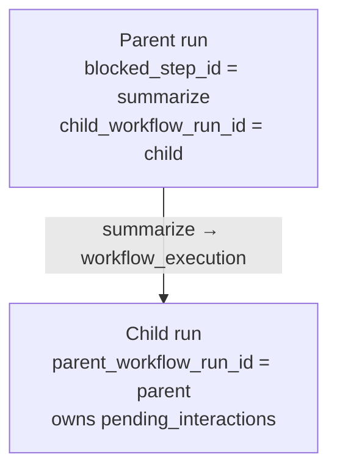
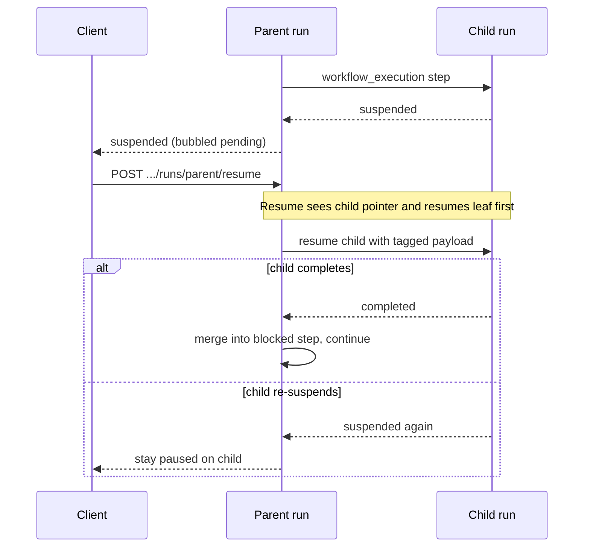

# Building Workflows

This tutorial walks you through building a complete workflow from definition to execution. You'll learn how to create workflows, manage dependencies, handle conditional execution, and register workflows for reuse.

## Overview

This tutorial uses **Python** to define and register workflows. Two other authoring paths exist:

- **Bundle YAML** — define workflows under the bundle’s `workflows/` directory; they load on deploy and are namespaced by bundle id. See [Workflow System – Bundle workflows (YAML)](./11-workflow-system.md#bundle-workflows-yaml).
- **Runtime `user.*` register** — validate/register YAML or JSON via HTTP, CLI, or the `core.workflow_builder` tool without deploying a bundle. See [Runtime-authored workflows](./11-workflow-system.md#runtime-authored-workflows-user) and [Runtime register via API or CLI](#runtime-register-via-api-or-cli) below.

We'll build a **document analysis workflow** that:
1. Extracts text from a document
2. Analyzes the text
3. Generates a summary
4. Stores results in memory
5. Handles errors with fallbacks

## Step 1: Define Workflow Steps

Create workflow definition:

```python
from motet.core.workflow import Workflow, WorkflowStep

document_analysis_workflow = Workflow(
    workflow_id="document_analysis",
    name="Document Analysis Workflow",
    description="Extract, analyze, and summarize documents",
    steps={
        "extract": WorkflowStep(
            step_id="extract",
            name="Extract",
            command_type="core.tool_execution",
            command_data={
                "tool_name": "core.file_read",
                "parameters": {"path": "{{document_path}}"}
            }
        ),
        "analyze": WorkflowStep(
            step_id="analyze",
            name="Analyze",
            command_type="core.agent_loop",
            command_data={
                "input": "Analyze: {{extract.content}}"
            },
            dependencies=["extract"]
        ),
        "summarize": WorkflowStep(
            step_id="summarize",
            name="Summarize",
            command_type="core.agent_loop",
            command_data={
                "input": "Summarize this text: {{extract.content}}"
            },
            dependencies=["extract"]
        ),
        "store": WorkflowStep(
            step_id="store",
            name="Store",
            command_type="core.tool_execution",
            command_data={
                "tool_name": "core.memory_store",
                "parameters": {"content": "{{summarize.result}}", "tags": ["document_analysis", "{{document_type}}"]}
            },
            dependencies=["summarize"]
        )
    }
)
```

## Step 2: Add Conditional Execution

Add skip conditions and fallbacks:

```python
document_analysis_workflow = Workflow(
    workflow_id="document_analysis",
    name="Document Analysis Workflow",
    description="Extract, analyze, and summarize documents",
    steps={
        "extract": WorkflowStep(
            step_id="extract",
            name="Extract",
            command_type="core.tool_execution",
            command_data={"tool_name": "core.file_read", "parameters": {"path": "{{document_path}}"}}
        ),
        "analyze": WorkflowStep(
            step_id="analyze",
            name="Analyze",
            command_type="core.agent_loop",
            command_data={"input": "Analyze: {{extract.content}}"},
            dependencies=["extract"],
            skip_condition="if_empty:extract.content"  # Skip if extract produced nothing
        ),
        "summarize": WorkflowStep(
            step_id="summarize",
            name="Summarize",
            command_type="core.agent_loop",
            command_data={
                "input": "Summarize: {{extract.content}}"
            },
            dependencies=["extract"],
            fallback_step_id="simple_summary"  # Fallback if the turn fails
        ),
        "simple_summary": WorkflowStep(
            step_id="simple_summary",
            name="Simple Summary",
            command_type="core.agent_loop",
            command_data={"input": "Analyze: {{extract.content}}"},
            dependencies=["extract"]
        ),
        "store": WorkflowStep(
            step_id="store",
            name="Store",
            command_type="core.tool_execution",
            command_data={
                "tool_name": "core.memory_store",
                "parameters": {"content": "{{summarize.result}}", "tags": ["document_analysis"]}
            },
            dependencies=["summarize"],
            skip_condition="if_failed:summarize"  # Skip if summarize failed
        )
    }
)
```

## Step 3: Define Workflow Inputs

Specify required inputs for LLM function calling:

```python
document_analysis_workflow = Workflow(
    workflow_id="document_analysis",
    name="Document Analysis Workflow",
    description="Extract, analyze, and summarize documents",
    required_inputs=["document_path", "document_type"],  # Required inputs
    input_parameters={  # Optional: detailed schemas
        "document_path": {
            "type": "string",
            "description": "Path to the document file"
        },
        "document_type": {
            "type": "string",
            "description": "Type of document (e.g., 'report', 'article')",
            "default": "document"
        }
    },
    steps={...}
)
```

## Step 4: Register Workflow

Register workflow in WorkflowRegistry (in-process / product code path):

```python
from motet.core.workflow import WorkflowRegistry

# Register workflow
WorkflowRegistry.register(document_analysis_workflow)

# Verify registration
workflow = WorkflowRegistry.get("document_analysis")
assert workflow is not None
```

For agent- or operator-authored YAML that should persist across workers without a bundle deploy, use the runtime path instead of calling `WorkflowRegistry.register` directly — see [Runtime register via API or CLI](#runtime-register-via-api-or-cli).

## Step 5: Execute Workflow

Execute workflow via WorkflowExecutor:

```python
from motet.core.workflow import WorkflowExecutor, WorkflowRegistry

# Get workflow
workflow = WorkflowRegistry.get("document_analysis")

# Prepare execution data
from motet.core.commands.command_data_classes import WorkflowExecutionData

execution_data = workflow.to_execution_data(
    context_overrides={
        "document_path": "/path/to/document.pdf",
        "document_type": "report"
    }
)

# Execute via command
from motet.core.commands.builtin.workflow import workflow_execution

result = motet.do(
    workflow_execution,
    data=execution_data
)
```

From inside another command, you can also run a registered workflow by id using the **workflows helper**: `motet.workflows.list()`, `motet.workflows.get(workflow_id)`, and `motet.workflows.run(workflow_id, context={...})`. See [Distributed Command System](./07-distributed-command-system.md) and [Workflow System](./11-workflow-system.md) for when to use the helper vs the executor or `motet.do(workflow_execution, ...)`.

## Step 6: Test Workflow

Write tests for workflow:

```python
"""Tests for document analysis workflow."""

import pytest
from unittest.mock import Mock
from motet.core.workflow import WorkflowRegistry, WorkflowExecutor

@pytest.fixture
def mock_motet():
    """Create mock motet context."""
    motet = Mock()
    motet.do = Mock(return_value={"result": "test"})
    return motet

def test_workflow_registration():
    """Test workflow registration."""
    workflow = WorkflowRegistry.get("document_analysis")
    assert workflow is not None
    assert workflow.workflow_id == "document_analysis"

def test_workflow_execution(mock_motet):
    """Test workflow execution."""
    workflow = WorkflowRegistry.get("document_analysis")
    executor = WorkflowExecutor()
    
    # Set up context
    workflow.context = {
        "document_path": "/test/path",
        "document_type": "test"
    }
    
    result = executor.execute_workflow(workflow, mock_motet)
    assert result["status"] == "completed"
```

## Step 7: LLM Function Calling

Export workflow for LLM function calling:

```python
# Workflows automatically exported for LLM function calling
schemas = WorkflowRegistry.export_for_llm_function_calling()

# LLM can discover and call workflows (use model_inference / model_stream, not motet.agent)
from motet.core.commands.builtin.model import model_inference
from motet.core.commands.command_data_classes import ModelInferenceData
response = motet.do(model_inference, data=ModelInferenceData(
    messages=[{"role": "user", "content": "Analyze the document at /path/to/document.pdf"}]
))
# LLM automatically discovers and calls document_analysis workflow
```

## Complete Example

Here's a complete workflow example:

```python
"""
Motet - Document Analysis Workflow

A complete workflow for document analysis.
"""

from motet.core.workflow import Workflow, WorkflowStep, WorkflowRegistry

# Define workflow
document_analysis_workflow = Workflow(
    workflow_id="document_analysis",
    name="Document Analysis Workflow",
    description="Extract, analyze, and summarize documents with error handling",
    required_inputs=["document_path"],
    input_parameters={
        "document_path": {
            "type": "string",
            "description": "Path to the document file"
        },
        "document_type": {
            "type": "string",
            "description": "Type of document",
            "default": "document"
        }
    },
    steps={
        "extract": WorkflowStep(
            step_id="extract",
            name="Extract",
            command_type="core.tool_execution",
            command_data={
                "tool_name": "core.file_read",
                "parameters": {"path": "{{document_path}}"}
            }
        ),
        "analyze": WorkflowStep(
            step_id="analyze",
            name="Analyze",
            command_type="core.agent_loop",
            command_data={
                "input": "Analyze: {{extract.content}}"
            },
            dependencies=["extract"],
            skip_condition="if_empty:extract.content"
        ),
        "summarize": WorkflowStep(
            step_id="summarize",
            name="Summarize",
            command_type="core.agent_loop",
            command_data={
                "input": "Summarize this document: {{extract.content}}"
            },
            dependencies=["extract"],
            fallback_step_id="simple_summary"
        ),
        "simple_summary": WorkflowStep(
            step_id="simple_summary",
            name="Simple Summary",
            command_type="core.agent_loop",
            command_data={"input": "{{extract.content}}"},
            dependencies=["extract"]
        ),
        "store": WorkflowStep(
            step_id="store",
            name="Store",
            command_type="core.tool_execution",
            command_data={
                "tool_name": "core.memory_store",
                "parameters": {"content": "{{summarize.result}}", "tags": ["document_analysis", "{{document_type}}"]}
            },
            dependencies=["summarize"],
            skip_condition="if_failed:summarize"
        )
    }
)

# Register workflow
WorkflowRegistry.register(document_analysis_workflow)
```

## Best Practices

### 1. Use Descriptive Step IDs

```python
# ✅ CORRECT: Descriptive step IDs
"extract_text": WorkflowStep(...),
"analyze_content": WorkflowStep(...),
"store_results": WorkflowStep(...),
```

### 2. Define Clear Dependencies

```python
# ✅ CORRECT: Clear dependencies
"process": WorkflowStep(
    dependencies=["extract"],  # Clear dependency
    ...
)
```

### 3. Use Context References

```python
# ✅ CORRECT: Reference step results
command_data={
    "input": "{{extract.result}}"  # MCP envelope; unwrap with mcp_text
}
```

### 4. Handle Errors with Fallbacks

```python
# ✅ CORRECT: Include fallback steps
"main": WorkflowStep(
    fallback_step_id="fallback",  # Fallback on error
    ...
)
```

### 5. Use Skip Conditions

```python
# ✅ CORRECT: Skip steps conditionally
"optional": WorkflowStep(
    skip_condition="if_empty:previous.result",  # Skip when the prior step produced nothing
    ...
)
```

### 6. Pause for client tools or human input

Tool steps default to Motet ownership (server executes). To hand a tool to the
client mid-workflow, set `ownership: handback` and name the client tool. The
workflow pauses, returns pending tool calls, and continues after
`resume_workflow` (or `POST /api/v1/workflows/runs/{workflow_run_id}/resume`).
When nested under an agent turn, handback also surfaces as ordinary tool calls
the client answers before the turn resumes.

```yaml
read_local:
  command_type: core.tool_execution
  ownership: handback
  command_data:
    tool_name: ReadFile
    parameters:
      target_file: "{{ inputs.path }}"
```

For human answers use `type: elicitation` with a JSON `schema`. For approve/
reject before Motet runs a tool, set `requires_confirmation: true` (ownership
stays Motet). Those pauses are supported by the workflow engine and HTTP resume
API, but **not** by the agent chat / OpenAI-compatible facade yet — resume them
with the tagged `resume_workflow` payload (`kind=elicitation` + `answers`, or
`kind=confirmation` + `decision`). Existing workflows omit these fields and
behave as before.

Operators can also pause or cancel a **run** (one execution instance):

- `POST /api/v1/workflows/runs/{workflow_run_id}/pause` — freeze a running run
  at the next step-level boundary (`suspend_reason=operator`); resume with
  `kind=operator`. Already-paused runs are a no-op success.
- `POST /api/v1/workflows/runs/{workflow_run_id}/cancel` — abandon the run
  (`cancelled`). Paused runs cancel immediately; running runs stop at the next
  level boundary. Nested child runs (and a parent blocked on this child) are
  cancelled too.

Same surface via CLI:

```bash
motet-cli workflows runs list
motet-cli workflows runs get <workflow_run_id>
motet-cli workflows runs pause <workflow_run_id> --reason "hold for review"
motet-cli workflows runs resume <workflow_run_id> --kind operator
motet-cli workflows runs cancel <workflow_run_id>
```

In-flight steps finish before the boundary check; this is cooperative, not a
hard Celery revoke.

### 7. Call another workflow (or yourself)

Nesting is a **stack of runs**, not a cyclic dependency graph. Each nested call
starts a new execution (`workflow_run_id`) with its own step cursor. Self-calls
are allowed: same `workflow_id`, new run id. Depth is capped (default 5;
override with `max_nesting_depth` on the workflow). Do not combine nested
`workflow_execution` with `foreach` / `until` on the same step.

```yaml
# parent
research_and_summarize:
  steps:
    gather:
      command_type: core.tool_execution
      command_data:
        tool_name: core.web_search
        parameters:
          query: "{{ inputs.q }}"

    summarize:
      command_type: core.workflow_execution
      dependencies: [gather]
      command_data:
        workflow_id: summarize_and_store
        # or this same workflow_id for a self-call
```

#### How nesting interacts with pause / resume

When the **child** hits a pause (handback, elicitation, confirmation, OAuth):

1. The child checkpoints as paused and returns `status=suspended`.
2. The parent sees that on the nested step, pauses too, and stores
   `child_workflow_run_id` plus `blocked_step_id` (the step waiting on the child).
3. Pending interactions are bubbled on the parent’s suspended envelope so clients
   can see them, but the leaf run still owns the interaction records.



Resume always satisfies the **leaf** first, then unwinds parents:



| You resume… | What happens |
|-------------|--------------|
| Parent id (blocked on a child) | Engine resumes the leaf first, then auto-continues the parent in the same command |
| Child / leaf id | Resumes that frame; on complete, parents blocked on it continue automatically |
| Cancel on either | Cascades: cancelling a parent cancels its child; cancelling a leaf cancels a parent blocked on it |

See [Workflow System — Workflow runs](./11-workflow-system.md#workflow-runs-pause-resume-cancel)
for the run HTTP surface.

## Runtime register via API or CLI

Use this when you have a YAML (or JSON) workflow document and want Motet to validate it and optionally register it as a reusable `user.*` tool — without writing Python or deploying a bundle.

**1. Validate** (no side effects):

```bash
motet-cli workflows validate --yaml-file my_workflow.yaml
# or: POST /api/v1/workflows/validate with {"yaml": "..."}
```

**2. Register** (durable `user.<owner>.<local_id>`, callable as `workflow_user.<owner>.<local_id>`):

```bash
motet-cli workflows register --yaml-file my_workflow.yaml
# or: POST /api/v1/workflows/register with {"yaml": "...", "replace": false}
```

**3. Call** the registered workflow like any other `workflow_*` tool (chat, agent turn, or `motet.workflows.run` with the full `user.*` id).

**4. Export / unregister** when promoting to a bundle or cleaning up:

```bash
motet-cli workflows export user.acme.my_workflow   # bundle-shaped YAML
motet-cli workflows unregister user.acme.my_workflow
```

Agents can drive the same modes through the `core.workflow_builder` tool. When validate fails, read the YAML contract with `core.docs_read` (`doc_id=11-workflow-system`, section `YAML structure`) rather than guessing. Details: [Runtime-authored workflows](./11-workflow-system.md#runtime-authored-workflows-user) and [API Reference — Workflows HTTP](./28-api-reference.md#workflows-http).

## Next Steps

Now that you can build workflows:

- **[Testing Strategies](./18-testing-strategies.md)** - Learn testing best practices
- **[Common Patterns](./25-common-patterns.md)** - Learn reusable patterns
- **[Example Bundles](./26-example-bundles.md)** - See complete bundles

## Navigation

- **[← Back to Documentation Home](./00-landing-page.md)** - Main documentation hub

---

**Last Updated**: 2026-08-24
