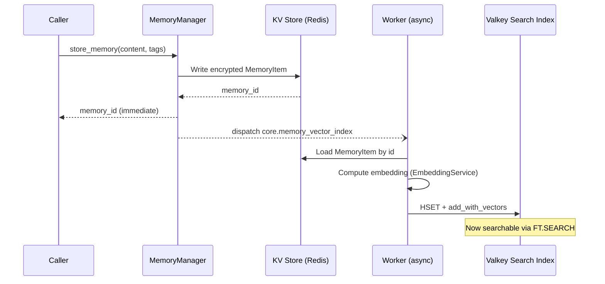
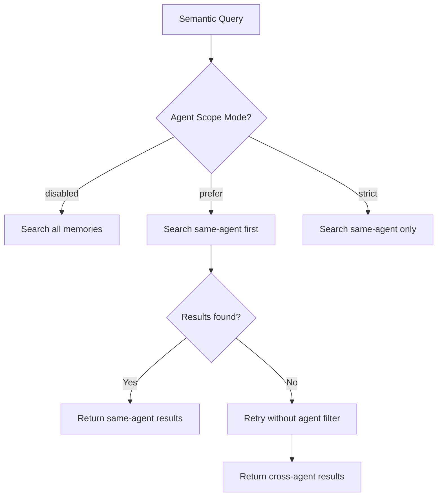

# Memory Management

Motet's memory system provides distributed memory operations with multiple tiers, hybrid retrieval, and optional consolidation. This section covers memory architecture, operations, and best practices.

## Memory Tiers

Motet has three tiers, and they are ordinary tags rather than separate stores you address differently. You choose a tier by tagging a memory `wm`, `stm`, or `ltm`; retrieval walks them in that order by default.

| Tier | Tag | Lives | Held in | For |
|------|-----|-------|---------|-----|
| Working | `wm` | One turn | Process memory | Scratch space for the turn in progress |
| Short-term | `stm` | The session | Redis | Conversation history and session state |
| Long-term | `ltm` | Indefinitely | Vector store (Valkey Search) | Knowledge worth keeping past the conversation |

Only `ltm` reaches the vector index and becomes semantically searchable. The other two are retrieved by tag.

## Memory Operations

There are two ways to reach memory, and they do not accept the same arguments.

`motet.memory.*` is the convenience form. It reads a fixed set of keywords and
**silently discards anything else** — no exception, no warning:

| Helper | Reads |
|--------|-------|
| `store` | `content`, `type`, `tags`, `metadata`, `long_term`, `scope_type` |
| `recall` | `query`, `limit`, `tags`, `min_relevance`, `conversation_id` |
| `tag` | `tags`, `op`, `memory_ids`, `conversation_id`, `filter_tag` |
| `forget` | `memory_ids`, `conversation_id`, `filter_tag` |

So `recall(mode="semantic")` returns keyword results and tells you nothing —
`mode` is not in that list. Reach for the command form when you need an option
the helper does not carry, and note that the two spell some arguments
differently (`op` on the helper, `operation` on the command):

```python
motet.do(memory_recall, data=MemoryRecallData(query="...", mode="semantic"))
```

The helper covers the common case; [Memory Operations via
Commands](#memory-operations-via-commands) below is the full surface.

### Store Memory

```python
@motet.command()
def store_memory(data: MemoryData, motet: MotetContext) -> Dict[str, Any]:
    """Store memory."""
    # Store in working memory
    motet.memory.store(
        content="Temporary data",
        tags=["wm", "temporary"]
    )
    
    # Store in short-term memory
    motet.memory.store(
        content="Session data",
        tags=["stm", "session"]
    )
    
    # Store in long-term memory
    motet.memory.store(
        content="Permanent knowledge",
        tags=["ltm", "knowledge"]
    )
    
    return {"status": "stored"}
```

### Retrieve Memory

```python
@motet.command()
def retrieve_memory(data: MemoryData, motet: MotetContext) -> Dict[str, Any]:
    """Retrieve memory."""
    # Recall from all tiers (default order: wm → stm → ltm)
    memories = motet.memory.recall(
        tags=["important"],
        limit=10
    )
    
    # Recall from a specific tier — tiers are tags, so filter on the tier tag
    stm_memories = motet.memory.recall(
        tags=["stm", "session"],
        limit=5
    )
    
    # Recall semantically rather than by keyword
    semantic_memories = motet.memory.recall(
        query="what did the customer ask for",
        tags=["ltm", "knowledge"],
        limit=5
    )
    
    return {"memories": memories}
```

### Tag Memory

```python
@motet.command()
def tag_memory(data: TagData, motet: MotetContext) -> Dict[str, Any]:
    """Tag memory items."""
    # Add tags to every memory in a conversation
    motet.memory.tag(
        conversation_id="abc",
        tags=["customer", "priority"],
        op="add",
    )
    
    # Replace the tags on specific IDs
    motet.memory.tag(
        memory_ids=["abc123"],
        tags=["project", "paid"],
        op="replace",
    )
    
    return {"status": "tagged"}
```

`op` accepts `add`, `remove`, or `replace`. Target items either by
`memory_ids`, or by `conversation_id` (optionally narrowed with
`filter_tag`). The return value is `{"updated": int, "ids": [...]}`.

### Forget Memory

```python
@motet.command()
def forget_memory(data: ForgetData, motet: MotetContext) -> Dict[str, Any]:
    """Delete targeted memory items."""
    motet.memory.forget(memory_ids=["abc123"])
    return {"status": "forgotten"}
```

Target items by `memory_ids`, or by `conversation_id` (optionally
narrowed with `filter_tag`). The return value is
`{"deleted": int, "ids": [...], "vector_deleted": int}`.

## Hybrid Retrieval

Recall combines three signals rather than picking one: keyword overlap against content and tags, vector similarity against embeddings, and a recency weighting that favours newer memories. You get all three by passing both a query and tags.

```python
memories = motet.memory.recall(
    query="customer feedback",
    tags=["feedback"],
    limit=10
)
```

Pass only `tags` and you get keyword retrieval, because there is nothing to embed. The `mode` argument selects a single strategy — `semantic` for vectors alone, `recent` for newest-first with no scoring — but the helper does not read it, so that choice has to go through the command form shown above.

## Memory Consolidation

Memory consolidation moves important short-term memories to long-term storage. There is no automatic background consolidation driven by env knobs; use the consolidation command or API when you want to run it.

### Manual Consolidation

Trigger consolidation via command:

```python
from motet.core.commands.builtin.memory import memory_consolidation, MemoryConsolidationData

@motet.command()
def consolidate_session_memories(data: SessionData, motet: MotetContext) -> Dict[str, Any]:
    """Consolidate memories for one conversation."""
    # Consolidation is scoped by conversation, not by an arbitrary session id
    result = motet.do(
        memory_consolidation,
        data=MemoryConsolidationData(
            conversation_id=data.conversation_id,
            max_items=100
        )
    )
    
    return {
        "consolidated": result["consolidated"],
        "conversation_id": data.conversation_id
    }
```

### Consolidation Criteria

Memories are evaluated for consolidation based on heuristics in the memory manager (content length, importance signals, recency, tags, and metadata). Pass `max_items` (and optional session/conversation filters) when invoking consolidation manually.

## Memory Scopes and Isolation

Motet provides hierarchical memory scoping for multi-tenant and multi-principal isolation.

### Tenant Isolation

Memory is automatically isolated by tenant:

```python
# Memory automatically scoped to tenant from MotetContext
motet.memory.store(
    content="Tenant-specific data",
    tags=["tenant_data"]
)
# Only accessible to same tenant
# Tenant ID comes from motet.tenant_id automatically
```

**How it works**:
- **Automatic Scoping**: Tenant ID from `MotetContext` automatically applied
- **Redis Keys**: Hierarchical keys include tenant ID: `memory:{tenant_id}:{memory_id}`
- **Vector Store**: Tenant ID included in metadata for filtering
- **Isolation**: Cross-tenant access prevented at storage layer

### Principal isolation

Memory is isolated per user the same way it is per tenant — automatically, from
the verified principal on the context. There is no `principal_id` parameter to
pass, and passing one does nothing:

```python
# Isolated to the current principal; nothing to declare
motet.memory.store(
    content="User prefers concise responses",
    tags=["personal"],
)
```

What you *can* choose is the **scope type**, which controls how a memory is
reached and how long it lives — not who can see it:

```python
motet.memory.store(
    content="Company policy: vacation requests require 2 weeks notice",
    tags=["policy"],
    scope_type="global",     # tenant-wide shared knowledge
)

motet.memory.store(
    content="User's timezone: PST",
    tags=["preference"],
    scope_type="principal",  # follows this user across conversations
)
```

| `scope_type` | Reach | Lifetime |
|--------------|-------|----------|
| `global` | Every user and conversation in the tenant | Durable |
| `principal` | One user, across their conversations | Durable |
| `conversation` | One conversation | Cleaned up when it ends |
| `task` | One task | Cleaned up when it completes |
| `collective` | Cross-worker insights promoted by consensus | Durable |
| `background` | Written by scheduled reflection tasks | Durable |

The distinction that matters: `scope_type="global"` widens reach *within* the
tenant. It is not a way out of the tenant.

### Conversation Scoping

Memory can be scoped to conversations. Chat prepare/recall filters conversation
scope using the `conversation:<id>` **tag** (not only the `conversation_id`
field on the stored row).

When a memory is stored with a conversation id in context (or via the store API
`conversation_id`), `MemoryManager.store_memory` automatically adds
`conversation:<id>` to the item's tags so chat hybrid retrieval can find it.

```python
# Memory scoped to conversation (conversation_id from MotetContext is enough)
motet.memory.store(
    content="Conversation context",
    tags=["note"],
)
# Internally adds: tag "conversation:<motet.conversation_id>" when present
```

You can also pass the tag explicitly; store will not duplicate it.

### Agent Segmentation

When multiple agents run within the same motet, each agent's memories are tagged with its identity so retrieval can be scoped per-agent or across agents. Agent scope is a soft policy **inside** the same principal and tenant — memories are not shared across principals.

**How it works on write:**

When a memory is stored, `MemoryManager.store_memory` automatically:
1. Sets `metadata["agent_id"]` to the active agent ID
2. Adds an `agent:<agent_id>` tag to the item's tag list (prefix configurable via `MOTET_MEMORY_AGENT_TAG_PREFIX`)
3. Writes the raw `agent_id` to a dedicated TAG field in the vector index (for efficient server-side filtering)
4. Adds `conversation:<id>` when a conversation id is present (see Conversation Scoping)

```python
# Memory automatically tagged with the current agent
motet.memory.store(
    content="Research findings about competitors",
    tags=["research", "ltm"]
)
# Internally adds: tag "agent:core.research", metadata["agent_id"] = "core.research"
```

**Scope modes** (`MOTET_MEMORY_AGENT_SCOPE_MODE`):

| Mode | Behavior | Use Case |
|------|----------|----------|
| `disabled` | No agent filtering; all agents see all memories | Simple single-agent deployments |
| `prefer` (default) | Try same-agent first; if no results, fall back to cross-agent | Multi-agent with knowledge sharing |
| `strict` | Only return memories from the same agent | Hard isolation between agents |

Chat stamps the API Config value of `memory_agent_scope_mode` into turn context
metadata. Workers honor that override during prepare/recall so the gateway
setting applies even when worker boot env differs (keep API and workers aligned
in production).

**How it works on read:**

- **`strict`**: Semantic queries include `@agent_id:{core.research}` in the FT.SEARCH predicate. Only memories from the querying agent are returned.
- **`prefer`**: Queries first with the agent filter. If zero results, retries without it (cross-agent fallback). This balances agent specialization with shared knowledge.
- **`disabled`**: No agent filter applied; all memories are candidates.

```python
# In a command running as agent "core.research":
memories = motet.memory.recall(
    query="competitor analysis",
    tags=["ltm"],
    limit=5
)
# prefer mode: returns core.research memories first;
# falls back to all agents if none found
```

**Configuration:**

```bash
# Agent scope mode
export MOTET_MEMORY_AGENT_SCOPE_MODE=prefer  # disabled|prefer|strict

# Agent tag prefix (default: "agent:")
export MOTET_MEMORY_AGENT_TAG_PREFIX=agent:
```

### How the dimensions stack

Every stored memory carries the full hierarchy:

```
Motet → Tenant → Principal → Agent → Conversation → Memory
```

All of them are applied as TAG predicates in the vector index, so filtering
happens server-side in Valkey Search rather than as a post-filter.

Every one of these is stamped from the context at write time. Motet id, tenant,
and principal come from the verified request; agent and conversation come from
the turn. None of them is a parameter:

```python
# Everything above is applied automatically
motet.memory.store(
    content="Scoped data",
    tags=["scoped"],
)
```

This is deliberate. If isolation were a keyword argument, a command that
forwarded user-controlled input into `store()` would be a cross-tenant write.
Because the values come from the verified principal instead, there is no
argument to get wrong — the three isolation levels are not addressable from
command code at all.

### Scope Isolation Enforcement

Motet enforces isolation at multiple levels:

1. **Storage Layer**: Redis keys and vector metadata include scope
2. **Retrieval Layer**: Queries automatically filter by scope
3. **API Layer**: Principal/tenant context validated
4. **Command Layer**: MotetContext provides scoped access
5. **Vector Index**: Dedicated TAG fields for `tenant_id`, `principal_id`, `agent_id`, `conversation_id` enable server-side filtering in FT.SEARCH

**Configuration**:

```bash
# Tag every memory with tenant:{id} and filter reads by that tag.
# Also makes tenant_id mandatory on memory commands rather than merely expected.
export MOTET_TENANT_ENFORCE_MEMORY_FILTER=true

# Agent scope mode
export MOTET_MEMORY_AGENT_SCOPE_MODE=prefer  # disabled|prefer|strict
```

This flag is defense in depth, not the isolation boundary itself. Tenant
scoping already comes from the verified principal and the `{tenant_id}:mem:…`
key prefix; the flag adds a tag-level filter on top. See
[Security & Multi-Tenancy](./22-security-multi-tenancy.md#2-enforce-tenant-isolation).

## Agent memory tools

The default agent catalog exposes two memory tools (keyword-pinned on remember/recall intent):

| Tool | Job |
|------|-----|
| `core.memory_store` | Persist an explicit “remember this” note. Uses `MotetContext` so `conversation_id` / `agent_id` are stamped, and `persist=true` (default) queues long-term indexing. |
| `core.memory_recall` | Query-based hybrid/semantic look-up. Chat already injects relevant memories each turn; call this when that is not enough. |

`core.memory_tag` stays registered but is not keyword-pinned. `core.memory_forget` deletes targeted items from KV and the vector index (same selectors as tag: `memory_ids`, `conversation_id`, or `filter_tag`). It is pinned only on forget-intent phrases (`forget that`, `please forget`); “don’t forget” still pins store/recall. HTTP find/tag call `MemoryManager` directly. Operator `POST /api/v1/memories/clear` is not an agent tool. `core.note` is a no-op comment and does **not** write memory.

## Memory Operations via Commands

Motet provides distributed commands for memory operations:

### Store Memory Command

```python
from motet.core.commands.builtin.memory import memory_store, MemoryStoreData

# Store memory via command
result = motet.do(
    memory_store,
    data=MemoryStoreData(
        content="Important information",
        tags=["important", "knowledge"],
        metadata={"source": "user_input"}
    )
)
```

### Retrieve Memory Command

```python
from motet.core.commands.builtin.memory import memory_recall, MemoryRecallData

# Retrieve memory via command
memories = motet.do(
    memory_recall,
    data=MemoryRecallData(
        query="customer feedback",
        tags=["feedback"],
        limit=10
    )
)
```

`mode` selects the retrieval strategy: `hybrid` (default, keyword + vector),
`semantic` (vector only), or `recent` (no scoring, newest first).

### Tag Memory Command

```python
from motet.core.commands.builtin.memory import memory_tag, MemoryTagData

# Tag memory via command
result = motet.do(
    memory_tag,
    data=MemoryTagData(
        memory_ids=["abc123"],
        tags=["customer", "priority"],
        operation="add"
    )
)
```

`operation` is `add`, `remove`, or `replace`. Note the command field is
`operation`, while the `motet.memory.tag()` helper spells the same argument `op`.

### Forget Memory Command

```python
from motet.core.commands.builtin.memory import memory_forget, MemoryForgetData

result = motet.do(
    memory_forget,
    data=MemoryForgetData(
        memory_ids=["abc123"]
    )
)
```

## Vector Indexing Lifecycle

When a memory is stored, it goes through a two-phase process:



**Key points:**

- **KV is the source of truth.** Full content and metadata are stored encrypted in the KV store. The vector index holds only embeddings and retrieval metadata (IDs, tags, identity fields).
- **Indexing is always async.** `store_memory` returns immediately after KV write. The `core.memory_vector_index` command runs asynchronously on a worker to compute embeddings and upsert into Valkey Search.
- **Semantic search is eventually consistent.** A memory is not searchable via `FT.SEARCH` until the async index command completes (typically sub-second, but not guaranteed under load).
- **Embedding is centralized.** The index command uses the shared `EmbeddingService` from worker context (avoids duplicate model loads).
- **Hydration on read.** Semantic search returns minimal vector hits (IDs + scores). The command layer enriches them with full content from KV before returning to the caller.

**Configuration:**

```bash
# Master switch for vector indexing
export MOTET_ENABLE_VECTOR_MEMORY=true

# Index assistant responses (default: false)
export MOTET_STORE_ASSISTANT_VECTOR=true

# Embedding model
export MOTET_EMBEDDING_MODEL=sentence-transformers/all-MiniLM-L12-v2
```

## Exploring Memories with the CLI

The `motet-cli` provides commands for inspecting, searching, and managing memories. All commands talk to the running API server.

### Semantic Search

Search memories by meaning using vector similarity:

```bash
# Basic semantic search
motet-cli memories retrieve --q "customer onboarding issues" --top-k 5

# Search within a specific agent's memories
motet-cli memories retrieve --q "competitor analysis" --tag agent:core.research

# Search by conversation tag
motet-cli memories retrieve --q "pricing discussion" --tag conversation:conv-abc123

# Search with entity filter
motet-cli memories retrieve --q "recent activity" --entity user123

# Search by collection
motet-cli memories retrieve --q "API documentation" --collection docs
```

### Inspect Memory System

Get an overview of the current memory state:

```bash
# Memory system stats and recent items
motet-cli memories inspect --limit 10
```

### Consolidation

Trigger memory consolidation (short-term → long-term):

```bash
motet-cli memories consolidate
```

### Retrieval Evaluation

Measure search quality with precision@k metrics:

```bash
# Prepare corpus.jsonl: {"id": "m1", "text": "...", "tags": ["ltm"]}
# Prepare queries.jsonl: {"q": "...", "relevant_ids": ["m1"]}
motet-cli memories retrieval-eval \
  --corpus-file corpus.jsonl \
  --queries-file queries.jsonl \
  --top-k 5
```

### Debug Commands

The debug CLI provides lower-level memory inspection (requires `MOTET_DEBUG_MODE=true` on the API server):

```bash
# Memory system statistics
motet-cli debug memory stats

# Search memories by content or tag (KV-level, not vector)
motet-cli debug memory search --q "agent:core.default" --limit 20
```

## Querying Across Agents and Conversations

### Finding Memories by Agent

Every memory stored by an agent gets an `agent:<agent_id>` tag. You can query by this tag to see what a specific agent knows:

```bash
# All memories from the research agent
motet-cli memories retrieve --q "findings" --tag agent:core.research --top-k 10

# All memories from the default agent
motet-cli memories retrieve --q "summary" --tag agent:core.default --top-k 10
```

When the system is in `prefer` mode (default), semantic search automatically tries the current agent's memories first and falls back to cross-agent results if needed. You don't need to specify `--tag` for this -- it's handled internally by the scope mode.

### Finding Memories by Conversation

Memories tagged with `conversation:<id>` can be queried per-conversation.
Store adds this tag automatically when a conversation id is present; chat
prepare/recall uses the same tag when filtering to the active conversation.

```bash
# Memories from a specific conversation
motet-cli memories retrieve --q "action items" --tag conversation:conv-abc123
```

### Cross-Agent Exploration

To explore memories **across all agents** regardless of scope mode, omit the agent tag:

```bash
# Search all agents' memories
motet-cli memories retrieve --q "competitive landscape" --top-k 10
```

### Listing Vector Memories by Tag

The API provides direct vector store listing (no semantic query needed):

```bash
# List LTM memories by tag
curl -H "X-API-Key: $API_KEY" \
  "$API_URL/api/v1/memories/vector/list?tag=ltm&limit=20"

# List memories from a specific agent
curl -H "X-API-Key: $API_KEY" \
  "$API_URL/api/v1/memories/vector/list?tag=agent:core.research&limit=10"
```

### Understanding Scope Modes in Practice



**Example scenario** -- three agents with `prefer` mode:

| Agent | Stores | Searches for "revenue" |
|-------|--------|------------------------|
| `core.research` | "Q3 revenue grew 15%" | Finds own memory first |
| `core.analyst` | "Revenue model needs updating" | Finds own memory first |
| `core.default` | (nothing about revenue) | Falls back to research + analyst memories |

## Memory API Reference

### Endpoints

| Method | Path | Description |
|--------|------|-------------|
| `GET` | `/api/v1/memories` | List recent memories (KV store) |
| `GET` | `/api/v1/memories/browse` | Newest-window manage-app browse (up to 5000 rows; contains, type, tag, tier, agent, conversation) |
| `GET` | `/api/v1/memories/stats` | Index totals and last 24h, plus type/tier/agent sample breakdowns |
| `POST` | `/api/v1/memories/store` | Store a memory item |
| `POST` | `/api/v1/memories/find` | Find memories by tags (any/all match) |
| `POST` | `/api/v1/memories/tag` | Add/remove/set tags on memories |
| `POST` | `/api/v1/memories/forget` | Delete targeted memories (ids, conversation, or tag) |
| `GET` | `/api/v1/memories/inspect` | Memory system state and statistics |
| `POST` | `/api/v1/memories/clear` | Clear memories by type, tag, scope, or all |
| `POST` | `/api/v1/memories/consolidate` | Consolidate STM → LTM |
| `GET` | `/api/v1/memories/search` | Semantic search (vector KNN) |
| `POST` | `/api/v1/memories/search/eval` | Retrieval precision evaluation |
| `GET` | `/api/v1/memories/vector/list` | List vector store entries by tag |

### Search Parameters

`GET /api/v1/memories/search`:

| Parameter | Type | Required | Description |
|-----------|------|----------|-------------|
| `q` | string | yes | Query text for semantic search |
| `top_k` | int | no | Number of results (default: 5, max: 100) |
| `tag` | string | no | Tag to filter by (e.g. `agent:core.default`, `ltm`) |
| `collection` | string | no | Collection name filter |
| `entity` | string | no | Entity ID filter |

### Distributed Commands

| Command | Data Class | Description |
|---------|-----------|-------------|
| `memory_store` | `MemoryStoreData` | Store a memory item (KV + async vector index) |
| `memory_recall` | `MemoryRecallData` | Retrieve memories (`mode`: `semantic`, `recent`, `hybrid`) |
| `memory_search` | `MemorySearchData` | Compatibility wrapper → `memory_recall(mode="semantic")` |
| `memory_vector_index` | `MemoryVectorIndexData` | Async: embed + upsert into Valkey Search |
| `memory_tag` | `MemoryTagData` | Add/remove/set tags on memories |
| `memory_forget` | `MemoryForgetData` | Delete targeted memories (KV + vector) |
| `memory_consolidation` | `MemoryConsolidationData` | Consolidate short-term → long-term |

## Getting It Right

**Tag for the retrieval you intend, not for the content you have.** Tags are the only thing keyword recall matches on, so `["data"]` is close to useless while `["customer", "feedback", "product"]` is reachable three ways. Include the tier tag — `wm`, `stm`, `ltm` — because that is what decides how long the memory lives and whether it reaches the vector index at all.

**Put anything you might filter or display later into `metadata`.** Source, category, and importance cost nothing to write and cannot be recovered from the content afterwards.

**Do not try to control isolation from the call site.** Motet id, tenant, principal, agent, and conversation are stamped from the verified context. `scope_type` is a separate axis — it chooses reach and lifetime *within* the tenant, never across it.

**Recall in two passes when you need both kinds of context.** Recent conversation and durable knowledge answer different questions, and one query cannot weight both well:

```python
@motet.command()
def get_contextual_memories(data: QueryData, motet: MotetContext) -> Dict[str, Any]:
    """Pull recent turn context and durable knowledge separately."""
    recent = motet.memory.recall(tags=["stm", "conversation"], limit=5)
    knowledge = motet.memory.recall(query=data.query, tags=["ltm"], limit=10)
    return {"recent_context": recent, "relevant_knowledge": knowledge}
```

**Remember that semantic search is eventually consistent.** A memory is in the KV store the moment `store` returns, but it is not in the vector index until the async indexing command finishes. Tests that store and immediately search semantically will be flaky.

## Troubleshooting

### Memory Not Storing

**Problem**: Memory operations fail silently

**Solutions**:
1. Check memory backend: `echo $MOTET_MEMORY_BACKEND`
2. Verify Redis connection: `redis-cli ping`
3. Check vector backend (for LTM): `echo $MOTET_ENABLE_VECTOR_MEMORY`
4. Review logs: `motet-cli local logs | grep memory`

### Memory Not Retrieving

**Problem**: Memory recall returns empty results

**Solutions**:
1. Verify tags match: Check tag spelling and case
2. Check scope: Ensure tenant/principal context correct
3. Widen retrieval: `mode="semantic"` ignores keyword overlap entirely
4. Check limits: Increase `limit` parameter
5. Check agent scope mode: If `strict`, only same-agent memories are returned. Try `prefer` mode for cross-agent fallback, or `disabled` to rule out agent filtering as the cause.

```bash
# Check if memories exist across all agents
motet-cli memories retrieve --q "your query" --top-k 10

# Check if memories exist for a specific agent
motet-cli memories retrieve --q "your query" --tag agent:core.default

# Check agent scope mode
echo $MOTET_MEMORY_AGENT_SCOPE_MODE
```

### Agent Memories Not Isolated

**Problem**: Agent sees memories from other agents when it shouldn't

**Solutions**:
1. Set scope mode to strict: `MOTET_MEMORY_AGENT_SCOPE_MODE=strict`
2. Verify agent ID is set: Check `MotetContext.agent_id` is populated
3. Check vector index: The `agent_id` TAG field must be populated in the index. If upgrading from an older version, existing memories may not have the field set; re-indexing is required.

### Consolidation Not Working

**Problem**: Memories not consolidating

**Solutions**:
1. Invoke consolidation explicitly (command or `POST /api/v1/memories/consolidate`) — there is no automatic env-gated job
2. Verify vector backend: Consolidation requires vector storage when promoting to LTM
3. Check that candidate memories exist for the session/conversation you are consolidating

## Next Steps

- **[Artifacts and Multimodal Context](./20a-artifacts-and-multimodal-context.md)** - User uploads and tool outputs as artifacts
- **[Tool Ecosystem](./21-tool-ecosystem.md)** - Learn about tools
- **[Security & Multi-Tenancy](./22-security-multi-tenancy.md)** - Understand security
- **[Observability & Debugging](./23-observability-debugging.md)** - Learn debugging

## Navigation

- **[← Back to Documentation Home](./00-landing-page.md)** - Main documentation hub

---

**Last Updated**: 2026-03-21
