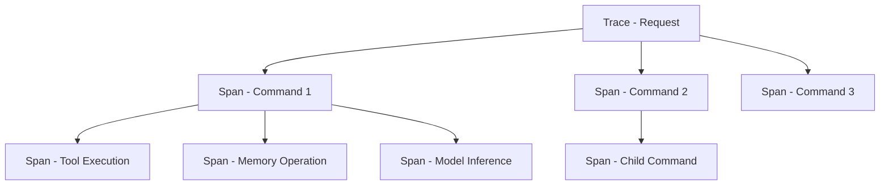

# Observability & Debugging

Four things are available when something goes wrong: structured logs, Prometheus metrics, traces, and a debug API. Logs and metrics are on by default; tracing is not.

## Logging

Motet logs through `structlog`, so every line is a structured event rather than a formatted string:

```python
import structlog
logger = structlog.get_logger(__name__)

logger.info(
    "operation_started",
    operation="my_operation",
    param1=value1,
    correlation_id=correlation_id,
    command_id=motet.command_id,
    task_id=motet.task_id
)
```

Include `command_id` and `task_id` and you can follow one request across every worker that touched it. This is the highest-value habit on the page, because a distributed failure is usually not visible in any single worker's logs.

The built-ins log that a command started and finished. They cannot log *what your command decided and why* — that part is yours to write, and it is what you will want at 3am.

## Metrics

Prometheus metrics are collected without configuration and served at `/metrics`:

```bash
curl http://localhost:8000/metrics
```

The metrics that actually exist are HTTP, auth, tool, model, circuit breaker, and scheduler:

```bash
# HTTP and auth
imf_requests_total
imf_request_latency_seconds
imf_auth_attempts_total
imf_auth_latency_seconds

# Tools
imf_tool_requests_total
imf_tool_latency_seconds
imf_tool_errors_total

# Models
imf_model_latency_seconds
imf_model_errors_total

# Resilience and scheduling
imf_breaker_blocked_total
imf_breaker_transitions_total
imf_scheduler_queue_length
imf_scheduler_queue_wait_seconds

# Memory
imf_summaries_created_total
```

Note what is **not** there: no per-command metrics and no worker metrics. For command-level questions use the debug API, and for worker state use `motet-cli workers health`. The `imf_` prefix is historical and predates the Motet name.

To record your own, get the live registry and use `prometheus_client` directly — `motet.core.observability.metrics` exposes typed helpers such as `observe_tool_latency` and `increment_tool_errors` rather than generic metric constructors:

```python
from prometheus_client import Counter
from motet.core.observability.metrics import get_registry

my_counter = Counter(
    "my_command_total", "My command executions",
    registry=get_registry(),
)
my_counter.inc()
```

Passing the registry is the part that matters. A metric created without it will not appear on `/metrics`.

## Tracing

There are two independent tracing systems, and confusing them wastes an afternoon.

### Motet's own trace store

This is what `motet-cli traces` reads. It writes JSONL traces to disk or Redis and is **off by default**:

```bash
export MOTET_TRACE_ENABLED=true
export MOTET_TRACE_DIR=traces          # file backend (default)
export MOTET_TRACE_BACKEND=file        # or "redis"
export MOTET_TRACE_REDIS_URL=...       # when backend is redis
```

```bash
motet-cli traces list                      # recent traces
motet-cli traces show --trace-id <id>      # one trace as JSONL
motet-cli traces watch                     # follow live
motet-cli traces replay                    # re-run a recorded trace
```

Use this for local debugging. It needs no collector, and `replay` is the fastest way to re-run a failing turn without reproducing the conditions by hand.

### OpenTelemetry

Separately, spans can be exported to an OTLP collector. Also **off by default**:

```bash
export MOTET_OTEL_ENABLED=true
export MOTET_OTEL_EXPORTER=otlp        # otlp|memory
export MOTET_OTEL_OTLP_ENDPOINT=http://localhost:4318
```

Turn this on when you have somewhere to send spans. Motet does not ship a Jaeger or Zipkin container, so a collector is yours to run.

Traces are hierarchical: a request is a trace, each command is a span, and tool calls, memory operations, and model inference are spans beneath it.



## Debug mode

Debug mode extends how long command data is retained and unlocks the debug API:

```bash
export MOTET_DEBUG_MODE=true
```

`/api/v1/debug` also requires an **admin** principal. Leave `MOTET_DEBUG_MODE` off on hosted or design-partner stacks; the flag is not enough by itself to expose debug routes to ordinary users.

Retention goes from 5–60 minutes (scaled to command timeout) to 1–6 hours, which is the point: by the time you know a command failed, normal TTL has often already discarded it.

### Debug API

```bash
# Task flow for specific task
GET /api/v1/debug/task-flow/{task_id}

# Events for a task
GET /api/v1/debug/task-events/{task_id}

# List commands (with filters)
GET /api/v1/debug/commands?limit=100&command_type=tool_execution

# Command details
GET /api/v1/debug/commands/{command_id}

# Command flow analysis — timings and bottlenecks
GET /api/v1/debug/command-flow/analysis/{task_id}

# Routing and memory stats
GET /api/v1/debug/routing/stats
GET /api/v1/debug/memory/stats
GET /api/v1/debug/memory/search

# Stored traces
GET /api/v1/debug/traces
GET /api/v1/debug/traces/{trace_id}
```

```python
import requests

# Get task flow
response = requests.get(
    "http://localhost:8000/api/v1/debug/task-flow/task-123",
    headers={"X-API-Key": "your-key"}
)
task_flow = response.json()
```

### Task flow visualization

`http://localhost:8000/manage` renders the same data as a graph — a 3D force-directed view and a 2D Mermaid flowchart, with per-command metadata, worker assignment, timings, and errors. It is the fastest way to see *where* a multi-command task stalled, as opposed to *that* it stalled.

```bash
open http://localhost:8000/manage?task_id=task-123
```

## Debugging scenarios

**A command never runs.** Almost always readiness or capability matching, not a lost message. Check `motet-cli workers readiness` first, since a warming-up worker accepts nothing. Then confirm some worker advertises the capability the command requires — a command requiring one nobody has queues forever instead of failing. `GET /api/v1/debug/commands?command_type=your_command` confirms it was registered and accepted.

**Execution is slow.** Traces are the right tool, because the interesting question is which span dominates. Enable the trace store, reproduce, and read it with `motet-cli traces show`. `imf_tool_latency_seconds` and `imf_model_latency_seconds` tell you whether the time is in tools or the provider; if it is in neither, look at queue wait with `imf_scheduler_queue_wait_seconds`.

**Commands fail in production.** Filter logs by `task_id` rather than grepping for ERROR, so you get the whole causal chain instead of the last line. `GET /api/v1/debug/commands/{command_id}` returns the input that produced the failure, which is usually the thing you actually need.

**Memory grows or workers get OOM-killed.** Check pool type first: `fork` pools carry a full interpreter per child, so a fleet sized for `eventlet` will not fit. `dmesg | grep -i oom` confirms a kill. Large command payloads are the other common cause — command data crosses a queue, so passing a large blob between commands costs memory in both.

**Workers restart repeatedly.** Look for a single command type in the logs before each restart. A worker dying on the same command is usually a memory ceiling or a bundle loading a large model, not a fault in the worker.

## Dashboards

Two Grafana dashboards ship in `operations/dashboards/`: one for **API observability** and one for the **planner and orchestrator**, with provisioning config in `operations/grafana/`. They are built on the metrics listed above, so they cover HTTP, auth, tools, and models rather than per-command detail.

| Component | Purpose | Access |
|-----------|---------|--------|
| **Structured logs** | JSON events with task and command IDs | stdout / `motet-cli local logs` |
| **Metrics** | Prometheus counters and histograms | `/metrics` |
| **Trace store** | JSONL traces, replayable | `motet-cli traces` |
| **Debug API** | Command flow, routing, memory stats | `/api/v1/debug/*` (admin) |
| **Task flow viz** | Command graph for a task | `http://localhost:8000/manage` |

## Next steps

- **[Advanced Motet Concepts](./24-advanced-concepts.md)** — composition patterns
- **[Common Patterns](./25-common-patterns.md)** — reusable shapes
- **[Troubleshooting Guide](./30-troubleshooting-guide.md)** — specific failures

## Navigation

- **[← Back to Documentation Home](./00-landing-page.md)**

---

**Last Updated**: 2026-08-21
