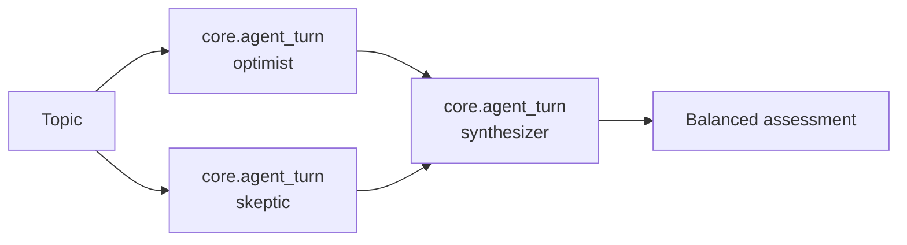

# Advanced Motet Concepts

Once you are comfortable writing a command and deploying a bundle, the next questions are usually about coordination: how work lands on the right worker, how to run several things at once, and how to run more than one agent against the same problem.

This page covers those. Everything here works with the runtime as shipped; the last section separates what is built in from what you assemble yourself.

## Worker capabilities and routing

Workers advertise **capabilities**, and commands declare what they need. The router matches the two, so you do not address workers directly.

```python
from motet_sdk import motet, MotetContext, WorkerCapability

@motet.command(required_capabilities=[WorkerCapability.BROWSER_OPERATIONS])
def capture_page(data: CaptureData, motet: MotetContext) -> Dict[str, Any]:
    ...
```

Capabilities cover model inference and streaming, embeddings, tool execution, memory and vector operations, web search, HTTP, browser and file operations, media processing, scheduling, MCP integration, and deployment. Edge capabilities (`EDGE_FILE_READ`, `EDGE_SHELL_EXEC`, `EDGE_CLIPBOARD`, and others) are special: a command that requires one can only run on an edge worker registered to a specific machine.

This is how you specialize a fleet. Put `MODEL_INFERENCE` on GPU hosts, `BROWSER_OPERATIONS` on hosts with Playwright installed, and leave the rest general. Command authors never learn the topology.

See [Worker System & Routing](./08-worker-system-routing.md) and the [Worker Targeting Guide](./08a-worker-targeting-guide.md).

## Running work in parallel

There are two ways to fan out, and they solve different problems.

**From inside a command**, use the composition helpers on `MotetContext`. `motet.join()` runs different commands with different inputs; `motet.apply()` runs one command across many inputs.

```python
reviews, pricing, specs = motet.join([
    (scrape_reviews, ProductData(product_id=data.id)),
    (scrape_pricing, ProductData(product_id=data.id)),
    (scrape_specs, ProductData(product_id=data.id)),
])

summaries = motet.apply(
    summarize,
    inputs=[{"doc_id": d} for d in data.doc_ids],
    batch_size=10,
)
```

Both execute in parallel and return unwrapped results. `batch_size` caps concurrency when you are pointed at a rate-limited dependency. See [Command Composition Patterns](./16-command-composition-patterns.md).

**From a workflow**, steps with no dependency on each other run in parallel automatically. Declaring `dependencies` is how you serialize, not how you parallelize.

## Multiple agents on one problem

A deployment can register many agents, each with its own system prompt, tool filter, model, and turn hooks. Agents come from bundles (`agents/agents.yaml`) or from core registration, and they are addressed by qualified ID: `core.default`, `expert-panel.synthesizer`.

There are two ways to route between them, and the difference is who decides.

### A workflow decides: declared routing

The `expert-panel` example bundle is the reference. Three agents analyze a topic, two of them concurrently:



Each step is a `core.agent_turn`, so every agent gets the full lifecycle — system prompt, memory reset, context preparation, tool access, and turn finalization — not just a bare LLM call. The synthesizer receives the other two responses templated into its message:

```yaml
  synthesize:
    step_id: synthesize
    command_type: core.agent_turn
    command_data:
      agent_id: "expert-panel.synthesizer"
      messages:
        - role: system
          content: >
            --- OPTIMIST ANALYSIS ---
            {{analyze_optimist.final_response}}

            --- SKEPTIC ANALYSIS ---
            {{analyze_skeptic.final_response}}
    dependencies:
      - analyze_optimist
      - analyze_skeptic
```

Here the **workflow is the coordinator**. One agent's output becomes another's input because a step declared it, and the cast is fixed before the run starts. That is what makes the exchange inspectable and replayable.

See [`expert-panel`](../../motet-sdk/examples/bundles/expert-panel/) and [Building Workflows](./17-building-workflows.md).

### An agent decides: the facilitator pattern

When you do not know the cast in advance, put the choice in a tool instead of a graph. `MotetContext.agents.turn()` takes the agent ID as an argument, so a tool that exposes it as a schema field hands the selection to the calling model:

```python
from motet_sdk import get_motet_context, motet
from pydantic import BaseModel, Field

class InviteParams(BaseModel):
    agent_id: str = Field(..., description="Qualified agent ID to invite, e.g. panel.economist")
    message: str = Field(..., description="What to ask this agent")

@motet.tool(
    description="Invite another agent to respond and return what it said.",
    name="invite",
    schema=InviteParams,
)
def invite(params: dict) -> dict:
    p = InviteParams(**params)
    ctx = get_motet_context()
    result = ctx.agents.turn(p.agent_id, messages=[{"role": "user", "content": p.message}])
    return {"agent_id": p.agent_id, "response": result}
```

An agent holding this tool is a facilitator: its model reads the conversation, picks who should speak, and sees the reply come back as a tool observation. Because the facilitator's own agentic loop iterates, it can invite, read, and invite again — rounds come from the loop, bounded by `max_iterations`, not from a workflow construct.

The worked example is [`roundtable`](../../motet-sdk/examples/bundles/roundtable/): a facilitator plus three panelists, where `roster` lists who can be invited, `invite` runs the chosen agent and appends to a conversation-scoped transcript, and `transcript` feeds the closing synthesis. It is roughly 200 lines of bundle code with no runtime changes, and it is the dynamic counterpart to `expert-panel` above — same discussion, cast chosen at runtime instead of declared in YAML.

Two details in that bundle are worth copying. Panelists are configured with `tool_filter.mode: explicit` and no tools, so an invited agent answers and stops rather than convening a panel of its own. And each invite briefs its agent with the recent transcript, which is what makes a second round a response rather than a restatement.

[`plan-mode`](../../motet-sdk/examples/bundles/plan-mode/) shows the narrower form of the same call: its `start_plan` tool runs one fixed agent through `agents.turn()`. A facilitator is that call with the ID left open.

### Choosing between them

| | Workflow | Facilitator tool |
|---|---|---|
| Who picks the next agent | You, at authoring time | The facilitator's model, per turn |
| Shape | DAG, no cycles | Loop, repeat until done |
| Cost | Fixed and predictable | One model call per routing decision |
| Debugging | Read the YAML | Read the transcript |

Prefer the workflow when the sequence is known — it is cheaper and you can diff it. Reach for a facilitator when relevance decides who participates.

## Sub-agent loops

When an agent turn spawns another agent — through a workflow step, a bundle tool, or `core.spawn_agents` — the child gets its own loop context carrying `parent_agent_id`. A `core.spawn_agents` child also gets a short worker system prompt (including its iteration, tool-call, and 60-second tool-time caps) and the tools that task declared as its catalog; it does not inherit the parent transcript. Catalog search is opt-in per task (`discover: true`). Fan-in comes back as each child's full write-up. Repeating a child's exact same web fetch this turn is refused and pointed at that observation; the parent does not get the child's page text. The loop tells every Motet-owned agent when it is on its last two rounds, and a rail stop asks for one tools-off write-up so partial findings survive. `core.spawn_agents` children write tokens and thinking to the same task stream as the parent, tagged with `{parent}.spawn-N`. Successful child write-ups are stored on the parent conversation as non-root transcript rows so a refresh can rebuild the nested turn. Thinking traces stay live-session only. Full `agent_turn` children (for example an expert panel) finalize the same way. Transcript rows record which agent produced each message and whether that row is the conversation's root.

That bookkeeping is what lets a UI show a panel discussion as distinct, attributed voices instead of one interleaved blur. [Streaming Responses](./13-streaming-responses.md) covers the event shapes.

## Agent-scoped memory

`finalize_turn` stores each response tagged with the producing agent's identity, so memories stay attributable. How much one agent can see of another's is controlled by `MOTET_MEMORY_AGENT_SCOPE_MODE`:

| Mode | Behavior |
|---|---|
| `prefer` (default) | Agents favor their own memories but can recall across agents |
| `strict` | Agents see only their own memories |
| `disabled` | No agent scoping; all memories are shared |

`prefer` is what makes the panel pattern work — analysts stay in their lane while the synthesizer reads across everyone. A recall tool must read the same tags that `finalize_turn` writes, or it will return nothing while looking perfectly healthy.

This is also the channel agents use to reach each other. There is no peer-to-peer message bus, but tagged memory plus semantic recall gives you a shared, attributed, searchable record — `expert-panel.recall_discussion` is one agent querying what the others contributed, including from conversations that ended weeks ago. Where a message bus is ephemeral, this is durable, which is usually what you wanted.

See [Memory Management](./20-memory-management.md).

## Parallel work

Every turn runs the agentic loop: the model calls tools until it can answer. There is no second executor to escalate into and nothing that predicts one from the request.

When the work splits into parts that do not depend on each other, the loop says so by calling `core.spawn_agents` with a list of tasks. Each becomes a sub-agent on its own worker, and the results return together as one observation. Because it is a tool call rather than a switch of executors, the loop still holds everything it learned before fanning out — and can fan out again, or act on what came back.

The publicly selectable modes are `auto` (the default) and `no_tools`. Leave the mode alone unless a turn must not touch the outside world — then pin `no_tools`.

`agentic` / `react` still skip the trivial gate (useful in tests) and otherwise run the same loop as `auto`. Do not pin them in product code.

See [Reasoning](./10-reasoning.md).

## What ships built in, and what you compose

Other multi-agent toolkits hand you a named abstraction — a group chat, a crew, a swarm. Motet ships the primitives and expects the pattern to live in a bundle. Nothing above required a runtime change:

| You want | You build it from | Shipped example |
|---|---|---|
| A facilitator that picks the speaker | An agent plus an `invite` tool over `agents.turn()` | [`roundtable`](../../motet-sdk/examples/bundles/roundtable/) |
| Rounds of agents responding to each other | The facilitator's agentic loop | [`roundtable`](../../motet-sdk/examples/bundles/roundtable/) |
| A shared record between agents | A conversation-scoped store, plus agent-tagged memory for durability | [`roundtable`](../../motet-sdk/examples/bundles/roundtable/), [`expert-panel`](../../motet-sdk/examples/bundles/expert-panel/) |
| A fixed panel | A workflow with parallel `core.agent_turn` steps | [`expert-panel`](../../motet-sdk/examples/bundles/expert-panel/) |

The trade is real in both directions. You write more than you would with a group-chat class, and you get to decide the routing policy instead of inheriting one.

Two things you cannot compose around today:

- **The chat API binds one agent per turn.** A request selects an agent by `agent_id` and that agent owns the turn. In practice a facilitator can *be* that agent, so this constrains the entry point more than the behavior — but there is no built-in way to address several agents in one request.
- **No external agent interop.** Motet does not speak an inter-agent protocol such as A2A, so its agents cannot be discovered or called as peers by agents built on another stack. Cross-system reach is through MCP tools instead. Worth knowing if you need Motet to participate in an agent ecosystem you do not own.

Every `turn_hooks` slot resolves through the command registry. `context_inject` is additive — it may append system messages and merge a context patch, but it cannot replace history. Set a slot to a registered command name, or omit it to skip that phase. `finalize` is the turn's commit step: an unknown name falls back to `core.finalize_turn` so a typo cannot drop the transcript.

## Next Steps

- **[Common Patterns](./25-common-patterns.md)** - Reusable patterns
- **[Example Bundles](./26-example-bundles.md)** - Complete, runnable bundles
- **[Best Practices](./27-best-practices.md)** - Learn from experience

## Navigation

- **[← Back to Documentation Home](./00-landing-page.md)** - Main documentation hub

---

**Last Updated**: 2026-08-26
