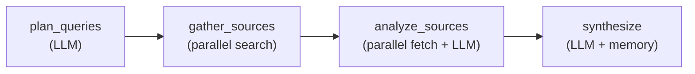
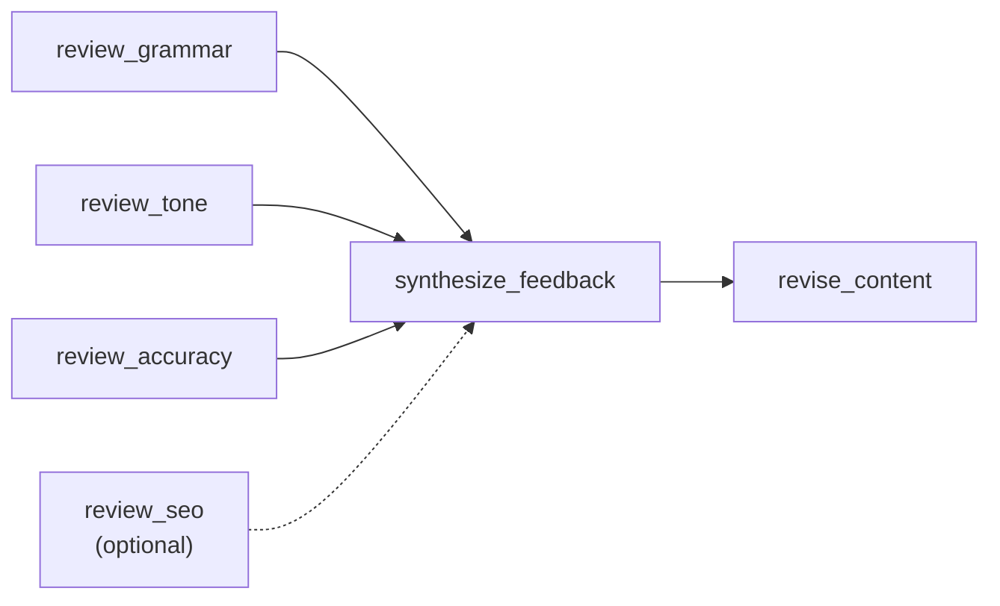
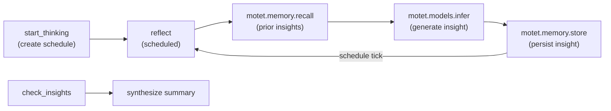
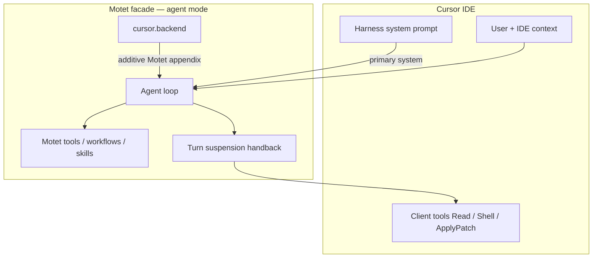
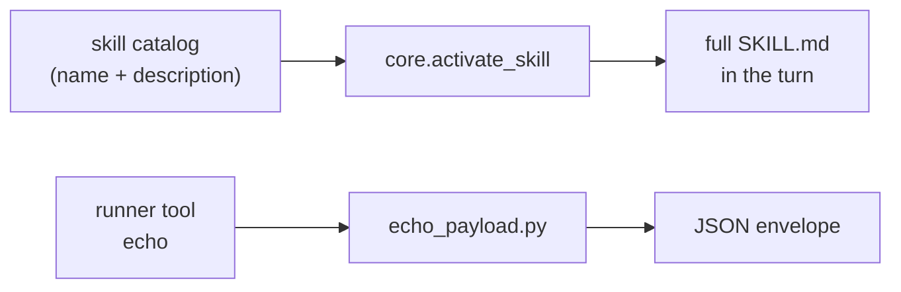

# Example Bundles

This section provides complete working examples you can use as a starting point. The best way to learn is to study the **SDK bundle examples** — they are complete, runnable bundles that use the correct SDK imports and patterns.

## SDK Bundle Examples

The example bundles live in `motet-sdk/examples/bundles/`. Each is a deployable bundle with a manifest, commands, and (where applicable) workflows and tools. Study these in order from simple to complex.

| Bundle | Focus | Key patterns |
|---|---|---|
| [hello-world](#hello-world--minimal-command--tool) | Smoke test | `@motet.command`, `@motet.tool`, `BaseCommandData` |
| [celebs](#celebs--config-only-persona-agents) | Config-only | Agent personas via YAML, turn hooks, tool filters |
| [get-news](#get-news--multi-step-news-aggregation) | Workflows | `motet.apply`, YAML workflows, browser tools |
| [deep-research](#deep-research--full-featured-research-pipeline) | Full pipeline | `motet.models.infer`, `motet.memory`, nested parallelism |
| [content-review](#content-review--multi-perspective-review-command-composition) | Composition | `motet.join`, `motet.maybe`, `motet.do` |
| [background-thinker](#background-thinker--scheduled-commands-for-autonomous-reflection) | Scheduling | `motet.schedules`, recurring/delayed, schedule lifecycle |
| [openai-gateway](#openai-gateway--passthrough-openai-compatible-gateway) | OpenAI-compat facade | Passthrough multi-provider drop-in; no Motet agent |
| [cursor](#cursor--openai-compatible-ide-backend) | OpenAI-compat facade | IDE harness primary, Motet tools additive, client tool handback |
| [langfuse-cms](#langfuse-cms--external-prompt-cms-via-langfuse-cloud) | External prompt CMS | `context_inject` / `after_finalize` hooks, vault keys, Cloud fallback |
| [skills-demo](#skills-demo--agent-skills) | Agent Skills | Skill catalog, `core.activate_skill`, runner tool, optional local fetch |

---

### hello-world — Minimal Command + Tool

The simplest possible bundle. Verifies that bundle fetch, lint, publish, and worker reload all work end-to-end.

**What it demonstrates**: `@motet.command`, `@motet.tool`, `BaseCommandData`, SDK imports, manifest structure.

```python
from motet_sdk import BaseCommandData, MotetContext, motet

class HelloWorldData(BaseCommandData):
    name: str = Field(default="World", description="Name to greet")
    shout: bool = Field(default=False, description="Uppercase the greeting if true")

@motet.command(timeout_seconds=30)
def hello_world(data: HelloWorldData, motet: MotetContext) -> Dict[str, Any]:
    message = f"Hello, {data.name}!"
    if data.shout:
        message = message.upper()
    return {"message": message, "bundle": "hello-world", "task_id": motet.task_id}
```

> **Source**: [`motet-sdk/examples/bundles/hello-world/`](../../motet-sdk/examples/bundles/hello-world/)

---

### celebs — Config-Only Persona Agents

A bundle with no commands or tools — just agent configuration via YAML. Defines celebrity-style persona agents for demos.

**What it demonstrates**: Config-only bundles, agent persona configuration via `agents/agents.yaml`, aliases, system prompts, tool filters, turn hooks.

**Agent definition** (`agents/agents.yaml`):

```yaml
agents:
  - agent_id: "arnold"
    aliases: ["governator", "austrian_oak"]
    display_name: "Arnold Persona Agent"
    description: "A playful demo agent that responds in an Arnold Schwarzenegger-inspired action-movie style."
    allowed_roles: ["*"]
    system_prompt: >
      You are a playful parody persona inspired by Arnold Schwarzenegger's
      action-movie style. Keep responses short, confident, and dramatic.
      Use occasional one-liners and motivational tone, but avoid claiming
      to be the real person.
    tool_filter:
      mode: "discovery"
    turn_hooks:
      conversation_analysis: "core.conversation_analysis"
      memory_reset: "core.memory_reset"
      context_prepare: "core.prepare_context"
      finalize: "core.finalize_turn"
```

**Key fields**:

| Field | Purpose |
|---|---|
| `agent_id` | Unique identifier used to select the agent |
| `aliases` | Alternative names that also route to this agent |
| `system_prompt` | Personality and behavior instructions for the LLM |
| `allowed_roles` | Which user roles can access this agent (`["*"]` = all) |
| `tool_filter.mode` | How tools are surfaced (`"discovery"` = agent discovers available tools) |
| `turn_hooks` | Core lifecycle hooks for conversation analysis, memory, and strategy |

The bundle defines five persona agents (Arnold, Elvis, Mr. T, Dolly, Trump) — no Python code needed, just YAML configuration.

> **Source**: [`motet-sdk/examples/bundles/celebs/`](../../motet-sdk/examples/bundles/celebs/)

---

### get-news — Multi-Step News Aggregation

Browser-assisted news aggregation with parallel fan-out fetch stages and structured output.

**What it demonstrates**: Multi-step YAML workflows, parallel command composition (`motet.apply`), browser-capable tool execution, graceful fallback on fetch failures.

**Pipeline**:


**Workflow definition** (`workflows/news_aggregation.yaml`):

```yaml
workflow_id: news_aggregation
name: News Aggregation
output_field: digest_markdown
steps:
  discover_sources:
    command_type: get-news.discover_sources
    parameters:
      topic: "{{topic}}"
      max_sources: "{{max_sources}}"
    dependencies: []

  fetch_articles:
    command_type: get-news.fetch_articles
    parameters:
      topic: "{{topic}}"
      sources: "{{discover_sources.sources}}"
    dependencies: [discover_sources]

  cluster_articles:
    command_type: get-news.cluster_articles
    parameters:
      articles: "{{fetch_articles.articles}}"
    dependencies: [fetch_articles]

  build_digest:
    command_type: get-news.build_digest
    parameters:
      clusters: "{{cluster_articles.clusters}}"
    dependencies: [cluster_articles]
```

> **Source**: [`motet-sdk/examples/bundles/get-news/`](../../motet-sdk/examples/bundles/get-news/)

---

### deep-research — Full-Featured Research Pipeline

The most comprehensive example. Multi-step research with LLM planning, parallel web search, parallel page extraction, LLM synthesis, memory persistence, and a custom recall tool.

**What it demonstrates**:

| Capability | Where |
|---|---|
| LLM planning (`motet.models.infer`) | `plan_queries` |
| Parallel fan-out (`motet.apply`) | `gather_sources` |
| Tool + LLM composition | `extract_findings` |
| Nested parallelism | `analyze_sources` |
| Memory persistence (`motet.memory`) | `synthesize` |
| Custom tool (`@motet.tool`) | `recall_research` |
| Workflow orchestration | `research.yaml` |
| Reading tool output | `search_source` — normalizes context-processed keys/scalars |
| Testing bundles (`MockMotetContext`) | `tests/unit/bundles/test_deep_research_bundle.py` |

**Pipeline**:



**Example command** — LLM-powered query planning:

```python
from motet_sdk import BaseCommandData, MotetContext, WorkerCapability, motet

class PlanQueriesData(BaseCommandData):
    topic: str = Field(..., description="Research topic to investigate")
    num_queries: int = Field(default=5, ge=2, le=10)
    provider: str = Field(default="openai")
    model_name: str = Field(default="gpt-4o-mini")

@motet.command(
    timeout_seconds=60,
    required_capabilities=[WorkerCapability.MODEL_INFERENCE],
)
def plan_queries(data: PlanQueriesData, motet: MotetContext) -> Dict[str, Any]:
    prompt = f"Generate {data.num_queries} diverse search queries for: {data.topic}"
    result = motet.models.infer(
        provider=data.provider,
        model_name=data.model_name,
        messages=[{"role": "user", "content": prompt}],
        model_settings={"temperature": 0.4, "max_tokens": 800},
    )
    queries = parse_queries(result.get("content", ""), data.topic, data.num_queries)
    return {"topic": data.topic, "queries": queries, "query_count": len(queries)}
```

**Example command** — Memory persistence:

```python
@motet.command(
    timeout_seconds=120,
    required_capabilities=[WorkerCapability.MODEL_INFERENCE, WorkerCapability.MEMORY_OPERATIONS],
)
def synthesize(data: SynthesizeData, motet: MotetContext) -> Dict[str, Any]:
    result = motet.models.infer(
        provider=data.provider,
        model_name=data.model_name,
        messages=[{"role": "user", "content": synthesis_prompt}],
    )
    report = result.get("content", "")

    if data.store_in_memory and report:
        topic_words = data.topic.lower().split()[:5]
        tags = ["research", "deep-research"] + [w for w in topic_words if len(w) > 2]
        motet.memory.store(
            content=report,
            type="research_report",
            tags=tags,
            metadata={"topic": data.topic, "bundle": "deep-research"},
            scope_type="principal",
        )

    return {"topic": data.topic, "report": report}
```

> **Source**: [`motet-sdk/examples/bundles/deep-research/`](../../motet-sdk/examples/bundles/deep-research/)

---

### content-review — Multi-Perspective Review (Command Composition)

Multi-agent coordination pattern: four review perspectives analyze the same content in parallel, then feedback is synthesized and the content is revised.

**What it demonstrates**:

| Capability | Where |
|---|---|
| `motet.join()` with different commands | `coordinate_reviews` — grammar, tone, accuracy in parallel |
| `motet.maybe()` for optional steps | `coordinate_reviews` — SEO review gracefully skipped on failure |
| Sequential `motet.do()` chains | `coordinate_reviews` — synthesis then revision |
| Multiple LLM perspectives | Four review commands with distinct prompts |
| Declarative vs programmatic | `content_review.yaml` workflow achieves the same pipeline |

**Pipeline**:



**Showcase command** — `coordinate_reviews` (the key patterns):

```python
from motet_sdk import BaseCommandData, MotetContext, WorkerCapability, motet

@motet.command(timeout_seconds=300, required_capabilities=[WorkerCapability.MODEL_INFERENCE])
def coordinate_reviews(data: CoordinateReviewsData, motet: MotetContext) -> Dict[str, Any]:
    # Step 1: Three DIFFERENT commands in parallel (motet.join)
    grammar, tone, accuracy = motet.join([
        (review_grammar, ReviewGrammarData(content=data.content)),
        (review_tone, ReviewToneData(content=data.content, audience=data.audience)),
        (review_accuracy, ReviewAccuracyData(content=data.content)),
    ])

    # Step 2: Optional SEO review — pipeline continues on failure (motet.maybe)
    seo, seo_error = motet.maybe(
        review_seo, data=ReviewSeoData(content=data.content, content_type=data.content_type),
    )

    # Step 3: Synthesize all feedback (sequential motet.do)
    feedback = motet.do(synthesize_feedback, data=SynthesizeFeedbackData(
        content=data.content, grammar=grammar, tone=tone, accuracy=accuracy, seo=seo,
    ))

    # Step 4: Revise the content (sequential motet.do)
    revised = motet.do(revise_content, data=ReviseContentData(
        original_content=data.content, feedback_report=feedback.get("report", ""),
    ))

    return {"feedback_report": feedback.get("report"), "revised_content": revised.get("revised_content")}
```

> **Source**: [`motet-sdk/examples/bundles/content-review/`](../../motet-sdk/examples/bundles/content-review/)

---

### background-thinker — Scheduled Commands for Autonomous Reflection

The only bundle that demonstrates the scheduling API. An agent that proactively thinks about a topic in the background, building progressively deeper understanding over time through a persistent knowledge loop.

**What it demonstrates**:

| Capability | Where |
|---|---|
| Scheduled commands (`motet.schedules.create`) | `start_thinking` — recurring and delayed schedules |
| Recurring schedules (interval + cron) | `start_thinking` — both `interval_seconds` and `cron_expression` |
| Delayed one-shot schedules | `start_thinking` — `mode="delayed"` with `delay_seconds` |
| Schedule lifecycle (cancel/suspend/resume) | `stop_thinking` — discovers schedules by topic via memory |
| Memory as a knowledge loop (`motet.memory`) | `reflect` — reads prior insights, writes new ones each cycle |
| Schedule creation from tools (`ctx.schedules.create`) | `start_thinking_tool` — scheduling from `get_motet_context()` |
| Built-in tool composition (`motet.tools.execute`) | `stop_thinking` — calls `manage_schedule` for lifecycle ops |

**Pipeline**:



**Showcase command** — creating a recurring schedule:

```python
from motet_sdk import BaseCommandData, MotetContext, motet

@motet.command(timeout_seconds=30)
def start_thinking(data: StartThinkingData, motet: MotetContext) -> Dict[str, Any]:
    # Create a recurring schedule targeting the reflect command
    result = motet.schedules.create(
        target_command_type="background-thinker.reflect",
        target_command_data={"topic": data.topic, "provider": data.provider},
        schedule_type="recurring",
        interval_seconds=data.interval_seconds,
        name=f"Background Thinking: {data.topic}",
    )

    # Store schedule metadata in memory so stop_thinking can find it by topic
    motet.memory.store(
        content=f"Active background thinking schedule for topic: {data.topic}",
        type="schedule_tracking",
        tags=["background-thinker-schedule", "background-thinker"],
        metadata={"topic": data.topic, "schedule_id": result.get("schedule_id")},
        scope_type="principal",
    )

    return {"schedule_id": result.get("schedule_id"), "topic": data.topic, "status": "created"}
```

**Showcase command** — the scheduled reflection cycle:

```python
@motet.command(
    timeout_seconds=120,
    required_capabilities=[WorkerCapability.MODEL_INFERENCE, WorkerCapability.MEMORY_OPERATIONS],
)
def reflect(data: ReflectData, motet: MotetContext) -> Dict[str, Any]:
    # Read prior insights from memory
    prior = motet.memory.recall(query=data.topic, tags=["background-thinker", "insight"], limit=5)

    # Generate deeper insight via LLM, building on prior thinking
    result = motet.models.infer(
        provider=data.provider,
        model_name=data.model_name,
        messages=[
            {"role": "system", "content": REFLECTION_PROMPT},
            {"role": "user", "content": f"Topic: {data.topic}\nPrior thinking:\n{format(prior)}"},
        ],
    )

    # Store new insight back to memory — completing the knowledge loop
    motet.memory.store(
        content=result.get("content", ""),
        type="background_insight",
        tags=["background-thinker", "insight"],
        metadata={"topic": data.topic, "iteration": next_iteration(prior)},
        scope_type="principal",
    )

    return {"topic": data.topic, "insight": result.get("content"), "iteration": next_iteration(prior)}
```

> **Source**: [`motet-sdk/examples/bundles/background-thinker/`](../../motet-sdk/examples/bundles/background-thinker/)

---

### openai-gateway — Passthrough OpenAI-Compatible Gateway

Run Motet as a multi-provider drop-in for anything that speaks OpenAI
(`OPENAI_BASE_URL` + API key): SDKs, Open WebUI, LibreChat, LangChain, CLIs.
One `/v1` URL, many `provider/model` ids, with Motet registry routing, vault
credentials, tenancy, allowlists, and budgets — without a Motet agent in the
path.

**What it demonstrates**: OpenAI-compatible `/v1` facade in `passthrough` mode,
deny-by-default `--allowed-models`, correlation headers, and the upgrade path
to `hosted_tools` / `agent` (see [cursor](#cursor--openai-compatible-ide-backend)).

Setup summary: enable the facade (`MOTET_OPENAI_COMPAT_ENABLED=true`), create a
service account with `--facade-mode passthrough` and an `--allowed-models`
allowlist, point the client at Motet `/v1` with the `sa_*` token as the API
key. No bundle deploy is required for the gateway itself.

> **Source**: [`motet-sdk/examples/bundles/openai-gateway/`](../../motet-sdk/examples/bundles/openai-gateway/)

---

### cursor — OpenAI-Compatible IDE Backend

Deploy Motet as an invisible model backend for Cursor (or any OpenAI Chat
Completions / Responses client). Two questions that are easy to conflate:

| Question | Answer for this agent |
|---|---|
| **Who owns the tool loop?** | Motet (`agent` mode + client-tool handback) |
| **Whose system prompt is primary?** | The client’s inbound harness (same contract as GPT/Claude) |

Motet tools, workflows, and skills are additive. IDE tools (Read, Shell,
ApplyPatch, …) run on the client via handback. When asked who it is, the agent
identifies as the selected model, not as Motet.

**What it demonstrates**:

| Capability | Where |
|---|---|
| OpenAI-compat `/v1` in **agent** mode | Facade + service account `--facade-mode agent` |
| Client harness as primary system prompt | `metadata.prompt_policy: client_system_primary` |
| Motet appendix (tools / workflows / skills) | Agent `system_prompt` — do not paste the client harness |
| Conversation surface `cursor_ide` | `config/surfaces.yaml` + `allowed_surface_ids` |
| Frozen meta-tool bag | `tool_filter.required_tools`: `core.help`, `core.tools_search`, `core.tool_call` |
| Client-tool handback | Motet suspends; the IDE executes and resumes |
| Binding for clients that cannot send Motet extensions | Service-account `--agent-id cursor.backend` |

**Pipeline**:



1. The client sends its full harness system prompt plus user/IDE context — what
   it would send to GPT or Claude.
2. Motet runs `cursor.backend`: harness stays first; this bundle’s appendix is
   appended.
3. Client tools → Motet suspends and returns OpenAI `tool_calls`; the IDE
   executes them and resumes.
4. Motet tools / workflows → Motet runs them server-side.

Cursor `GetMcpTools` lists IDE MCP only. Motet-hosted tools use
`core.tools_search` / `core.help` / `core.tool_call`.

**Agent definition** (`agents/agents.yaml`):

```yaml
agents:
  - agent_id: backend
    aliases: ["cursor"]
    display_name: Cursor Backend
    description: >
      Invisible model backend for Cursor / OpenAI-compat IDE clients.
    allowed_roles: ["*"]
    allowed_surface_ids:
      - cursor_ide
    metadata:
      prompt_policy: client_system_primary
    system_prompt: |
      Additional capabilities from this backend (Motet):

      You have Motet server tools, workflows, and skills in addition to any
      client-provided tools. Prefer:

      - Client-provided tools for the user's local workspace (files, shell, edits,
        IDE context). Those run in the client's environment via tool handback.
      - Motet tools for server-side work the client cannot do: scheduling, Motet
        admin/history, Motet workflows, memory store/recall, Motet tool discovery,
        web fetch/search when appropriate, vault, long-running distributed commands.

      When asked who you are, identify as the selected model for this request,
      not as Motet or another product.
    tool_filter:
      mode: discovery
      required_tools:
        - core.help
        - core.tools_search
        - core.tool_call
    skill_mode: discovery
    skill_max_per_turn: 3
    max_iterations: 60
    max_model_calls: 180
    max_tools: 8
```

The committed file has a longer appendix (two tool catalogs, memory pins). The
live inbound system message is the source of truth for the harness — do not
copy Cursor’s prompt into `agents.yaml`; Cursor updates it often.

**Key fields**:

| Field | Purpose |
|---|---|
| `agent_id` | `backend` (qualified `cursor.backend`, alias `cursor`). Motet is the backend, not the IDE |
| `metadata.prompt_policy` | `client_system_primary` — inbound `role=system` stays first; Motet branding is not used |
| `allowed_surface_ids` | Channel this agent may use (`cursor_ide`, registered from `config/surfaces.yaml`) |
| `system_prompt` | Motet appendix only |
| `tool_filter.required_tools` | Frozen shortlist so the tools-prefix cache stays stable; catalog tools via `tools_search` → `tool_call` |
| `max_iterations` | Motet-tool recursion budget (60). Client handbacks do not burn it |
| `max_model_calls` | Cap on handback↔model loops per turn (180) |
| `max_tools` | Headroom for the sticky meta bag plus keyword pins (8) |

**Surface** (`config/surfaces.yaml`):

```yaml
surfaces:
  - id: cursor_ide
    display_name: Cursor IDE
    description: Cursor / OpenAI-compat IDE client traffic for cursor.backend
```

**Deploy and bind**:

```bash
motet-cli deploy dir-deploy motet-sdk/examples/bundles/cursor
```

Enable the facade, then bind mode / agent / models on the service account.
Cursor can only send base URL, API key, and model id:

```bash
export MOTET_OPENAI_COMPAT_ENABLED=true
export MOTET_OPENAI_COMPAT_AGENT_CLIENT_TOOLS=true

motet-cli service-account create \
  --name cursor-facade \
  --tenant motet-global \
  --motet default \
  --roles member \
  --facade-mode agent \
  --allowed-models 'openai/*,deepseek/*,moonshot/*' \
  --agent-id cursor.backend \
  --force-thinking \
  --force-thinking-effort medium
```

`--force-thinking` turns thinking on for Chat Completions clients that omit
`reasoning_effort`. Point Cursor’s custom OpenAI base URL at Motet `/v1` and
use the returned `sa_*` token as the API key.

Operator flags, mode ceilings, and thinking UI notes live in
[OpenAI-compatible API](./28-api-reference.md#openai-compatible-api) and the
bundle README. The passthrough sibling (no Motet agent) is
[openai-gateway](#openai-gateway--passthrough-openai-compatible-gateway).

> **Source**: [`motet-sdk/examples/bundles/cursor/`](../../motet-sdk/examples/bundles/cursor/)

---

### langfuse-cms — External Prompt CMS via Langfuse Cloud

Opt-in demo that manages **one agent’s** system prompt in **Langfuse Cloud**
and optionally records that agent’s turn usage/cost there. Motet does **not**
ship Langfuse as platform infrastructure — this bundle talks to your Cloud
project over HTTPS with vault-backed keys. Platform cost tracking stays in
Motet.

**What it demonstrates**: `turn_hooks.context_inject` to fetch a live system
prompt each turn, fail-soft fallback when Cloud/credentials fail,
`after_finalize` to push generation usage, vault credentials, and prompt
management tools (`get_prompt` / `list_prompts` / `update_prompt`).

```yaml
# agents/agents.yaml (excerpt)
agents:
  - agent_id: "prompt-manager"
    display_name: "Langfuse CMS"
    system_prompt: ""   # empty on purpose — inject supplies the sole system prompt
    turn_hooks:
      context_inject:
        - "langfuse-cms.inject_langfuse_prompt"
      after_finalize:
        - "langfuse-cms.record_turn_to_langfuse"
```

```python
@motet.command(timeout_seconds=30)
def inject_langfuse_prompt(
    data: InjectLangfusePromptData,
    motet: MotetContext,
) -> Dict[str, Any]:
    """context_inject hook: Cloud prompt or static fallback; never aborts the turn."""
    resolved = lf.resolve_turn_system_prompt(motet, ...)
    return {
        "system_messages": [resolved["system_prompt"]],
        "context_patch": {"langfuse_prompt_source": resolved["prompt_source"], ...},
    }
```

Setup summary: create a Langfuse Cloud project and text prompt named
`langfuse_cms.prompt_manager` (label `production`), store vault credential
`langfuse` with `--scope tenant` (so Chat Explorer can read it), deploy the
bundle, then chat as agent `langfuse-cms.prompt-manager`. Edit the Cloud
prompt → next message uses it (no redeploy).

> **Source**: [`motet-sdk/examples/bundles/langfuse-cms/`](../../motet-sdk/examples/bundles/langfuse-cms/)

---

### skills-demo — Agent Skills

Deployable demo of Motet Agent Skills. The model sees a compact catalog of names
and descriptions until it calls `core.activate_skill`, which loads the full
`SKILL.md` into the turn. A Motet-authored runner skill also registers a first-class
tool that executes a bundled script.

Anthropic’s Apache-2.0 reference skills are committed in the bundle. Proprietary
document skills (`pdf` / `docx` / `pptx` / `xlsx`) are not — fetch them locally
when you want them. No vault secrets are required for the committed example.

**What it demonstrates**:

| Capability | Where |
|---|---|
| Bundle skill trees (`skills/<name>/SKILL.md`) | `skills/` — cataloged on deploy |
| Agent allowlist + discovery | `agents/agents.yaml` — `skill_ids`, `skill_mode` |
| Progressive disclosure | `core.activate_skill` — full instructions only when needed |
| Declarative runner tool | `runners.yaml` → `skills-demo.basic-script-skill.echo` |
| Bundled script execution | `scripts/echo_payload.py` — JSON envelope on stdout |
| Apache reference skills | `brand-guidelines`, `frontend-design`, `theme-factory`, `algorithmic-art` |
| Optional local document skills | `scripts/fetch-skills.sh` — gitignored; not redistributed by Motet |

**Pipeline**:



**Agent definition** (`agents/agents.yaml`):

```yaml
agents:
  - agent_id: "skills"
    aliases: ["skills-demo"]
    display_name: "Skills Demo"
    description: >
      Agent Skills demo: Apache Anthropic reference skills plus a Motet
      runner skill. Optional document skills can be fetched locally (gitignored).
    allowed_roles: ["*"]
    system_prompt: >-
      You are a helpful assistant with Motet Agent Skills. The model sees a
      compact catalog until you call core.activate_skill with the skill id
      (for example skills-demo.brand-guidelines) and then follow those
      instructions. For a quick execution smoke test, call the runner tool
      skills-demo.basic-script-skill.echo with a text argument and report the
      JSON result. Prefer activated skill guidance over inventing workflows.
    tool_filter:
      mode: "discovery"
      required_tools:
        - "core.activate_skill"
        - "skills-demo.basic-script-skill.echo"
    skill_ids:
      - "skills-demo.algorithmic-art"
      - "skills-demo.basic-script-skill"
      - "skills-demo.brand-guidelines"
      - "skills-demo.frontend-design"
      - "skills-demo.theme-factory"
    skill_mode: "discovery"
    skill_max_per_turn: 3
    turn_hooks:
      conversation_analysis: "core.conversation_analysis"
      memory_reset: "core.memory_reset"
      context_prepare: "core.prepare_context"
      finalize: "core.finalize_turn"
```

**Key fields**:

| Field | Purpose |
|---|---|
| `agent_id` | `skills` (qualified `skills-demo.skills`). Avoid `main` — that short id collides with other example bundles in the global alias map |
| `skill_ids` | Canonical skill ids this agent may use (`{bundle_id}.{name}`). Required in `allowlist` mode; optional prefilter in `discovery` mode (this example uses both) |
| `skill_mode` | `allowlist` discloses only `skill_ids`; `discovery` discloses visible skill metadata for model-driven activation |
| `skill_max_per_turn` | Cap on harness activations in a single turn |
| `tool_filter.required_tools` | Always expose `core.activate_skill` and the echo runner |
| `turn_hooks` | Core lifecycle hooks for conversation analysis, memory, and finalize |

**Skill + runner** (`skills/basic-script-skill/`):

The Motet-authored skill is a `SKILL.md` plus `runners.yaml`. Each runner
registers as `{bundle_id}.{skill_name}.{runner_name}` when the skill loads.
The committed `SKILL.md` also has how-to and expected-behavior sections
(omitted here — they contain nested fences).

```markdown
---
name: basic-script-skill
description: >
  Motet demo skill that runs a bundled Python script via a skill runner
  and returns a JSON envelope. Use to verify skill deployment and script execution.
---

# Basic Script Skill

Prefer the registered runner tool `skills-demo.basic-script-skill.echo` with a
`text` argument.
```

```yaml
# skills/basic-script-skill/runners.yaml
runners:
  - name: echo
    description: |
      Run echo_payload.py with a text argument and return a JSON envelope.
      Useful for verifying that bundle deployment, skill loading, and
      worker_exec wiring all work end-to-end.
    script: scripts/echo_payload.py
    interpreter: python3
    image_stack: python-minimal
    lifetime: ephemeral
    timeout_seconds: 30
    network: inherit
    args:
      text:
        type: string
        description: Message text to round-trip through the script.
        default: "hello"
```

```python
# skills/basic-script-skill/scripts/echo_payload.py
from __future__ import annotations

import argparse
import json


def main() -> None:
    parser = argparse.ArgumentParser(
        description="Emit a small JSON payload for bundle skill smoke tests."
    )
    parser.add_argument("--text", default="hello", help="Message text to include in payload.")
    args = parser.parse_args()

    payload = {
        "ok": True,
        "message": args.text,
        "source": "skills-demo.basic-script-skill",
    }
    print(json.dumps(payload))


if __name__ == "__main__":
    main()
```

The committed Apache skills (`brand-guidelines`, `frontend-design`,
`theme-factory`, `algorithmic-art`) are instruction catalogs — activate them
with `core.activate_skill` and follow the body. They do not register runner
tools.

**Deploy and try**:

```bash
motet-cli bundle lint motet-sdk/examples/bundles/skills-demo
motet-cli deploy dir-deploy motet-sdk/examples/bundles/skills-demo
```

After reload you should see agent `skills-demo.skills` (alias `skills-demo`),
the five committed skill ids, and tool `skills-demo.basic-script-skill.echo`.
Open Chat Explorer and select **Skills Demo**:

1. Smoke-test the runner: *Call the skills-demo.basic-script-skill.echo runner
   with text "sticky".* Expect a JSON envelope with `ok: true`,
   `message: "sticky"`, and `source: "skills-demo.basic-script-skill"`.
2. Activate an instruction skill: *Activate the brand-guidelines skill and
   summarize how Motet should present primary vs secondary colors using that
   skill’s guidance.* The agent should call `core.activate_skill` for
   `skills-demo.brand-guidelines` before answering from the skill body.

**Optional — document skills (local only)**:

```bash
./motet-sdk/examples/bundles/skills-demo/scripts/fetch-skills.sh
# or a subset:
./motet-sdk/examples/bundles/skills-demo/scripts/fetch-skills.sh pdf
```

Then redeploy the same path. The fetch script syncs `skill_ids` to every
`skills/*/SKILL.md` present. Those folders are gitignored — do not commit them.
Catalog + `core.activate_skill` runs on the committed `python-minimal` stack.
Full LibreOffice / poppler / office script pipelines need an operator-pinned
`python-office` image (`./scripts/build-python-office-stack.sh`) and
`base_image_stack: python-office` in this bundle’s `config/exec.yaml`.

> **Source**: [`motet-sdk/examples/bundles/skills-demo/`](../../motet-sdk/examples/bundles/skills-demo/)

---

## Inline Pattern Examples

The examples below show common patterns in condensed form. For complete, runnable versions of these patterns, see the SDK bundles above.

### Data Processing Pipeline (ETL)

Extract, transform, load with parallel fan-out at each stage.

```python
from motet_sdk import BaseCommandData, MotetContext, motet

@motet.command()
def data_processing_pipeline(data: PipelineData, motet: MotetContext) -> Dict[str, Any]:
    """Process data through extract, transform, load pipeline."""
    extracted = motet.join([
        (extract_from_source, SourceData(source="source1")),
        (extract_from_source, SourceData(source="source2")),
        (extract_from_source, SourceData(source="source3"))
    ])

    transformed = motet.do(
        transform_data,
        data=TransformData(sources=extracted, transformation_rules=data.rules)
    )

    loaded = motet.join([
        (load_to_destination, LoadData(destination="db1", data=transformed)),
        (load_to_destination, LoadData(destination="db2", data=transformed)),
        (load_to_destination, LoadData(destination="cache", data=transformed))
    ])

    return {
        "status": "complete",
        "extracted_count": len(extracted),
        "transformed": transformed,
        "loaded_count": len(loaded)
    }
```

### Lead Qualification Workflow

Business process automation as a YAML workflow with conditional execution.

```yaml
workflow_id: lead_qualification
name: Lead Qualification
description: "Qualify leads through multi-step analysis"
input_parameters:
  lead_email:
    type: string
    required: true

steps:
  analyze_email:
    command_type: my_bundle.analyze_email
    parameters:
      email: "{{lead_email}}"
    dependencies: []

  check_crm:
    command_type: my_bundle.check_crm
    parameters:
      email: "{{lead_email}}"
    dependencies: [analyze_email]

  score_lead:
    command_type: my_bundle.score_lead
    parameters:
      analysis: "{{analyze_email.result}}"
      crm_data: "{{check_crm.result}}"
    dependencies: [analyze_email, check_crm]

  update_crm:
    command_type: my_bundle.update_crm
    parameters:
      email: "{{lead_email}}"
      score: "{{score_lead.score}}"
    dependencies: [score_lead]
    skip_condition: "if_equals:score_lead.qualified:False"

  send_notification:
    command_type: my_bundle.send_notification
    parameters:
      to: "sales@example.com"
      subject: "New Qualified Lead"
      body: "Lead {{lead_email}} scored {{score_lead.score}}"
    dependencies: [score_lead]
    skip_condition: "if_equals:score_lead.high_priority:False"
```

`skip_condition` is a string using a fixed operator set — `if_empty`, `if_not_empty`, `if_equals`, `if_contains`, and `if_failed`. There is no numeric comparison, so `score_lead` returns the `qualified` and `high_priority` booleans alongside the raw score and the workflow branches on those. Putting the threshold in the command rather than the condition also keeps the cutoff in one place. See [Workflow System](./11-workflow-system.md) for the full vocabulary.

### Conditional Workflow with Fallbacks

Workflow with primary/fallback execution paths.

```yaml
workflow_id: conditional_workflow
name: Conditional Workflow
description: "Workflow with conditional execution and fallbacks"

steps:
  primary:
    command_type: my_bundle.primary_operation
    parameters:
      input: "{{input}}"
    dependencies: []

  fallback:
    command_type: my_bundle.fallback_operation
    parameters:
      input: "{{input}}"
    dependencies: [primary]
    skip_condition: "if_not_empty:primary.result"

  final:
    command_type: my_bundle.final_operation
    parameters:
      result: "{{primary.result}}"
      fallback_used: "{{primary.status}}"
    dependencies: [primary]
```

## Next Steps

- **[Best Practices](./27-best-practices.md)** - Learn from experience
- **[Troubleshooting Guide](./30-troubleshooting-guide.md)** - Solve problems
- **[API Reference](./28-api-reference.md)** - Quick reference

## Navigation

- **[← Back to Documentation Home](./00-landing-page.md)** - Main documentation hub

---

**Last Updated**: 2026-08-28
