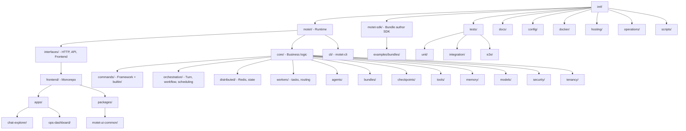

# Project Structure

Understanding Motet's codebase organization helps you navigate efficiently and find what you need quickly.

## Directory Structure



**Key paths** (for copy-paste):

- `motet/core/commands/` — command framework (`decorator`, `distributed`) and `builtin/` implementations
- `motet/core/orchestration/` — orchestrator, turn loop, scheduling
- `motet/core/workflow/` — workflow definition, registry, and execution
- `motet/core/distributed/` — execution_api, redis_manager, state_registry, worker_readiness
- `motet/core/workers/` — app, tasks, parent_coordinator, concurrency_primitives, routing/
- `motet/core/agents/`, `bundles/`, `checkpoints/`, `conversations/` — agent config, bundle lifecycle, turn suspend/resume, conversations
- `motet/core/reasoning/` — strategy implementations
- `motet/core/tools/` — mcp_motet/, builtin/
- `motet/interfaces/api/v1/` — auth, commands, workflows; `shared/` for utilities
- `motet/interfaces/frontend/packages/motet-ui-common/` — shared UI library (@motet/ui-common)
- `motet/interfaces/frontend/apps/chat-explorer/` — Chat Explorer (`/chat-explorer/`)
- `motet/interfaces/frontend/apps/ops-dashboard/` — operations dashboard (`/manage/`)
- `motet-sdk/` — bundle-author SDK; example bundles under `motet-sdk/examples/bundles/`
- `hosting/` — deploy targets (AWS EC2, Fargate) + motet-host CLI
- `config/mcp_instance_manager.yaml` — MCP configuration
- `docs/developer_onboarding/`, `docs/architecture/`, `docs/operations/`, `docs/motet/`

## Key Directories

### `motet/core/`

**Purpose**: Core business logic and services.

**Key Modules**:
- `commands/`: Command framework and `builtin/` implementations (not under orchestration)
- `orchestration/`: Orchestrator, turn loop, workflow, scheduling
- `distributed/`: Redis, state, execution API
- `workers/`: Worker coordination and routing
- `agents/`, `bundles/`, `checkpoints/`, `conversations/`: Agent config, bundle lifecycle, turn suspend/resume, conversation store
- `reasoning/`: Reasoning strategies
- `tools/`: Tool ecosystem and MCP integration
- `memory/`, `models/`, `artifacts/`, `skills/`: Memory, LLM adapters, artifacts, agent skills
- `security/`, `tenancy/`: Authentication and multi-tenancy
- Also: `cost/`, `embedding/`, `execution/`, `media/`, `rag/`, `registry/`, `observability/`, …

### `motet/core/commands/`

**Purpose**: Command framework and built-in command implementations.

**Key Files / dirs**:
- `decorator.py`: `@motet.command` (and `@distributed_command` alias)
- `distributed.py`: Base distributed command class
- `motet_context.py` / `motet_namespace.py`: MotetContext and `motet` namespace
- `builtin/`: Built-in commands (agents, memory, model, reasoning, schedule, rag, …)

### `motet/interfaces/api/v1/`

**Purpose**: API endpoints (all APIs in v1/).

**Key Files**:
- `auth.py`: Authentication endpoints
- `commands.py`: Command execution endpoints
- `workflows.py`: Workflow management endpoints
- `conversations.py`: Conversations API (list, get, rename, clear, delete)
- `oauth.py`: OAuth endpoints

**Pattern**: All APIs follow `/api/v1/{resource}` pattern.

### `motet/interfaces/frontend/`

**Purpose**: Frontend monorepo (npm workspaces) containing all UI applications and shared packages.

**Structure**:
```
frontend/
├── apps/
│   ├── chat-explorer/          # Reference chat UI (React + Ant Design X)
│   └── ops-dashboard/         # Operations and admin UI
└── packages/
    └── motet-ui-common/       # Shared UI library (@motet/ui-common)
```

**`@motet/ui-common`** is the shared package providing hooks (`useAuth`, `useConversationManager`, `useAttachments`, `useRequestContext`), components (`AuthModal`, `MermaidBlock`, `RenameModal`), API clients (conversations CRUD), chat protocol reducer (`reduceChatEvent`), and shared types. Both apps import from this package. See [Chat Explorer & Shared UI Library](./36-chat-explorer.md) for details.

### `tests/`

**Purpose**: Comprehensive test suite.

**Structure**:
- `unit/`: Unit tests
- `integration/`: Integration tests
- `e2e/`: End-to-end tests

## Finding Things

### By Feature

- **Commands**: `motet/core/commands/` (framework) and `motet/core/commands/builtin/` (built-in commands)
- **Workflows**: `motet/core/workflow/`
- **Tools**: `motet/core/tools/`
- **Memory**: `motet/core/memory/`
- **Reasoning**: `motet/core/reasoning/`
- **Workers**: `motet/core/workers/`
- **Bundles / SDK examples**: `motet/core/bundles/`, `motet-sdk/examples/bundles/`
- **Checkpoints / turn suspend**: `motet/core/checkpoints/`
- **API**: `motet/interfaces/api/v1/`
- **Frontend (shared)**: `motet/interfaces/frontend/packages/motet-ui-common/`
- **Frontend (apps)**: `motet/interfaces/frontend/apps/`
- **Hosting**: `hosting/`

### By Type

- **Runtime**: `motet/`
- **SDK**: `motet-sdk/`
- **Interfaces**: `motet/interfaces/`
- **Tests**: `tests/`
- **Documentation**: `docs/`
- **Example bundles**: `motet-sdk/examples/bundles/`
- **Configuration**: `config/`
- **Deploy / ops**: `hosting/`, `operations/`

## File Naming Conventions

- **Commands**: Descriptive names (e.g., `text_analysis.py`)
- **API Files**: Resource names (e.g., `commands.py`, `workflows.py`)
- **Tests**: `test_*.py` prefix
- **Config**: `*.yaml`, `*.yml`

## Module Organization

### Core Modules

Each core module typically has:
- Main implementation file(s)
- `README.md` with module documentation
- Tests in `tests/unit/` or `tests/integration/`

### API Modules

All APIs in `interfaces/api/v1/`:
- One file per resource
- Export `router` (not `*_router`)
- Use `/api/v1/{resource}` prefix

## Navigation Tips

### Finding Command Implementations

```bash
# Search for command
grep -r "def.*command" motet/core/commands/

# Find specific command
grep -r "text_analysis" motet/core/commands/
```

### Finding API Endpoints

```bash
# List API files
ls motet/interfaces/api/v1/

# Search for endpoint
grep -r "/api/v1/" motet/interfaces/api/v1/
```

### Finding Tests

```bash
# Find test for specific module
find tests/ -name "*test_my_module*"

# Run specific test
pytest tests/unit/test_my_module.py
```

## Code Organization Principles

1. **Separation of Concerns**: Core logic separate from interfaces
2. **Distributed-First**: All operations are distributed commands
3. **Modular Design**: Clear module boundaries
4. **Testability**: Easy to test in isolation

## Next Steps

- **[Resources & Links](./34-resources-links.md)** - Additional resources
- **[Contributing Guide](./32-contributing-guide.md)** — no unsolicited PRs; style and tests for this tree

## Navigation

- **[← Back to Documentation Home](./00-landing-page.md)** - Main documentation hub

---

**Last Updated**: 2026-08-27

**Ready for resources?** Continue to [Resources & Links](./34-resources-links.md).
