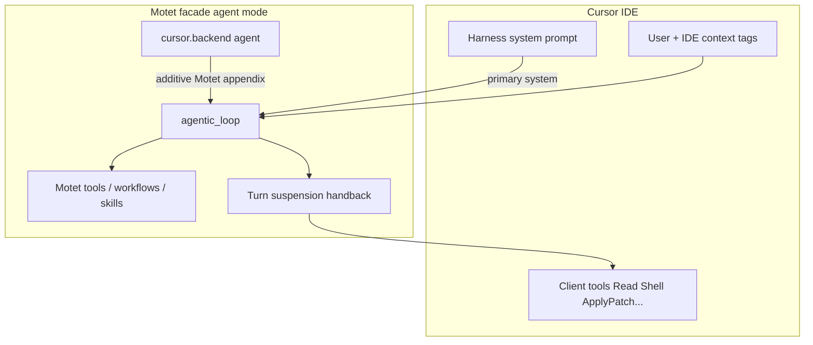

# cursor

**OpenAI-compatible facade showcase** — deploy Motet as an invisible model
backend for [Cursor](https://cursor.com) (or any OpenAI Chat Completions /
Responses client). Cursor’s harness system prompt stays primary (same contract
as GPT/Claude); Motet tools, workflows, skills, and client-tool handback are
additive.

This example demonstrates the OpenAI-compat layer: drop-in `/v1`, facade
**agent** mode, `client_system_primary` prompt policy, and client-tool
handback.

The default agent id, `client_system_primary` prompt policy, and
`metadata.prompt_policy` live on the agent config.

## What it showcases

| Capability | Where |
|---|---|
| Drop-in OpenAI `/v1` surface | Cursor (or any OpenAI client) → Motet |
| Conversation surface `cursor_ide` | `config/surfaces.yaml`; agent `allowed_surface_ids` |
| Facade **agent** mode | Motet owns the tool loop (not bare passthrough) |
| Client harness as primary system prompt | `metadata.prompt_policy: client_system_primary` |
| Motet tools / workflows / skills | Agent `system_prompt` appendix |
| Minimal Motet tool footprint | Meta disclosure (frozen bag); `required_tools`: help + tools_search + tool_call |
| Client-tool handback | IDE tools suspend; Cursor runs them |
| Service-account policy | `--facade-mode agent`, allowlist, `--agent-id`, `--force-thinking` |

## How it works

Two questions that are easy to conflate:

| Question | Answer for this agent |
|----------|------------------------|
| **Who owns the tool loop?** | Motet (`agent` mode + handback) |
| **Whose system prompt is primary?** | Cursor’s inbound harness (same as other models) |



1. Cursor sends its full harness system prompt plus user/IDE context — what it
 would send to GPT or Claude.
2. Motet runs `cursor.backend` in agent mode: harness stays first; this bundle’s
 Motet appendix is appended (tools, workflows, prefer handback for workspace).
3. The model calls **client** tools → Motet suspends and returns OpenAI
 `tool_calls`; Cursor executes them and resumes.
4. The model calls **Motet** tools / workflows → Motet runs them server-side.

**Discovery vs Cursor MCP:** Motet-hosted tools/MCP (e.g. Zoom) use Motet
`core.tools_search` / `core.help`. Cursor `GetMcpTools` only lists IDE MCP
servers. Interactive Motet memory uses `core.memory_store` /
`core.memory_recall`, admitted by memory keyword pins
(`remember`, `recall`, …) rather than resident in every request.
`core.memory_forget` is admitted on forget-intent phrases
(`forget that`, `please forget`), not on “don’t forget”.

**Tool footprint:** Cursor already sends ~26 client tools. Motet keeps a small
frozen meta bag (`core.help` / `core.tools_search` / `core.tool_call`) so the
tools-prefix cache stays stable; catalog Motet tools are reached via
`tools_search` → `tool_call`. Keyword pins admit memory, scheduling/temporal,
oauth, and exec tools on intent. `max_tools: 8` is headroom for always-sticky
(3) plus the largest pin group (4), not a discovery budget.

Motet stays invisible: when asked who you are, identify as the selected model,
not as Motet.

## Prompt assembly

`cursor.backend` sets `metadata.prompt_policy: client_system_primary`
(`motet.core.agents.prompt_policy`):

1. Inbound `role=system` messages (Cursor harness) stay **first**.
2. This agent’s `system_prompt` is appended as a **Motet appendix**.
3. Motet’s default “You are Motet's assistant…” branding is **not** used.
4. Harness + appendix are protected from context token-budget trimming.

Do **not** paste Cursor’s harness into `agents.yaml` — the live inbound system
message is the source of truth (Cursor updates it often).

## Facade modes

| Mode | Client harness system prompt | Motet tools / loop |
|------|------------------------------|--------------------|
| `passthrough` | Forward unchanged | No Motet agent loop |
| `hosted_tools` | Forward unchanged | Bounded Motet tool loop only. Does **not** select this agent — no `cursor.backend` appendix, discovery, or memory hooks. |
| `agent` + `core.default` | Effectively Motet-branded default | Full Motet loop |
| `agent` + `cursor.backend` (this bundle) | Primary | Full Motet loop + appendix + handback |

## Layout

```text
cursor/
 README.md
 manifest.yaml
 agents/agents.yaml # cursor.backend + prompt_policy metadata
```

Agent id: **`cursor.backend`** (alias **`cursor`**). Motet is the backend, not
the IDE — hence not `ide`.

`max_iterations` defaults to **60** (Motet-tool recursion budget). Client
`Read`/`Grep` handbacks stay on the same iteration and do not burn that budget;
`max_model_calls` (default **180**) caps handback↔model loops per turn.

## Setup

### 1. Deploy the bundle

```bash
motet-cli bundles deploy./motet-sdk/examples/bundles/cursor
```

Confirm the agent is registered as `cursor.backend` (alias `cursor`).

### 2. Enable the OpenAI-compat facade

```bash
export MOTET_OPENAI_COMPAT_ENABLED=true
export MOTET_OPENAI_COMPAT_PREFIX=/v1
export MOTET_OPENAI_COMPAT_AGENT_CLIENT_TOOLS=true
```

Restart the API (and workers if needed) so env and the deployed bundle load.

Prefer binding mode / agent / models / thinking on the **service account**
(step 3) so Cursor credentials are self-contained. Process-wide fallbacks still
exist if you need them (`MOTET_OPENAI_COMPAT_DEFAULT_MODE`,
`MOTET_OPENAI_COMPAT_DEFAULT_AGENT_ID`,
`MOTET_OPENAI_COMPAT_DEFAULT_ALLOWED_MODELS`,
`MOTET_OPENAI_COMPAT_FORCE_THINKING`).

### 3. Create a service account for Cursor

Cursor can only send base URL, API key, and model id — it does **not** send
`motet_agent_id` or reasoning opt-in. Bind those on the token:

```bash
motet-cli service-account create \
 --name cursor-facade \
 --tenant motet-global \
 --motet default \
 --roles member \
 --facade-mode agent \
 --allowed-models 'openai/*,deepseek/*,moonshot/*' \
 --agent-id cursor.backend \
 --force-thinking \
 --force-thinking-effort medium
```

| Flag | Why |
|------|-----|
| `--facade-mode agent` | Motet owns the tool loop + handback (ceiling for this credential) |
| `--allowed-models` | Deny-by-default facade allowlist (`provider/model` or `provider/*`) |
| `--agent-id cursor.backend` | Selects this bundle when the request omits `motet_agent_id` |
| `--force-thinking` | Enables Motet thinking for `CAP_REASONING` models even though Cursor’s Chat Completions body usually has no `reasoning_effort` / `reasoning` |

Use the returned `sa_*` token as the OpenAI API key in Cursor. Precedence for
agent id: request `motet_agent_id` → SA `--agent-id` →
`MOTET_OPENAI_COMPAT_DEFAULT_AGENT_ID` → `core.default`.

**Thinking UI:** Motet surfaces summary thinking as Chat Completions
`delta.reasoning_content` when thinking is on. Whether Cursor’s thoughts panel
opens for a custom BYOK model name is client-side and may still fail for
unrecognized ids even when the stream is correct.

### 4. Point Cursor at Motet

In Cursor Settings → Models (custom OpenAI-compatible):

| Setting | Value |
|---------|--------|
| Base URL | `https://<your-motet-host>/v1` (or ngrok URL for local) |
| API Key | `sa_...` token from step 3 |
| Model | An id allowed by the service account / allowlist |

Optional: clients that support Motet request extensions can still send
`motet_agent_id: "cursor.backend"` (or `"cursor"`); that wins over the SA
binding.

## Related

- Passthrough gateway cookbook (no agent): [`../openai-gateway`](../openai-gateway/)
- Other examples: [`../README.md`](../README.md)
- Facade package: `motet/interfaces/api/openai_compat/`
- Prompt policy: `motet/core/agents/prompt_policy.py`
