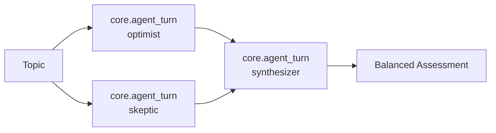

# Expert Panel Bundle

Multi-agent expert panel that analyzes topics from opposing perspectives, then synthesizes a balanced assessment. Demonstrates agent-scoped memory, cross-agent recall, and workflow-driven parallel execution using `core.agent_turn`.

## What It Does

Given a topic (e.g., "remote work", "AI regulation"), three specialist agents each take a full turn analyzing it:

| Agent | Role | Memory Behavior |
|-------|------|-----------------|
| `expert-panel.optimist` | Finds opportunities, benefits, and positive potential | Response stored automatically via `finalize_turn` with agent identity |
| `expert-panel.skeptic` | Identifies risks, challenges, and failure modes | Response stored automatically via `finalize_turn` with agent identity |
| `expert-panel.synthesizer` | Produces a balanced, actionable assessment | Recalls prior panels via `recall_discussion` tool, response stored with agent identity |

The workflow runs the optimist and skeptic as **parallel agent turns**, then feeds both responses into the synthesizer agent. A full run takes roughly a minute. Each `core.agent_turn` pins `openai` / `gpt-5.6-luna` and `enable_thinking: true` on `context` so the panel uses a thinking-capable model even when the chat turn is on something else. Pass `provider` and `model_name` to change the pin.

## Quick Start

```bash
motet-cli deploy dir-deploy motet-sdk/examples/bundles/expert-panel
motet-cli workflows list   # should include expert-panel.discuss
motet-cli agents list      # should include the three expert-panel.* agents
```

Run the panel directly, without going through an agent:

```bash
motet-cli command run core.tool_execution --timeout 300 --data '{
  "tool_name": "core.tool_call",
  "parameters": {
    "tool_name": "workflow_expert-panel.discuss",
    "parameters": {"topic": "four-day work week"}
  }
}'
```

Workflows are invoked through `core.tool_call`, not `core.tool_execution` — the
latter only resolves registry tool names and will report `workflow_expert-panel.discuss`
as not found.

### Chat demo

Open **http://localhost:5173/chat-explorer/** (or `/chat-explorer/` via the API), authenticate, then send:

> Call core.tool_call with tool_name "workflow_expert-panel.discuss" and parameters {"topic": "four-day work week"}. Then present the synthesizer assessment.

Naming the dispatch is what makes this reliable, and it does double duty. Shorter
asks like "run an expert panel on X" read to the model as something it can answer
unaided, so it writes its own pros-and-cons essay instead of convening the panel.
A named tool or workflow also pins the turn to the tool-calling path: analytical
wording alone ("assess", "evaluate") hints chain-of-thought reasoning, which answers
from its own data gathering and never dispatches.

If you use `motet-cli chat` rather than the browser demo, pass `--stream`: a panel
run outlasts the CLI's 60s non-streaming read timeout.

What comes back is the synthesizer's markdown verbatim, with no agent commentary
around it. `discuss.yaml` declares `presentation: {user_facing: true, requires_llm:
false}`, so the loop streams the final step and skips the post-workflow LLM pass.
Without it the calling agent receives all three turns in full — around 170k
characters, large enough to be offloaded to an artifact — and then has to page that
artifact back in to find the synthesis, which costs minutes and often surfaces the
wrong section.

Then, in the same conversation:

> Call expert-panel.recall_discussion with topic "four-day work week" and tell me what each perspective said.

## How It Works

Each workflow step invokes `core.agent_turn`, which gives every agent the full lifecycle:

1. **System prompt** applied from `agents.yaml` (persona, instructions)
2. **`memory_reset`** clears working memory for a clean turn
3. **`prepare_context`** recalls relevant memories from prior conversations
4. **LLM inference** with tool access (the synthesizer can use `recall_discussion`)
5. **`finalize_turn`** stores the response in memory, scoped to the agent's identity

`finalize_turn` tags each stored response `agent:<agent_id>` and records `agent_id`
in its metadata, so each agent's memories are identifiable and cross-agent queries
work naturally. That tag is the contract `recall_discussion` reads — a recall tool
that invents its own tag scheme finds nothing, however healthy the run looked.

## Bundle Structure

```
expert-panel/
├── manifest.yaml              # Bundle metadata and load order
├── agents/
│   └── agents.yaml            # 3 agents: optimist, skeptic, synthesizer
├── tools/
│   └── recall_discussion.py   # Recall past panel discussions by topic
└── workflows/
    └── discuss.yaml           # Parallel agent turns → synthesis
```

No custom commands are needed -- the workflow calls `core.agent_turn` directly with each agent's ID.

## Workflow



`analyze_optimist` and `analyze_skeptic` run in **parallel** (no dependencies on each other). `synthesize` waits for both to complete, receiving their `final_response` outputs in its user message.

## Memory System Features Demonstrated

- **Agent-scoped memory**: Each agent's response is stored with its `agent_id` via `finalize_turn`, providing automatic identity isolation
- **Cross-agent recall**: The synthesizer's `prepare_context` hook can recall memories across agents via `prefer` scope mode
- **Tool-based recall**: The synthesizer explicitly uses `recall_discussion` to search past panel discussions by topic
- **Cross-conversation recall**: `recall_discussion` finds panels held in earlier conversations, so repeated runs build on prior assessments
- **LTM vector search**: `finalize_turn` stores responses that are indexed for semantic recall
- **Topic filtering via memory manager**: `recall_discussion` passes `query` and `min_relevance=0.8` so core keyword coverage (head-biased) drops unrelated panels; the tool only derives perspective from agent identity

## Usage

### Exploring Memories with the CLI

After running the panel, explore what each agent stored:

```bash
# What did the optimist find?
motet-cli memories retrieve --q "remote work" --tag agent:expert-panel.optimist --top-k 5

# What did the skeptic find?
motet-cli memories retrieve --q "remote work" --tag agent:expert-panel.skeptic --top-k 5

# What was the synthesis?
motet-cli memories retrieve --q "remote work" --tag agent:expert-panel.synthesizer --top-k 3

# Cross-agent: see all memories about this topic
motet-cli memories retrieve --q "remote work" --top-k 10
```

### Recalling Past Discussions

The `recall_discussion` tool lets agents query past panel discussions:

```
"What did the panel say about remote work?"
→ expert-panel.recall_discussion(topic="remote work")

"What risks did we identify around AI regulation?"
→ expert-panel.recall_discussion(topic="AI regulation", perspective="skeptic")
```

`perspective` accepts `optimist`, `skeptic`, `synthesizer` (or `all`, the default);
`synthesis`, `moderator`, and `critic` are accepted as aliases. Directly:

```bash
motet-cli command run core.tool_execution --timeout 90 --data '{
  "tool_name": "expert-panel.recall_discussion",
  "parameters": {"topic": "remote work", "limit": 6}
}'
```

Results come back context-processed, so keys are namespaced
(`recall_discussion.result_count`) rather than flat.

## Configuration

The panel works best with `prefer` agent scope mode (the default), which lets the synthesizer read across all agents' memories while each analyst primarily sees their own:

```bash
export MOTET_MEMORY_AGENT_SCOPE_MODE=prefer  # default; recommended
export MOTET_ENABLE_VECTOR_MEMORY=true        # required for LTM
```

## Testing

The bundle's only Python surface is the recall tool, and it is exactly where a
bundle can look healthy while returning nothing. `tests/unit/bundles/test_expert_panel_bundle.py`
pins it to what `finalize_turn` stores, with no memory backend or LLM involved:

```bash
pytest tests/unit/bundles/test_expert_panel_bundle.py -q
```

## Troubleshooting

**The agent answers the question itself instead of running the panel.** Use the
explicit `core.tool_call` prompt above. Model routing decides between answering
directly and dispatching a tool, and a request for a balanced assessment looks
answerable without help. Naming the workflow also keeps intent detection from
hinting a chain-of-thought strategy, which cannot dispatch.

**`recall_discussion` returns 0 results.** Run a panel first — it recalls what
`finalize_turn` stored, so there is nothing to find before the first run.
Then check the tags are present:

```bash
motet-cli memories retrieve --q "<topic>" --tag agent:expert-panel.optimist --top-k 3
```

**A bundle tool outranks its own workflow in discovery.** Agents reach uncatalogued
capabilities through `core.tools_search`, which ranks tools and workflows together.
Generic keywords on a recall tool (`panel`, `discussion`, `debate`) beat the workflow
for "run a panel on X", so the agent searched for a way to recall a discussion that
had never been held. Keep recall-tool keywords past-tense; check with:

```bash
motet-cli command run core.tool_execution --timeout 60 --data '{
  "tool_name": "core.tools_search",
  "parameters": {"query": "run an expert panel discussion on a topic", "limit": 3}
}'
```

## Extending

Ideas for extending this bundle:

- **Add more perspectives**: Add a `pragmatist` agent that focuses on implementation feasibility
- **Scheduled re-evaluation**: Use the scheduler to re-run panels periodically and track how assessments evolve
- **Debate mode**: Have agents respond to each other's analyses in a second round before synthesis
- **Domain specialization**: Create topic-specific agents (e.g., `economist`, `ethicist`) for deeper analysis
