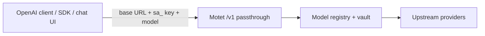

# openai-gateway

**OpenAI-compatible gateway cookbook** — run Motet as a multi-provider drop-in
for anything that speaks OpenAI (`OPENAI_BASE_URL` + API key): SDKs, Open
WebUI, LibreChat, LangChain, CLIs, custom apps.

This is Motet’s answer to a **dumb OpenRouter-style proxy**: one `/v1` URL,
many `provider/model` ids, Motet-owned registry routing, vault credentials,
tenancy, allowlists, and budgets — without BYOK credential relay or silent
model swapping.

This cookbook uses facade **passthrough** mode. Package docs:
[`motet/interfaces/api/openai_compat/README.md`](../../../../motet/interfaces/api/openai_compat/README.md).

## What it showcases

| Capability | Where |
|---|---|
| Drop-in OpenAI `/v1` surface | Any OpenAI client → Motet |
| Facade **passthrough** mode | Registry inference only; client owns any tool loop |
| Multi-provider model ids | `openai/…`, `anthropic/…`, `deepseek/…`, … via allowlist |
| Deny-by-default model policy | SA `--allowed-models` |
| Cost / budgets / traces | Same Motet control plane as native traffic (see below) |
| Upgrade path (same URL) | `passthrough` → `hosted_tools` → `agent` ([`cursor`](../cursor/)) |

## What Motet adds vs a dumb proxy

Passthrough still looks like OpenAI on the wire. Underneath, every completion
runs through Motet’s normal `model_inference` / `model_stream` path — so gateway
traffic is not a dark hole.

| Motet provides | Why it matters |
|----------------|----------------|
| **Cost rows + usage** | Token/usage accounting lands in Motet cost tracking (same as native calls); OpenAI `usage` is returned on the wire |
| **Budgets** | Tenant/principal budget checks apply on facade traffic; exhaustion fails closed instead of running forever |
| **Command events + traces** | Ops can join a client request to Motet task/conversation ids via response headers |
| **Correlation headers** | `X-Motet-Task-Id`, `X-Motet-Conversation-Id`, `X-Motet-Facade-Mode`, `X-Motet-Model` on every response |
| **Vault-held provider keys** | Clients auth to Motet with `sa_*`; Motet calls upstream — not a BYOK credential relay |
| **Deny-by-default allowlists** | Per-credential `provider/model` (or `provider/*`) policy; empty allowlist grants nothing |
| **Tenancy** | Traffic is scoped to the service account’s tenant / Motet environment |

**Not in this cookbook (yet):** cost/complexity **auto-routing** (agent mode,
unbuilt). In passthrough the client’s `model` is binding. Memory,
RAG, Motet tools, and workflows need `hosted_tools` or `agent` (see
[`cursor`](../cursor/)).

## What this folder is (and is not)

| | |
|--|--|
| **Is** | Operator cookbook under `examples/bundles/` so it sits next to `cursor` |
| **Is not** | An agent / tools / workflows bundle |
| **Deploy required?** | **No.** Gateway works from facade env + a service account alone |

There is no `agents/` tree. Deploying `manifest.yaml` is optional and registers
nothing runnable — it only names the example if you want it in a catalog.

For IDE agent mode + client-tool handback, use [`../cursor`](../cursor/)
instead (`--facade-mode agent`, `cursor.backend`).

## How it works



1. Enable the OpenAI-compat facade (`MOTET_OPENAI_COMPAT_ENABLED=true`).
2. Mint a service account with `--facade-mode passthrough` and an
 `--allowed-models` allowlist (deny-by-default).
3. Point the client at `https://<host>/v1` with the `sa_*` token as the API key.
4. Request `model` is **binding** in passthrough — Motet resolves that
 registry id and does **not** silently swap (cost/complexity routing is
 agent mode, not yet applied).

Motet is **not** a BYOK transparent proxy: provider keys stay in Motet’s vault.
Clients authenticate to Motet; Motet calls providers.

## Layout

```text
openai-gateway/
 README.md # this cookbook
 manifest.yaml # example identity only (no agents/commands/tools)
```

## Setup

### 1. Enable the OpenAI-compat facade

```bash
export MOTET_OPENAI_COMPAT_ENABLED=true
export MOTET_OPENAI_COMPAT_PREFIX=/v1
```

Restart the API so the env takes effect. Process-wide fallbacks
(`MOTET_OPENAI_COMPAT_DEFAULT_MODE`,
`MOTET_OPENAI_COMPAT_DEFAULT_ALLOWED_MODELS`) exist, but prefer binding policy
on the service account so each credential is self-contained.

### 2. Ensure provider credentials in Motet

Models come from Motet’s registry; upstream keys live in the vault (same as
native Motet inference). If a provider is not configured for the tenant, facade
calls for that `provider/model` fail the same way Motet-native calls would.

### 3. Create a passthrough service account

```bash
motet-cli service-account create \
 --name openai-gateway \
 --tenant motet-global \
 --motet default \
 --roles member \
 --facade-mode passthrough \
 --allowed-models 'openai/*,anthropic/*,deepseek/*,moonshot/*'
```

| Flag | Why |
|------|-----|
| `--facade-mode passthrough` | Models + metering only; ceiling for this credential |
| `--allowed-models` | Deny-by-default allowlist (`provider/model` or `provider/*`) |

Use the returned `sa_*` token as the OpenAI API key. Do **not** set
`--agent-id` for this path — that binding matters for `agent` mode
([`cursor`](../cursor/)).

### 4. Point a client at Motet

| Setting | Value |
|---------|--------|
| Base URL | `https://<your-motet-host>/v1` |
| API Key | `sa_...` from step 3 |
| Model | An id allowed by the service account (see `GET /v1/models`) |

**List models:**

```bash
curl -sS https://<your-motet-host>/v1/models \
 -H "Authorization: Bearer sa_..."
```

**Chat Completions (curl):**

```bash
curl -sS https://<your-motet-host>/v1/chat/completions \
 -H "Authorization: Bearer sa_..." \
 -H "Content-Type: application/json" \
 -d '{
 "model": "openai/gpt-4o-mini",
 "messages": [{"role": "user", "content": "hello"}]
 }'
```

**OpenAI Python SDK:**

```python
from openai import OpenAI

client = OpenAI(base_url="https://<your-motet-host>/v1",
 api_key="sa_...",)
client.chat.completions.create(model="openai/gpt-4o-mini",
 messages=[{"role": "user", "content": "hello"}],)
```

**Open WebUI / LibreChat / similar:** set the OpenAI-compatible base URL and
API key the same way; pick a model from the allowlist.

Correlation headers on every response (`X-Motet-Task-Id`,
`X-Motet-Conversation-Id`, `X-Motet-Facade-Mode`, `X-Motet-Model`) join client
traffic to Motet traces and cost rows.

## Modes on the same URL

| Mode | Use when |
|------|----------|
| `passthrough` (this cookbook) | Motet as LLM gateway; client owns tools |
| `hosted_tools` | Gateway plus Motet-executed allowlisted tools |
| `agent` + [`cursor`](../cursor/) | Full Motet agent + IDE handback |

A leaked passthrough token cannot escalate into `agent` / `hosted_tools`
(mode ceiling on the credential).

## Optional: deploy this example identity

```bash
motet-cli bundles deploy./motet-sdk/examples/bundles/openai-gateway
```

Optional only — no agents or tools are registered. Skip unless you want the
manifest name visible in deployment listings.

## Related

- Agent / IDE showcase: [`../cursor`](../cursor/)
- Other examples: [`../README.md`](../README.md)
- Facade package: `motet/interfaces/api/openai_compat/`
