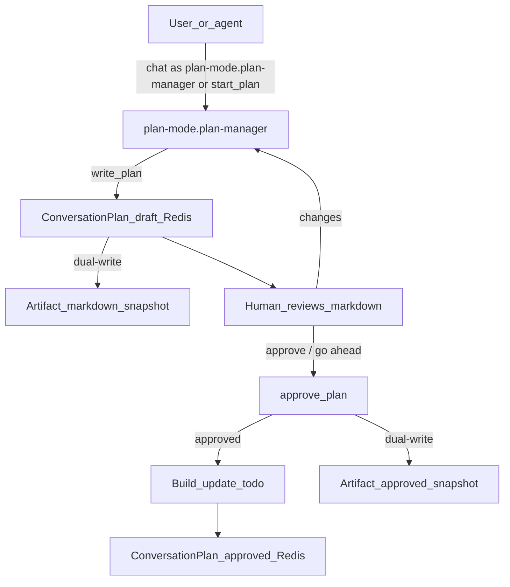

# Plan Mode (example bundle)

Inspectable planning for Motet: one agent writes a structured plan, waits for
**explicit approval**, then implements while updating todo progress.

It does **not** emit Motet Workflow YAML. Workflows remain for authored
command DAGs; planning here is structured plans/todos + `agentic_loop`.

## What you get

| Piece | Purpose |
|-------|---------|
| Agent `plan-mode.plan-manager` | Plan → approve → build (bare alias: `plan-manager`) |
| Tool `plan-mode.start_plan` | Kick off a **plan-only** turn via `core.agent_turn` from another agent |
| Tool `plan-mode.write_plan` | Create/replace conversation plan as **draft** |
| Tool `plan-mode.approve_plan` | Approve or reject the draft (unlocks / blocks build) |
| Tool `plan-mode.get_plan` | Load plan (JSON + markdown + approval_status) |
| Tool `plan-mode.update_todo` | Patch one todo’s status/notes (**approved** plans only) |
| Tool `plan-mode.update_plan` | Patch summary/files/todos (replan → back to **draft**) |

## Plan shape

**Live source of truth:** JSON per conversation
(`plan-mode:plan:{conversation_id}` in Redis, 7-day TTL).

**Durable dual-write:** on `write_plan`, `update_plan`, and `approve_plan`,
plan-mode also creates a **new** `text/markdown` artifact (create-once;
payloads are not updated in place). Tags: `plan-mode`,
`plan-{approval_status}`, `plan-snapshot-{write|update|approve|reject}`.
`latest_artifact_id` is stored on the Redis plan. Use
`core.search_artifacts` (`artifact_tags: ["plan-mode"]`) or
`core.artifact_read` to find prior snapshots. Todo progress
(`update_todo`) does **not** snapshot.

```json
{
 "version": 1,
 "goal": "...",
 "summary": "...",
 "todos": [
 {"id": "t1", "title": "...", "status": "pending", "notes": ""}
 ],
 "files": ["..."],
 "acceptance": ["..."],
 "open_questions":,
 "approval_status": "draft",
 "latest_artifact_id": "",
 "updated_at": "..."
}
```

`approval_status`: `draft` → `approved` | `rejected`. Content edits via
`write_plan` / `update_plan` reset to `draft`.

**Human view:** markdown with approval line + checkbox-style todos
(`` / `[~]` / `[x]` / `[-]`).

## Flow



1. Plan — Chat Explorer: select **Plan Mode**, describe the goal
 (or call `plan-mode.start_plan` from another agent — that turn plans only,
 leaves the plan as **draft**).
2. Review — read the markdown; request edits verbally (`update_plan` /
 `write_plan` → draft again).
3. Approve — say approve / go ahead / implement; the agent calls
 `plan-mode.approve_plan`.
 (If you said “plan and implement without pausing”, it may approve in the
 same turn as `write_plan`.)
4. Build — same agent updates todos as it goes (`update_todo` fails until
 approved).

No new `/api/v1/planner`. This is a **bundle-level** approval gate (tool
enforcement), not a mid-workflow pause worker.

## Deploy

```bash
motet-cli bundle deploy./motet-sdk/examples/bundles/plan-mode
# or hot-load in local/dev per your environment
```

Confirm agents appear:

```bash
motet-cli agents list | rg plan-mode
```

## Naming

Bundle id is **`plan-mode`** (not `planner`) to avoid colliding with
`app-builder.planner` and artifact-prep “planner”.

## Related

- Prior art: `motet-sdk/examples/bundles/app-builder` planner + `approve_plan`
 (GitHub label gate)
- Onboarding: [Your First Bundle](../../../../docs/developer_onboarding/15a-your-first-bundle.md)
