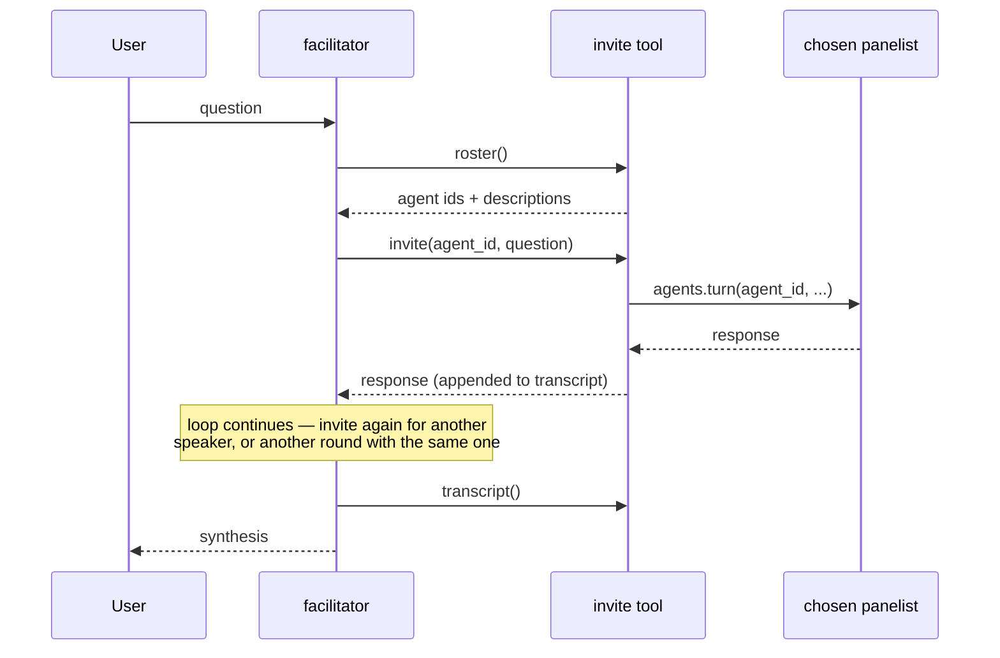

# Roundtable Bundle

A facilitator agent that decides **who speaks next at runtime**, rather than following an order declared ahead of time. It demonstrates that dynamic speaker selection and multi-round discussion do not need a dedicated framework abstraction in Motet — they fall out of three things the runtime already has: an agent registry, `agents.turn()`, and the agentic loop.

Contrast with [`expert-panel`](../expert-panel/), which is the *declared* form of the same idea: a workflow names the participants and fixes the order in a DAG. Use a workflow when the shape of the discussion is known in advance and you want it reproducible; use a facilitator when the question should decide who is worth asking.

## What It Does

You chat with `roundtable.facilitator`. It reads the roster, chooses which agents to put the question to, runs as many rounds as the discussion warrants, and then writes a synthesis grounded in what was actually said.

| Agent | Role | Tools |
|-------|------|-------|
| `roundtable.facilitator` | Chooses speakers, runs rounds, synthesizes | `roster`, `invite`, `transcript` |
| `roundtable.researcher` | Weighs evidence and states confidence | none |
| `roundtable.practitioner` | Tests ideas against operational reality | none |
| `roundtable.contrarian` | Attacks the emerging consensus | none |

Panelists have **no tools at all** (`tool_filter.mode: explicit` with no `required_tools`). That is deliberate: an invited agent answers and stops, so it cannot convene a panel of its own.

## Quick Start

```bash
motet-cli deploy dir-deploy motet-sdk/examples/bundles/roundtable
motet-cli agents list   # should include the four roundtable.* agents
```

Then chat with the facilitator:

```bash
motet-cli chat --stream --agent roundtable.facilitator \
  "Should a mid-size engineering org adopt a four-day work week?"
```

Or open **`/chat-explorer/`**, select **Roundtable Facilitator**, and ask the same question. Streaming is worth using — several agent turns run inside one facilitator turn, so a non-streaming client can hit its read timeout before the discussion finishes.

## How Speaker Selection Works

There is no routing table. The mechanism is one tool call:



The facilitator's model picks the `agent_id`, so selection is a decision made per question. Rounds are not a separate feature either: the agentic loop may call a tool more than once in a turn, so a second `invite` for an agent that already spoke *is* round two. `invite` records it as such, and briefs that agent with the recent transcript so it responds to the discussion rather than restarting it.

This is the same capability other toolkits expose as a `GroupChat` class or a handoff edge. The difference is that here it is ordinary bundle code you can read and change, not a framework primitive you configure.

## The Shared Channel

`invite` appends every contribution to a conversation-scoped transcript, which gives participants a common record without any of them calling each other directly. Three consumers read it:

- **Invited agents** are shown the last few turns, so the contrarian can argue with what the researcher actually said.
- **The facilitator** reads it via `transcript` before deciding whether another round is warranted and before writing the synthesis.
- **Memory** holds a durable copy independently: each panelist's `finalize` hook tags its response `agent:<agent_id>`, so past discussions remain queryable after the transcript's 24-hour TTL expires.

The transcript is stored in Redis under `roundtable:transcript:{conversation_id}` and falls back to a process-local dict when Redis is unavailable, so the helpers stay importable in unit tests.

## Bundle Structure

```
roundtable/
├── manifest.yaml           # Bundle metadata and load order
├── agents/
│   └── agents.yaml         # facilitator + 3 panelists
└── tools/
    ├── roster.py           # List invitable agents from the registry
    ├── invite.py           # Run one turn with a chosen agent — the selection primitive
    ├── transcript.py       # Read the discussion so far
    └── _transcript.py      # Shared-channel store (Redis + fallback)
```

No custom commands and no workflow. Everything is `agents.turn()` plus three tools.

## Inviting Agents From Other Bundles

`roster` lists every agent visible to the caller, not just this bundle's, and `invite` accepts any id the registry resolves. With `expert-panel` also deployed, the facilitator can seat its agents alongside the local ones:

```
"Discuss the four-day work week, and include the expert panel's optimist and skeptic."
```

Pass `bundle="roundtable"` to `roster` if you want to keep the panel to this bundle's cast.

Be aware of two things when inviting outside agents. An agent that has tools of its own will use them, which is often what you want but makes the turn slower and less predictable. And an agent whose tools include a way to convene others can recurse — the guard here only refuses to invite the facilitator itself.

## Testing

`tests/unit/bundles/test_roundtable_bundle.py` covers the transcript store and the tools' guard paths with no runtime, Redis, or LLM involved:

```bash
pytest tests/unit/bundles/test_roundtable_bundle.py -q
```

## Troubleshooting

**The facilitator answers the question itself.** Its system prompt tells it not to, but a question that reads as trivially answerable can still tempt a direct reply. Ask for the panel explicitly — "get the researcher and the practitioner on this" — or make the question one where perspectives plainly differ.

**Only one round happens.** That is often correct: the prompt says to stop when another round would only restate what it has. If you want to see rounds, ask something the panelists will disagree about, or say "run two rounds" outright.

**`invite` returns "Unknown agent".** The bundle deployed but the agent ids are namespaced. Run `motet-cli agents list` and use the fully qualified id (`roundtable.researcher`, not `researcher`).

**Panelists ignore what came before.** Check that `include_transcript` was not set to `false`, and note that only the last four turns are included by design — an agent invited late in a long discussion sees the recent thread, not the whole history.

## Extending

- **Persist the synthesis**: write the closing summary to an artifact, the way `plan-mode` snapshots plans, so a discussion outlives the conversation.
- **Voting**: add a `poll` tool that asks every panelist the same yes/no question and tallies replies, for when you want a count rather than a synthesis.
- **Parallel rounds**: `invite` is sequential. A variant that takes a list of agent ids and uses `motet.join()` would run a round concurrently, trading the ability to let later speakers react to earlier ones for latency.
- **Facilitator-as-tool**: expose the whole roundtable as one tool that another agent can call, the way `plan-mode.start_plan` wraps its planner.
