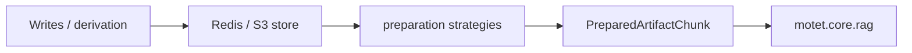

## Package: artifacts

**Artifact storage and metadata** for uploads, derived text, and RAG-facing source material behind a typed protocol (**`ArtifactStoreProtocol`**) with Redis and S3-compatible implementations plus tenant-scoped wrappers.

### Purpose

- **Durable blobs + metadata**: `ArtifactKind`, `ArtifactMetadata`, and store implementations isolate persistence from orchestration commands.
- **Scoped access**: `ScopedArtifactStore` applies tenant/context rules so callers do not bypass isolation at the edges.
- **Preparation pipeline** (`preparation/`): Pluggable strategies select extractors/normalizers before chunk embeddings and Valkey indexing (see and `motet.core.rag`).

### Flow (high level)

### Core components

#### Types and protocol

- **`types.py`**: `ArtifactKind`, `ArtifactMetadata` and related enums/structs consumed by APIs and commands.
- **`protocol.py`**: Abstract store contract implementations must satisfy.

#### Backends

- **`redis_artifact_store.py`** / **`get_artifact_store`**: Redis-backed payloads (default when `MOTET_ARTIFACT_STORE_BACKEND=redis`).
- **`s3_artifact_store.py`**: S3-compatible payload store (Redis still holds metadata/indexes). Local distributed compose uses **SeaweedFS** (`weed mini`) via `MOTET_ARTIFACT_STORE_BACKEND=s3`; EC2 uses AWS S3. The **app-builder** edge worker (`motet-sdk/examples/bundles/app-builder/deploy/docker-compose.yml`) shares that same SeaweedFS endpoint over the external `motet_dev` network — do not run a second object store there or derivation on `edge_app_builder` will miss cloud-worker uploads. Inspect with `motet-cli artifacts` (or SeaweedFS Admin UI on `:23646` locally).
- **`scoped_store.py`**: Namespaced wrapper enforcing scope on top of another store.

#### Delivery helpers

- **`range_utils.py`**: HTTP `Range` header parsing and payload slicing for `206 Partial Content` delivery.
- **`playback_tokens.py`**: Short-lived HMAC tokens that let browser media elements stream artifacts via `GET /api/v1/artifacts/{id}/stream?token=...` without auth headers.

#### Preparation (`preparation/`)

- **`selector.py`**, **`executor.py`**, **`strategies/`**: Pick a strategy per artifact, run preparation, emit normalized content for hashing/chunking. Strategy modules include text/office/docx-oriented paths documented in.

### Notes

- **Retention**: artifacts are durable by default. Callers may pass `ttl_seconds`
 for explicitly transient artifacts; the store does not apply a global default
 expiration.
- **Indexing policy**: eligibility and per-strategy flags live on artifact metadata (see **`motet.core.rag`** README for retrieval scope and env toggles tied to indexing).
- **Orchestration touchpoints**: derivation and artifact/RAG-related commands live under **`motet.core.orchestration.commands`** (for example derivation, preparation/index commands invoked from workers).

### Related

- RAG ingest and retrieval: **`motet/core/rag/`**
