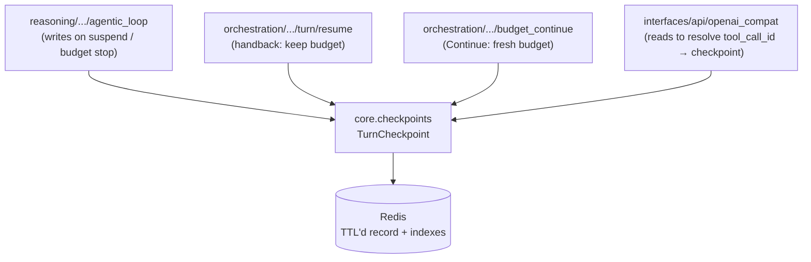

# Turn Checkpoints (`motet.core.checkpoints`)

Durable state for the lifecycle of a single agent turn, independent of the
reasoning strategy that produced it.

One store, two policies:


 handback suspension (`checkpoint_kind=handback`) — resume keeps remaining budget
- Issue #188 budget Continue (`checkpoint_kind=budget_continue`) — prior turn
 finalizes; Continue rehydrates with a **fresh** budget

Not to be confused with [`orchestration/turn/`](../orchestration/README.md),
which is the *active* turn lifecycle — the commands and helpers that run a turn.
This package is the passive store those components read and write. The two were
called `core/turns/` and `orchestration/turn/` until the one-letter difference
proved to be exactly as confusing as it looks.

## Why this is its own package

A turn checkpoint is written by the agentic loop, but it is *read* by two
components that have nothing to do with ReAct:



While the store lived under the ReAct strategy package (`reasoning/react/`), the facade
had to import from a reasoning strategy to resolve a checkpoint, and
orchestration and reasoning imported each other in both directions. `core.checkpoints`
is a leaf: it imports `core.distributed` and nothing else from the application
layers, so all three callers depend downward.

**Keep it that way.** Nothing here may import `reasoning` or `orchestration`.

## Components

| Module | Purpose |
|--------|---------|
| `checkpoint.py` | `TurnCheckpoint` / `CheckpointKind` plus store/load/index helpers; Redis blobs are nested v1 (`schema_version` + `identity` / `loop_state` / `handback`) with flat dual-read for older blobs; handback indexes by `tool_call_id`, budget Continue by conversation+kind |
| `redis_store.py` | Shared Redis blob/index helpers + principal assert, conversation bind, handback observation validation (used by turn + workflow checkpoint stores) |
| `ownership.py` | Shared `classify_turn_ownership` → `execute` \| `handback_all` (issue #157) plus `split_calls_by_ownership` for mixed-turn execute-at-resume (issue #159); consumed by agentic loop + OpenAI HOSTED_TOOLS |

## Usage

```python
from motet.core.checkpoints import (TurnCheckpoint,
 store_turn_checkpoint,
 load_turn_checkpoint,
 find_checkpoint_id_by_tool_call,
 resolve_resume_checkpoint,
 classify_turn_ownership,
 TurnOwnership,)

# On suspend: persist the Motet-authoritative loop state and hand the calls back.
checkpoint = TurnCheckpoint(tenant_id=tenant_id,
 principal_id=principal_id,
 conversation_id=conversation_id,
 handed_back_tool_calls=[
 {"tool_call_id": "call_1", "tool_name": "read_file", "parameters": {...}},
 ],
 **snapshot.to_checkpoint_loop_fields, # LoopStateSnapshot codec)
store_turn_checkpoint(checkpoint)

# On resume: callers usually hold only a tool_call_id, so resolve it first.
checkpoint_id = find_checkpoint_id_by_tool_call(tenant_id=tenant_id, motet_id=motet_id, tool_call_id="call_1")
cp = load_turn_checkpoint(tenant_id=tenant_id, motet_id=motet_id, checkpoint_id=checkpoint_id)
```

## Behavior worth knowing

- **Reads are non-consuming.** Resume is retried in practice (clients re-POST
 tool results), so loading a checkpoint must be idempotent. Records expire on
 their own after `MOTET_TURN_CHECKPOINT_TTL_SECONDS` (default 24h).
- **Writes fail loudly.** `store_turn_checkpoint` raises on Redis failure. A
 suspension whose checkpoint was lost can never be resumed, so silent
 degradation would strand the turn.
- **Keys are tenant/motet-scoped**, which makes cross-tenant reads structurally
 impossible. Principal re-authorization is still performed on resume by
 `resume_turn`.
- **Which fields the checkpoint owns** is defined by 's authority split:
 Motet iteration budget, model-call counters, usage and media accumulators,
 executed signatures, and model/tool settings. Conversation history is recorded
 for callers that resume without their own, but a caller that owns the wire
 transcript (the OpenAI facade) may override it.
- **Populating the loop-state fields** should go through `LoopStateSnapshot`
 (`reasoning/react/loop_state_snapshot.py`) rather than by
 hand, so the checkpoint and `AgenticLoopData` cannot drift apart.
- **Mixed turns execute at resume** (issue #159): suspend always hands the
 whole turn back — the wire assistant message declares every call, so
 caller-supplied transcripts stay provider-valid — but at resume the client
 covers only the externally-owned ids. Observations for Motet-owned ids are
 discarded with a warning (stock agent frameworks answer every call in
 `tool_calls`; Motet's own execution is authoritative), and `resume_turn`
 executes the Motet-owned calls itself before re-entering the loop, with a
 synthetic error-observation backstop for calls that fail. Pure-client turns
 have no Motet-owned calls and resume exactly as before. HOSTED_TOOLS mode
 is unchanged.

## Related

- [`core/reasoning/`](../reasoning/README.md) — the loop that writes checkpoints
- [`core/orchestration/`](../orchestration/README.md) — `resume_agent_turn`, which owns the resumed turn's lifecycle
