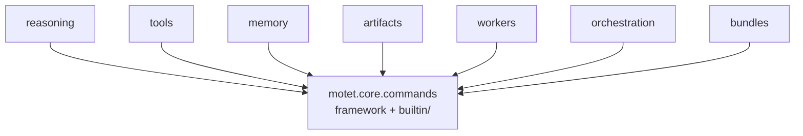

# Commands (`motet.core.commands`)

The command framework, and the built-in command library written on top of it.

## Layout

| Path | Contents |
|------|----------|
| `base.py`, `capabilities.py`, `base_command_data.py`, `response_models.py` | The vocabulary: `Command`, `WorkerCapability`, `BaseCommandData`, command envelopes and typed errors |
| `command_data_registry.py`, `command_type_registry.py` | Command type → payload class, and type registration |
| `decorator.py` | `@distributed_command` / `@motet.command`; re-exports `MotetContext` |
| `motet_context.py` | `MotetContext` and resource helpers (issue #158). `join` unwraps child envelopes on both the success path and `GatherExecutionError.partial_results`. |
| `distributed.py` | `DistributedCommand` base, routing, registry, execute |
| `distributed_types.py` | `DistributionStrategy`, `ScheduleType`, `WorkerAssignment`, `DistributedCommandContext` |
| `distributed_serialization.py` | Redis / msgpack transport mixin |
| `distributed_streaming.py` | Task/command stream helpers mixin |
| `distributed_responses.py` | Success/error response mixin |
| `command_data_classes.py` | Payload models for the built-in commands |
| `concurrency.py` | Composition primitives: gather / dispatch / map. Gather/map fan-in loads Motet `cmd:outcome` first and BLPOP-waits only leftovers (#242); a missed result wake cannot hide a stored envelope. Join Celery limits inherit remaining parent time and cover child max + 30s. EventBus events are observability. Dispatch stays fire-and-forget. |
| `builtin/` | The built-in command library: memory, model, tool, rag, artifacts, conversation, derivation, schedule, reasoning, agent, workflow, transform, worker_lifecycle |

## Why this is one package

Reasoning, tools, memory, artifacts, and workers all *write* commands, so they
all need the `Command` base, `WorkerCapability`, `BaseCommandData`, and the
response models. They are peers that share a framework.

The built-in commands live here too, in `builtin/`, rather than being scattered
into the domain packages they serve. Two reasons. They reach their domains
through the injected context (`motet.memory.recall(...)`) rather than through
imports, so scattering them would collapse no dependency edge. And `MotetContext`
dispatches to them, so keeping them in the same package makes that edge internal
instead of a framework-to-library back-edge.



Nothing in the framework layer imports `orchestration` or `reasoning` at module
scope. **Keep it that way.**

## Registration is explicit

`@distributed_command` registers a command when its module is imported, and
those imports live in `DistributedCommand._ensure_commands_registered`.

**Adding a command module means adding it to that list.** Package `__init__`
does not import every sibling as a backstop, so an unlisted module is an
unregistered command: workers reject it at runtime with "Unknown command
type", and no unit test will catch it.

## What lives elsewhere

- **`motet/core/orchestration/`** — `agent_turn.py` and `turn/`, the turn
 lifecycle. Those genuinely are orchestration.
- **`motet/core/bundles/`** — bundle deploy, hot-reload, and image build.
- **`motet/core/checkpoints/`** — the turn checkpoint store.

## Architecture Overview


## Core Components

### Base Infrastructure

> Import `Command` / `CommandContext` / `CommandStatus`, `WorkerCapability`,
> `BaseCommandData`, the response models, and both registries from
> `motet.core.commands`. Prefer
> `from motet.core.commands.decorator import MotetContext`
> or `from motet.core.commands.motet_context import MotetContext`.

#### Command Execution Engine (Distributed)
- Use `DistributedCommandInvoker` for distributed command execution with routing
- Provides tracing integration, resilience patterns, and worker coordination
- Maintains command history with configurable limits
- Supports both local and distributed execution modes

#### `distributed.py` - Distributed Command Infrastructure
- **`DistributedCommand`**: Base class for commands that can be distributed across workers (mixins for serialization, streaming, and response envelopes; types in `distributed_types.py`)
- **`DistributionStrategy`**: Strategies for distributing commands (single_worker, parallel_fanout, etc.)
- **`DistributedCommandContext`**: Enhanced context for distributed execution
- Public import path: `from motet.core.commands.distributed import …`

**Worker Capabilities Include:**
- `REASONING`, `MODEL_INFERENCE`, `TOOL_EXECUTION`
- `MEMORY_OPERATIONS`, `BROWSER_OPERATIONS`
- `DEPLOYMENT` (bundle deploy pipeline — deployer worker only)
- `MCP_INTEGRATION`, `EMBEDDINGS`, `FILE_OPERATIONS`
- And many more specialized capabilities

#### `utils.py` - Utility Functions
- **`format_tool_observation_text`**: Formats tool results for display
- Tool transcript persistence/reconstruction uses `tool_invocation` + renderers

#### `command_data_classes.py` - Command Payloads
The payload models for concrete commands live here; their shared base
(`BaseCommandData`, `MessageFieldMixin`) is in
[`motet.core.commands`](./README.md).

- **`BaseCommandData`**: Common fields (conversation_history, reasoning_context, metadata, execution_hints) for every command payload
- **`MessageFieldMixin`**: Automatic `Message` deserialization for a `messages` field
- **`unknown_command_data_keys(data_class, payload)`**: Single source of truth for keys a data class would silently drop (`extra="allow"` respected)
- **`validate_command_data(command_type, command_data)`**: Validates a payload against the registered data class and returns an actionable error string, or `None` when valid

```python
from motet.core.commands.command_data_classes import (validate_command_data,)

validate_command_data("core.agent_turn", {"messages": [{"role": "user", "content": "hi"}]}) # None
validate_command_data("core.agent_turn", {"message": "hi"})
# 'unknown command_data field(s) for core.agent_turn: message. Valid fields:...
# Did you mean "messages": [{"role": "user", "content": "..."}]?'
validate_command_data("core.tool_execution", {"tool": "core.note"})
# "unknown command_data field(s) for core.tool_execution: tool. Valid fields:..."
```

There is one canonical turn shape — `messages` as a list of `{role, content}` items.
No alias keys (`message`, `prompt`,...) and no bare-string coercion: misnamed keys
and string `messages` are rejected with actionable errors that name the correct
shape, so an LLM caller self-corrects in one retry.

Unknown keys are rejected rather than ignored. Pydantic drops extras silently, so
without this check a payload like `{"message": "hi"}` for `core.agent_turn` is
accepted, `messages` stays empty, and the turn runs with no user input — surfacing
much later as a provider error. Callers that create schedules (`core.schedule_command`
and `POST /api/v1/schedules`) validate at creation time, because a schedule is
immutable and may be recurring. Every other entry point gets warning-mode visibility:
`DistributedCommand._deserialize_command_data` logs `command_data_unknown_fields_dropped`
whenever a payload carries keys the data class discards.

## Command Categories

### 1. Conversation Analysis (incl. Intent) (`conversation_analysis/`)

Intent classification is handled by the conversation analysis system (no standalone `IntentClassificationCommand`).

#### `conversation_analysis` (decorator-based)
Orchestrates multi-dimension analysis. **No dimension runs by default**: `intent`, `context`, `complexity`, `tone`, and `user_profile` are all opt-in. They remain available for callers that want the labels for their own purposes. Use `ConversationAnalysisData` for the payload.

Routing tiers: trivial turns (closed allowlist of greetings/acks/thanks) skip analysis entirely and qualify for the direct-answer short-circuit; short/moderate turns get LLM-free lightweight analysis; complex turns get full parallel LLM analysis. An allowlisted ack answering a pending assistant proposal ("Should I send it?" → "ok") never skips — `agent_turn` reads the `pending_action` marker from the latest root assistant message in the canonical transcript and passes a routing hint (`ConversationAnalysisData.pending_action`) with the classified reply, yielding dedicated reasons (`confirm_pending_action`, `decline_pending_action`, `stale_pending_action`, `ack_to_pending_action`); stale markers still disable the skip but require re-confirmation before acting. The marker is the single source of truth for pendingness: without a fresh/stale hint the command applies no transcript reads or text heuristics of its own. On a fresh confirm the prior turn's tool shortlist is pinned into tool discovery; on an unconsumed deferral `finalize_turn` carries the marker forward (capped). Every routing decision is logged (`conversation_routing_decision`) and counted in daily Redis hashes surfaced at `GET /api/v1/debug/routing/stats`.

Lightweight analysis still emits an `intent` label, but nothing routes on it. A turn that genuinely needs parallel work calls `core.spawn_agents` mid-loop, once it knows — as an ordinary tool, keeping its history and its control of the turn.

On a turn, analysis inherits that turn's provider and model — the same pair `core.spawn_agents` sub-agents inherit — unless `MOTET_ANALYSIS_MODEL` is set. A model pin without a provider keeps the turn's vendor; set `MOTET_ANALYSIS_PROVIDER` only to send analysis elsewhere. Direct calls with both unset still let `model_inference` resolve the stack defaults. Pin `analysis_model` / `analysis_provider` on the data to override a single call. Each dimension attaches an `OutputContract` built from its `*Result` model, so adapters that can constrain generation do — JSON Schema on OpenAI and Gemini, GBNF grammar locally, a forced tool on Anthropic — and the rest degrade to the prompt plus the dimension's heuristic fallback. Because those result models are the schema source, `Complexity` from `motet.core.reasoning.constants` is literally what the model is asked to emit, and editing it changes the contract.

#### `intent_analysis` (decorator-based)
Focused intent-only analysis. Use `IntentAnalysisData` for the payload. Classifies user intent (greeting, question, task_request, etc.), confidence levels, and strategy hints.

**Purpose:**
- Classify user intent and recommend reasoning strategy
- Used in PREPARING phase via `conversation_analysis` or directly as `intent_analysis`

**Worker Requirements:** `REASONING`, `MODEL_INFERENCE`

### 2. Memory Commands (`memory.py`)

#### `memory_store` (decorator-based)
Stores content in distributed memory systems. Use `MemoryStoreData` for the payload.

**Features:**
- Content storage with metadata and tags
- Automatic embedding generation
- Tenant isolation support

#### `memory_consolidation` (decorator-based)
Consolidates short-term memories into long-term storage. Use `MemoryConsolidationData` for the payload.

#### `memory_tag`, `memory_recall`, & `memory_forget` (decorator-based)
Tag-based memory operations, recall, and targeted delete. Use `MemoryTagData`, `MemoryRecallData`, and `MemoryForgetData` for the payload.

**Worker Requirements:** `MEMORY_OPERATIONS`, `VECTOR_OPERATIONS`, `EMBEDDINGS`

### 3. Model Commands (`model.py`)

#### `model_inference` (decorator-based)
Executes LLM inference across distributed workers. Use `ModelInferenceData` for the payload.

**Features:**
- Multi-provider support (OpenAI, Anthropic, etc.)
- Configurable temperature, max_tokens
- Automatic model selection and load balancing

#### `model_stream` (decorator-based)
Handles streaming model responses. Use `ModelStreamData` for the payload.

**Features:**
- Real-time token streaming
- SSE (Server-Sent Events) support
- Backpressure handling

#### `embedding_generation` (decorator-based)
Generates embeddings for text content. Use `EmbeddingData` for the payload.

**Worker Requirements:** `MODEL_INFERENCE`, `MODEL_STREAMING`, `EMBEDDINGS`

### 4. Orchestration Commands (`orchestration.py`, `turn/` package)

The orchestration commands are split across modules (GitHub issues #146 / #147). The `turn/` package owns the agent-turn surface:

- `turn/command.py` — `@distributed_command` `agent_turn` entry (prepare → hooks → reason → complete) and turn-lifecycle helpers
- `turn/prepare.py` — message / model-policy / input / tool-schema helpers
- `turn/complete.py` — media collection + the terminal stream/return path
- `turn/outcome.py` — `TurnOutcome` / `HandedBackToolCall` classifier + suspended/auth gates (shared finalize policy)
- `turn/resume_agent_turn.py` — `@distributed_command` `resume_agent_turn` (orchestration-owned resume: calls Turn Runtime `resume_turn`, then the same outcome gate + finalize + complete path)
- `turn/runtime/` — Turn Runtime: `persist.py` checkpoint writes, `resume.py` private re-entry, `start.py` / `resume_turn` / `continue_after_budget` return `TurnResult`
- `turn/__init__.py` — re-exports the public API so `from.turn import...` keeps working

`orchestration.py` owns the surrounding commands (`memory_reset`, `prepare_context`, `finalize_turn`, `page_context`) while re-exporting `agent_turn`, `resume_agent_turn`, and turn-lifecycle helpers. Hooks remain inline in `agent_turn` for this slice.

#### `memory_reset` (decorator-based)
Resets working and conversation memory. Use `MemoryResetData` for the payload.

**Features:**
- Selective memory clearing
- High priority execution
- Initialization phase support

#### `prepare_context` (decorator-based)
Prepares execution context for reasoning. Use `PrepareContextData` for the payload.

**Features:**
- Context gathering and preparation
- Memory retrieval and formatting
- Environment setup

#### `finalize_turn` (decorator-based)
Finalizes conversation turns and cleanup. Use `FinalizeTurnData` for the payload. When the assistant response ends with a question, a heuristic `pending_action` marker (question text + this turn's tool shortlist) is attached to the root assistant message in the canonical transcript; `FinalizeTurnData.pending_action_carry` re-attaches an unconsumed deferred proposal (capped carry-forward).

**Worker Requirements:** `MEMORY_OPERATIONS`, `TASK_SCHEDULING`

#### Turn outcome gate + resume (issue #147)
`classify_loop_outcome` maps loop payloads to `complete` / `suspended` / `auth_required` with an explicit `should_finalize` bit. Suspended and auth_required skip the completed-turn finalize. `agent_turn` and `resume_agent_turn` branch on `TurnResult.kind`; a `suspended` kind emits a terminal `suspended` stream event (or nested `agent_turn_suspended`) carrying typed `handed_back_tool_calls` and returns `suspended: true`.

A second bit, `history_only_finalize`, distinguishes the two incomplete outcomes. Suspension writes nothing because its resume writes the single transcript for the logical turn. `auth_required` has no checkpoint and no resume handle — the user authorizes out of band and starts a new turn — so it stores conversation history with `update_memory=False`; otherwise the question and the authorization prompt would both be lost. The gate decides *when* to persist; the caller supplies a `persist_history` callback because only it has the turn's messages and transcript sequence.

Gate and completion responses still carry `stop_reason` / `suspended` / `outcome` on the public command dict. In-process callers and the OpenAI facade resume mapper consume `TurnResult.kind`.

Resume path: prefer `core.resume_agent_turn` (orchestration). It calls Turn Runtime `resume_turn` (checkpoint load, observation validation, loop re-entry; returns `TurnResult`; not a Celery command), then applies the same TurnOutcome gate + `finalize_turn` + `complete_agent_turn` as a normal completed turn. The transcript it finalizes is rebuilt from the checkpoint via the shared `build_resume_history`, so the resume response does not carry every message back across the worker boundary. The OpenAI-compat facade resume (agent mode and hosted_tools mixed/client handback) dispatches `resume_agent_turn` and maps `TurnResult.kind`.

#### Prompt policy (`metadata.prompt_policy`)
By default `agent_turn` prepends the agent’s configured `system_prompt` (motet_system_primary). Agents may set `metadata.prompt_policy: client_system_primary` so inbound client `role=system` messages stay first and the agent `system_prompt` is appended as a Motet capability appendix — used by the `cursor.backend` OpenAI-compat example bundle. Protected prefix messages survive context token-budget trimming (`motet.core.agents.prompt_policy`).

### 5. Tool Commands (`tool.py`)

#### `tool_execution` (decorator-based)
**The primary command for executing any tool through distributed workers.**

**Supported Tools:**
- **Built-in tools**: `web_search`, `http_get`, `file_read`, `math_eval`
- **MCP tools**: `mcp.playwright.*`, `mcp.weather.*`
- **Memory tools**: `memory_tag`, `memory_recall`, `memory_forget`
- **Custom tools**: Any registered tool

**Features:**
- Parameter enhancement using conversation context
- Automatic tool result formatting
- Error handling and retries
- Memory storage of observations
- Metrics collection (execution time, success/failure rates)

#### `tool_list` (decorator-based)
Lists all available tools from worker registries.

#### `tool_discovery` (decorator-based)
Discovers relevant tools based on content and context.

**Worker Requirements:** `TOOL_EXECUTION`, `MCP_INTEGRATION`, `BROWSER_OPERATIONS`, `FILE_OPERATIONS`

### 8. Conversation Commands (`conversation.py`)

Distributed commands for the Conversations API: list, get, clear, register, rename.

- **`conversations_list`** — List conversations for the principal in the tenant (from motet context); returns id, title, created_at, updated_at.
- **`conversation_get`** — Get one conversation: history (from canonical `conversation_transcript` replay) plus memory/vector counts. Memory count is the conversation index size (no decrypt). When the index has rows but replay is empty, `warning` explains that stored messages cannot be decrypted. Uses shared helper in `motet.core.conversations.transcript_replay`.
- **`conversation_clear`** — Remove from registry and clear memory/vector by session tag.
- **`conversation_register`** — Register or touch a conversation in the registry (ensure it exists, update updated_at).
- **`conversation_rename`** — Update a conversation's display title in the registry.

**Worker Requirements:** `MEMORY_OPERATIONS`

### 9. Workflow Commands (`workflow.py`)

#### `workflow_execution` (decorator-based)
Executes multi-step tool workflows with dependency management.

**Features:**
- Sequential step execution
- Dependency resolution
- Error recovery and rollback
- Progress tracking

**Example Workflows:**
- Navigate → Screenshot sequences
- Data extraction → Processing → Storage
- Multi-step research workflows

#### `full_workflow_execution` (decorator-based)
Comprehensive workflow execution with orchestrator integration.

**Worker Requirements:** Dynamically inferred from workflow modules (MODEL_INFERENCE, MEMORY_OPERATIONS, TOOL_EXECUTION, REASONING, TASK_SCHEDULING)

**Usage:**
```python
from motet.core.commands.builtin.workflow import full_workflow_execution, FullWorkflowData

# Inside decorated command:
try:
 result = motet.do(full_workflow_execution, data=FullWorkflowData(workflow=workflow_obj))
 # result is the workflow domain payload (status, step_results,...)
except CommandExecutionError as e:
 logger.error("Workflow execution failed", error=str(e))
 raise
```

## Command Relationships

### Execution Flow
```
1. Intent Classification → Determines routing strategy
2. Memory Reset → Clears working memory
3. Context Preparation → Gathers relevant context
4. Reasoning/Planning → Determines execution approach
5. Tool/Workflow Execution → Performs actual work
6. Memory Storage → Stores results and observations
7. Turn Finalization → Cleanup and response formatting
```

### Dependency Graph
```
conversation_analysis (intent / context)
 ↓
memory_reset → prepare_context
 ↓
reasoning (agentic_loop)
 ↓
tool_execution ←→ workflow_execution
 ↓
memory_store → finalize_turn
```

### Worker Capability Mapping
```
REASONING workers:
- reasoning
- complexity_analysis

MODEL_INFERENCE workers:
- model_inference
- model_stream
- embedding_generation

TOOL_EXECUTION workers:
- tool_execution
- tool_list
- tool_discovery

MEMORY_OPERATIONS workers:
- memory_store
- memory_consolidation
- memory_tag
- memory_recall
- memory_forget
- memory_reset

BROWSER_OPERATIONS workers:
- workflow_execution (for browser workflows)
- tool_execution (for MCP Playwright tools)

DEPLOYMENT workers (deployer worker only):
- core.deploy_bundle, core.validate_bundle, core.publish_bundle
- core.propagate_bundle, core.rollback_bundle, core.undeploy_bundle
```

## Usage Patterns

### Basic Command Execution
```python
from motet.core.commands.builtin.tool import tool_execution, ToolExecutionData
from motet.core.workers import global_invoker

# Create command (decorator-based API)
command = tool_execution(data=ToolExecutionData(tool_name="math_eval", parameters={"expression": "2 + 2"}),
 command_id="cmd_123",
 task_id="task_456",
 conversation_id="conv_789",)

# Execute through distributed invoker
global_invoker.initialize
result = global_invoker.execute_command(command)
```

### Distributed Execution
```python
from motet.core.commands.builtin.model import model_inference
from motet.core.commands.command_data_classes import ModelInferenceData

# Create distributed command (decorator-based API)
command = model_inference(data=ModelInferenceData(messages=[{"role": "user", "content": "Hello"}],
 model_settings={"provider": "openai", "model_name": "gpt-4o-mini", "temperature": 0.7},),
 command_id="model_123",
 task_id="task_456",
 conversation_id="conv_789",)

# Command automatically routes to appropriate worker
# based on MODEL_INFERENCE capability
global_invoker.initialize
result = global_invoker.execute_command(command)
```

### Workflow Execution
```python
from motet.core.commands.builtin.workflow import workflow_execution, WorkflowExecutionData

# Create workflow command (decorator-based API)
workflow_data = WorkflowExecutionData(workflow_id="nav_screenshot",
 workflow_name="Navigate and Screenshot",
 workflow_steps=[
 {"tool": "mcp.playwright.browser_navigate", "params": {"url": "https://example.com"}},
 {"tool": "mcp.playwright.browser_take_screenshot", "params": {}},
 ],)
command = workflow_execution(data=workflow_data,
 command_id="workflow_123",
 task_id="task_456",
 conversation_id="conv_789",)
```

### Automatic Parent Command Tracking

Commands automatically track parent-child relationships for task flow visualization and debugging. When a command creates sub-commands during execution, the parent relationship is automatically detected.

**How It Works:**
```python
# agent_turn (decorator-based) creates sub-commands during execution.
# When a command creates sub-commands (e.g. via motet.do), the parent
# relationship is automatically detected from execution context.
# Example: agent_turn runs conversation_analysis, memory_reset, prepare_context,
# reasoning, finalize_turn — each child gets parent_command_id from context.
```

**Key Features:**
- **Automatic Detection**: Sub-commands automatically detect their parent from execution context
- **Context Preservation**: Parent context is saved/restored across nested command execution
- **Explicit Override**: Can explicitly set `parent_command_id=None` to break the chain
- **Task Flow Visualization**: Parent relationships power the task flow diagram

**Parent Detection Logic:**
1. If `parent_command_id` is explicitly provided (and not None), use it
2. Otherwise, auto-detect from the current execution context via `get_current_command_id`
3. If no context available, `parent_command_id` remains None

**Result:**
```
agent_turn (parent)
 ├── conversation_analysis (child)
 │ └── model_inference (grandchild)
 ├── memory_reset (child)
 ├── prepare_context (child)
 ├── reasoning (child)
 │ └── model_stream (grandchild)
 └── finalize_turn (child)
```

This enables powerful debugging, tracing, and visualization of complex command execution flows.

## Command Services

Each command category includes a corresponding service class that provides high-level orchestration:

- **`IntentCommandService`**: Intent classification orchestration
- **`ModelCommandService`**: Model operation orchestration
- **`OrchestrationCommandService`**: Core orchestration flow
- **`PlanningCommandService`**: Planning operation orchestration
- **`ReasoningCommandService`**: Reasoning strategy orchestration
- **`workflow_execution` / `full_workflow_execution`**: Decorated workflow commands

These services handle:
- Command creation and configuration
- Error handling and retries
- Result aggregation and formatting
- Integration with the broader orchestration system

## Error Handling & Resilience

### Built-in Resilience Features
- **Circuit Breaker Integration**: Commands can specify breaker profiles
- **Retry Logic**: Configurable retry attempts with exponential backoff
- **Timeout Management**: Per-command timeout configuration
- **Graceful Degradation**: Fallback strategies for failed commands

### Error Recovery
- **Undo Operations**: Commands support undo with stored undo_data
- **Compensation Actions**: Failed workflows can trigger compensation
- **State Rollback**: Memory and context can be restored on failures

## Observability

### Tracing Integration
- All commands automatically generate OpenTelemetry spans
- Command execution is traced end-to-end
- Distributed tracing across worker boundaries

### Metrics Collection
- Command execution times and success rates
- Worker utilization and capability usage
- Tool execution metrics (via ToolExecutionCommand)
- Memory operation performance

### Logging
- Structured logging with command context
- Error logging with full stack traces
- Performance logging for optimization

## Bundle Deployment

Bundle build, deploy, propagate, rollback, and hot-reload live in
**`motet/core/bundles/`** — see [that package's README](../bundles/README.md).
They are distributed commands, but nothing about them is orchestration, so they
are documented with the rest of the bundle lifecycle rather than here.

Note that `motet.core.orchestration.commands` deliberately does **not**
re-export them; import from `motet.core.bundles.deploy` /
`motet.core.bundles.bundle_reload` directly.

## Extension Points

### Adding New Commands (Traditional)
1. Inherit from `DistributedCommand`
2. Define required worker capabilities
3. Implement serialization/deserialization
4. Add to `__init__.py` exports
5. Create corresponding service class if needed

### Adding New Commands via Bundles ✅ **RECOMMENDED**
1. Use `@motet.command` or `@distributed_command` decorator in a bundle’s `commands/*.py`
2. Define Pydantic data class for input; use `motet` for tools, memory, etc.
3. Deploy the bundle via **POST /api/v1/deploy** or **`motet-cli deploy git-deploy`** / **`motet-cli deploy dir-deploy`**
4. Commands are namespaced as `bundle_id.command_type` and available on targeted workers after reload
5. No worker image rebuild for code-only changes; validate with **POST /api/v1/deploy/validate** or **`motet-cli bundle lint`**

### Custom Worker Capabilities
1. Add to the `WorkerCapability` enum in `motet/core/commands/capabilities.py` (and mirror it in `motet_sdk.capabilities`)
2. Update worker registration
3. Implement capability-specific logic
4. Update routing and distribution logic

### Integration with External Systems
- Commands can integrate with external APIs
- Support for custom transport mechanisms
- Pluggable serialization formats
- Custom result aggregation strategies

## Best Practices

### Command Design
- Keep commands focused and single-purpose
- Use appropriate worker capabilities
- Include comprehensive error handling
- Support serialization for distributed execution

### Performance Optimization
- Use appropriate timeout values
- Configure retry policies based on operation type
- Leverage worker capabilities for optimal routing
- Monitor and optimize command execution patterns

### Security Considerations
- Validate all command parameters
- Implement proper tenant isolation
- Use secure serialization methods
- Audit command execution for compliance

This command system provides the foundation for the AI stack's distributed architecture, enabling scalable, resilient, and observable execution of all system operations.
