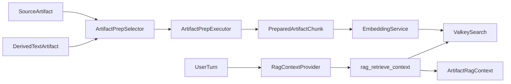

# Motet Core RAG

## Overview

`motet.core.rag` indexes `PreparedArtifactChunk` records into tenant-scoped Valkey Search indexes and retrieves citation-ready chunks during context preparation.

Artifact preparation and chunking live in `motet.core.artifacts.preparation`. Built-in strategies currently cover plain text/Markdown, JSON/tool output, structure-aware DOCX, and broader office documents. Image artifacts continue to use multimodal context injection; CLIP-style image embeddings remain future work.

## Flow



## Configuration

Artifact RAG is disabled by default:

```bash
MOTET_ARTIFACT_RAG_ENABLED=true
MOTET_ARTIFACT_RAG_INDEX_ON_DERIVATION=true
MOTET_ARTIFACT_RAG_TOP_K=5
MOTET_ARTIFACT_RAG_SIMILARITY_THRESHOLD=0.0
MOTET_ARTIFACT_RAG_HYBRID_ENABLED=true
MOTET_ARTIFACT_RAG_NATIVE_TEXT_MODE=auto
MOTET_ARTIFACT_RAG_VECTOR_WEIGHT=0.7
MOTET_ARTIFACT_RAG_LEXICAL_WEIGHT=0.3
MOTET_ARTIFACT_RAG_CANDIDATE_MULTIPLIER=4
MOTET_ARTIFACT_RAG_CHUNK_SIZE=3200
MOTET_ARTIFACT_RAG_CHUNK_OVERLAP=400
MOTET_ARTIFACT_RAG_TOKEN_BUDGET=4000
```

Workers use the centralized `EmbeddingService` from worker context. In Docker Compose this should point at the `embedding-server` sibling rather than loading SentenceTransformer inside the worker.

## Artifact Eligibility

Durable artifact eligibility is stored on the source artifact metadata. `artifact_indexing_enabled=false` prevents `core.prepare_artifact_index` from writing chunks for that source and removes existing chunks when the Manage UI disables indexing through the Artifacts API. Per-strategy overrides are stored in `disable_strategies`.

## Scope Enforcement

Retrieval is fail-closed. Conversation-scoped retrieval requires:

- `tenant_id`
- `motet_id`
- `principal_id`
- `role`
- `conversation_id`

Chunk indexes are tenant scoped with names like `artifact_chunks:{tenant_id}` and keys like `artifact_chunk:{tenant_id}:{source_artifact_id}:{prep_strategy_id}:{chunk_index}`.

The portable index uses vector search plus TAG/NUMERIC metadata filters. `content_text`, `coordinates`, strategy metadata, and `filename` are stored in the HASH for retrieval and citation formatting. With `MOTET_ARTIFACT_RAG_NATIVE_TEXT_MODE=auto`, startup probes whether the current Valkey Search runtime accepts `TEXT` fields. If it does, new indexes include native `filename TEXT` and `content_text TEXT`; if not, the repository falls back to the portable schema.

## Hybrid Retrieval

Retrieval uses application-layer hybrid fusion by default. The retriever over-fetches vector candidates from Valkey Search, performs a bounded scoped scan of chunk HASHes for keyword/phrase scoring, then merges candidates with weighted vector and lexical scores. This preserves keyword-sensitive retrieval without requiring native Valkey/RediSearch `TEXT` support.

## Position-Ordered Retrieval

When the retrieval plan sets `position_ordered=True` (artifact-scoped retrieval where the inline attachment text exceeds the token budget), the retriever bypasses similarity ranking and returns chunks for the scoped artifacts in chronological/document order (`source_artifact_id`, timestamp, `chunk_index`). This yields an even sample of a long document or transcript instead of similarity-clustered fragments.

## Fallback Behavior

`RagContextProvider` is no-op unless `artifact_rag_enabled` is true. Supersession of inline attachment text is budget-gated: full derived text that fits the configured token budget is kept and retrieval is skipped (`full_text_in_budget`); signal-free queries over a single this-turn attachment also skip retrieval (`signal_free_single_attachment`). When retrieval does run and hits, chunks replace the oversized inline text; if retrieval has no hits or errors, the existing full-document injection remains as fallback.
