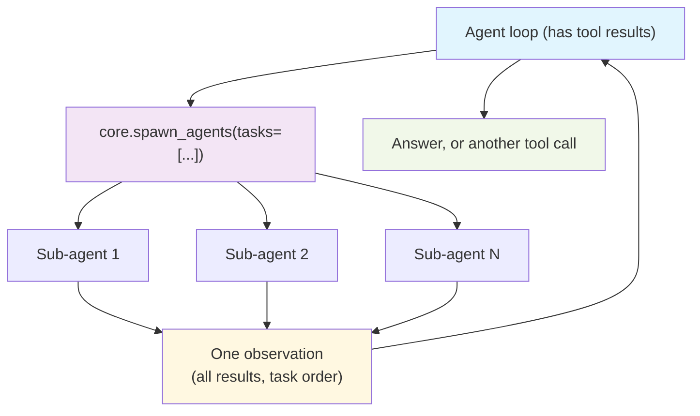
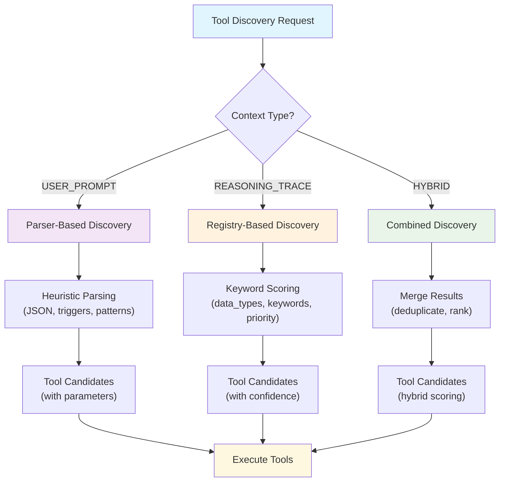

## Package: reasoning

**Distributed reasoning system**: `agent_turn` → in-process `run_agent` → in-process `agentic_loop` (Turn Runtime `start`; no nested `core.agent_loop` slot). Fan-out sub-agents still `motet.do(agent_loop)` so workers overlap.

### Purpose
- **Distributed Reasoning Execution**: Reasoning executes as distributed commands
- **Single execution entry point**: `run_agent` starts `agentic_loop`
- **Live Data Integration**: Trace-based reasoning with current information gathering
- **Intelligent Tool Discovery**: Context-aware tool selection and parameter enhancement
- **Fan-out**: the `core.spawn_agents` tool, called from inside the loop when parallelism adds value
- **Worker Coordination**: Seamless execution across distributed Celery workers

### Core Components

#### Agent loop (`react/`)
- **Default executor**: `agentic_loop` (self-contained discovery + tool chaining)
- **Turn destinations**: the loop via `run_agent`, or a direct no-tools reply in `orchestration/turn/no_tools.py`. Nothing routes between reasoning strategies, because there is only one executor
- **Event Streaming**: Real-time reasoning events for monitoring and UI integration

#### Loop modules
`loop_context.py` and `reasoning_events.py` sit alongside `react/` as shared utilities.
- `react/`: `agentic_loop` (one in-process iteration; issue #147 factorization), `loop_driver.py` (`run_agentic_loop` calls `agentic_loop` in-process under Turn Runtime `start`; model/tools stay distributed; child commands carry `agentic_loop_iteration` on cmd:meta for task-flow grouping; do not `motet.do(agentic_loop)`), `loop_discovery.py` (sticky shortlist merge, keyword pins, discovery filters), `loop_execution.py` (tool-call build/dedup, tool execution, prefilled first action, signature derivation, workflow fast-path), `loop_observations.py` (workflow step formatting, MCP text extract, observation clipping), `loop_skills.py` (attachment pins, artifact_view sidecars, activate_skill runner exposure), `loop_results.py` (terminal `build_loop_result` contract + `accumulate_usage`; a deliberate leaf so both `agentic_loop` and `loop_execution` can import it at module scope — `react/` is an acyclic import graph and nothing imports back into the conductor. The accumulator also carries the turn's `cost_usd`, summed from each priced model call, which `build_loop_result` surfaces top-level rather than inside `usage`: `usage` is the token envelope the UI and OpenAI-compat facade read, and a dollar amount there would be taken for a token count. The key is created on the first priced call, so an unpriced turn reports no cost instead of a `0.0` that reads as free — which is why `usage_accumulator` is typed `Dict[str, Any]` on `AgenticLoopData` / `LoopStateSnapshot` / `TurnCheckpoint`), `loop_state_snapshot.py` (**LoopStateSnapshot** codec — single `AgenticLoopData` ↔ checkpoint / recursion conversion surface so agent entry, recursion, suspend, and resume cannot drift), `tool_shortlist.py` (conversation **sticky tool set** — tools-prefix stability: frozen meta bag — `core.help` / `core.tools_search` / `core.tool_call` plus keyword pins — cache-stable; catalog reachability is `tools_search` → `tool_call`; no per-turn embedding shortlist. Size `max_tools` above always-sticky (3) plus the largest keyword pin group (4) — truncation happens after pins are admitted), Resume re-entry is Turn Runtime (`orchestration/turn/runtime/resume.py`, re-exported from `runtime/`). The checkpoint store itself lives in [`core/checkpoints/`](../checkpoints/README.md) rather than here, because orchestration's `resume_agent_turn` and the OpenAI-compatible facade both read it: when `AgenticLoopData.handback_tool_names` marks a tool as externally owned, a model turn requesting it checkpoints the Motet-authoritative loop state to Redis (TTL'd, non-consuming reads), hands ALL of the turn's calls back with `stop_reason="suspended"`, and `resume_turn` later validates the supplied observations against the recorded handback, re-authorizes the principal, and re-enters the loop with the restored iteration budget / usage. Call signatures are the exception to "restore from checkpoint": they assert *this call ran and its result is above*, so they are re-derived from whichever history is authoritative (`derive_executed_signatures`) — a client that summarizes drops old tool results, and a carried-over signature would misread a legitimate re-read as making no progress. Restoring Motet's own history keeps the checkpointed set; when `handback_tools` schemas are present they are injected into the model tool list every iteration — client schema wins on a name collision, logged — and the system prompt enumerates them and steers the model to prefer them for client-environment work over overlapping Motet tools)
- **Budget wrap-up** (`agentic_loop.py`, `BUDGET_WRAP_UP_REMAINING`): the model does not otherwise see `remaining_iterations`. On the last two Motet-tool rounds the loop appends a trailing user notice (`[budget wrap-up] Iteration N of M…`) so a parent or a `core.spawn_agents` child can write up instead of fetching once more. The system prefix is not rewritten. Hosted_tools turns leave the client's messages alone. A leftover notice is stripped when Continue refreshes the budget.
- **Forced finalize** (`agentic_loop.py`, `_try_finalize_writeup`): when a rail still fires (`max_iterations` / `max_model_calls` / `max_cost` / `max_prompt_tokens` / `max_tool_time` / `stalled`), the loop issues one extra `model_stream` with `tools=` and a trailing `[budget finalize]` notice. `stop_reason` stays the rail so parent Continue still applies; `finalized=True` marks a successful write-up so `core.spawn_agents` counts it as an answer instead of dropping scaffolding. Failure falls back to the scaffolding text.
- **Observation cache-control** (`tools/cache_control.py`, honored in `loop_execution.py`): a tool result may declare freshness (`no-store`, `same-turn`, `max-age=N`). A fresh same-signature hit replays a short `[cached]` notice instead of re-executing. Default is `no-store`. Snapshot built-ins (`core.http_get`, `core.http_get_browser`, `core.web_search`) attach `same-turn` on a usable success. A key inherited from `core.spawn_agents` is marked `inherited_from=spawn` and the notice points at the spawn observation — the parent does not have the child's page body — plus the child's tool `artifact_id` when the fetch was offloaded. This is not a stall rail — shopping new URLs still runs.
- **Progress rail, not duplicate veto** (`agentic_loop.py`, `MAX_STALLED_ITERATIONS`): repeating a tool call is executed, not refused. A re-read after an edit is legitimate and is indistinguishable by signature from a stuck model, and a per-call veto is escapable anyway — nudge an offset and the "same" call goes through, which is how refused re-reads turned into read windows that crept a byte at a time. Progress is judged per iteration: any call the turn has not made before clears the counter, and `MAX_STALLED_ITERATIONS` (default 3, `MOTET_MAX_STALLED_ITERATIONS`) consecutive repeat-only iterations stop the turn with `stop_reason="stalled"`. Cost stays bounded by `max_model_calls`; idempotent side effects are handled at the command layer.
- `react/prompt_cache_probe.py`: **prompt-cache prefix diagnostics**. Provider prefix caches are all-or-nothing from the first changed byte, so an *append* to the prompt tail keeps the cache while any *rewrite* upstream of it re-ingests the remainder at full input price — a distinction aggregate usage counters cannot show. The probe fingerprints every prompt segment (one per tool schema, one per message) in provider prefix order, chains those digests into rolling prefix hashes, and diffs the chain against the previous model call on the same conversation. State lives in Redis, so the comparison also spans turn suspension/resume. Off by default; enable with `MOTET_PROMPT_CACHE_PROBE=true` and read `prompt_cache_probe` log lines:

```bash
MOTET_PROMPT_CACHE_PROBE=true # then, per model call:
docker logs motet_dev-worker-1-1 | rg prompt_cache_probe
```

 `verdict=append_only` means the prefix survived (a cache miss on that call points at cache TTL or provider eviction, not prompt shape); `verdict=prefix_rewritten` names the exact `divergence_segment` Motet changed and reports `lost_chars`, the size of the invalidated suffix.

Inspectable planning is a bundle concern (structured plans/todos + agentic_loop);
durable multi-step command DAGs remain workflows.

### Implemented
- Agent loop (ReAct) as the only executor; live `reasoning_step` events.
- **Parallel fan-out** as the `core.spawn_agents` tool: the loop names the work, sub-agents run it on separate workers, and results return as one observation the loop synthesizes with the rest of its context.
- **Unified tool discovery** with context-aware selection
- **Enhanced parameter extraction** using conversation context and schema awareness
- **Enhanced event telemetry** via `reasoning_step` events (strategy, step, thought, action, observation).

### Usage
- Use `mode="auto"` (the default). The remaining modes are escape hatches, not a strategy menu — see *Forcing a mode* below.

### Parallel fan-out (`core.spawn_agents`)

Fan-out is a tool, not an executor the turn switches into. The loop passes a list
of self-contained task strings; each becomes one sub-agent on its own worker, and
their answers come back together as a single observation.



The loop keeps control throughout: the children's results are already in its
history when it decides, and still there when the answers return.

**Rails:**
- **Width** is capped at `MAX_FANOUT_WIDTH` (8). Over the cap the call is
 rejected with the limit stated, rather than truncated: silently dropping
 declared work would let the model believe it ran.
- **Recursion** is blocked by subtracting the tool, not counting depth.
 Sub-agents inherit the parent's `tool_filter_metadata` with
 `core.spawn_agents` added to `exclude_tools`, so a child cannot fan out again.
 Depth 3 at width 10 would be a thousand agents.
- **Scope** never widens: children inherit the parent's exclusions and pins. A
 parent with no delegable filter (non-discovery `ToolFilter`) is refused rather
 than given a guessed one.
- **Handback tools** are never inherited — they suspend the *turn*
 and a sub-agent has no caller to hand back to.
- **Partial failure** degrades the observation, not the turn: `fail_fast=False`,
 and failed branches come back marked as errors alongside the ones that worked.
- **Child spend** is tighter than the parent: 10 rounds, 8 tool calls, $0.20,
 80k prompt tokens, and 60s of join wall-clock tool time. Parent turns leave
 `max_tool_time_ms` at 0 (off). The loop checks tool time after each batch;
 a cache hit adds 0. `max_tool_time` is an incomplete stop unless the loop
 finalized a write-up.
- **Fan-in observation is the write-ups.** Each child comes back as
 status, stop reason, full response, and `tools_used`. A tool artifact
 is only a clip sidecar for the 8k observation cap. After fan-in the
 parent inherits the children's snapshot-tool *keys* (`http_get` /
 `http_get_browser` / `web_search`) so an exact repeat this turn is a
 refetch veto that points at that observation. The parent does not
 receive the child's page bodies.

### NEW: Unified Tool Discovery System
All reasoning strategies now use a centralized tool discovery service that intelligently selects the best tools for each context.

**Discovery Strategies:**
- **USER_PROMPT**: Parser-based discovery for direct user requests (ReAct style)
- **REASONING_TRACE**: Registry-based discovery for investigation areas
- **HYBRID**: Combines both approaches for optimal results

**Tool Selection Process:**


**Benefits:**
- **Consistent Discovery**: Same logic across every discovery caller
- **Context-Aware**: Different strategies for different use cases
- **Confidence Scoring**: Tools ranked by relevance and capability
- **Fallback Mechanisms**: Graceful degradation when discovery fails
- **Extensible**: Easy to add new discovery strategies

### Event Telemetry

`agentic_loop` and `core.spawn_agents` emit `reasoning_step` events (via shared `emit_reasoning_event`) for observability and UI:

- **EventBus**: All events published for system-wide observability.
- **Task/trace stream**: When `stream_key` is set, events are also written to Redis for frontend (e.g. Reasoning Chain).

**`reasoning_step`** (strategy, step, thought, action, observation) enables:
- **Progress visibility**: Stage and per-trace steps (e.g. "Generated N traces", "Gathering data for trace").
- **Debugging**: Trace reasoning flow and failures.
- **Metrics**: Step counts and strategy usage.

### Turn routing
There is one default executor and nothing predicts it. `resolve_turn_mode`
(`orchestration/turn/gate.py`) resolves a caller's forced mode and the turn
gate's trivial verdict; everything else runs the agent loop, which reaches
fan-out itself by calling `core.spawn_agents` once it has evidence.

Asking for a missing fact is a standing line in the agent's system brief,
where the tool schemas are.

### Forcing a mode
- `mode="auto"` (default): agent loop. Trivial turns get a direct reply.
- `mode="no_tools"`: direct reply with no tools (safety, compliance, testing).
- `direct` maps to `no_tools`. `agentic` / `react` skip the trivial gate and
  otherwise match `auto` — keep them for tests, not product code. Any other
  value runs as `auto`. Parallel work is `core.spawn_agents` from inside the
  loop.

### Planned
- Per-step tool choice scoring and backtracking policy.
- Richer reasoning traces (with confidence) and evaluation harness.
