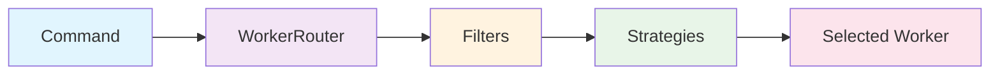
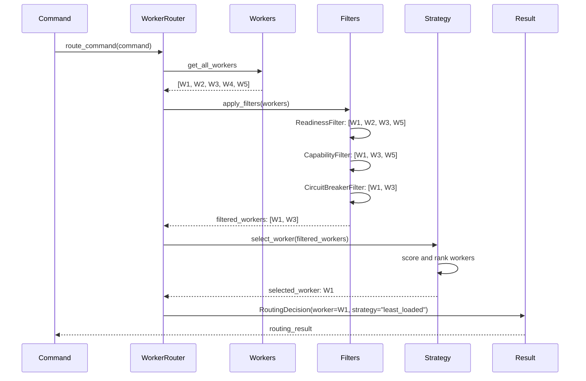
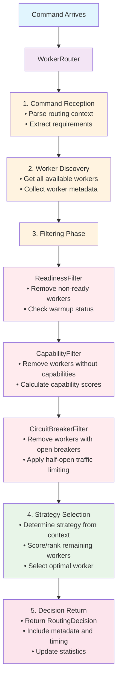
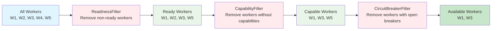
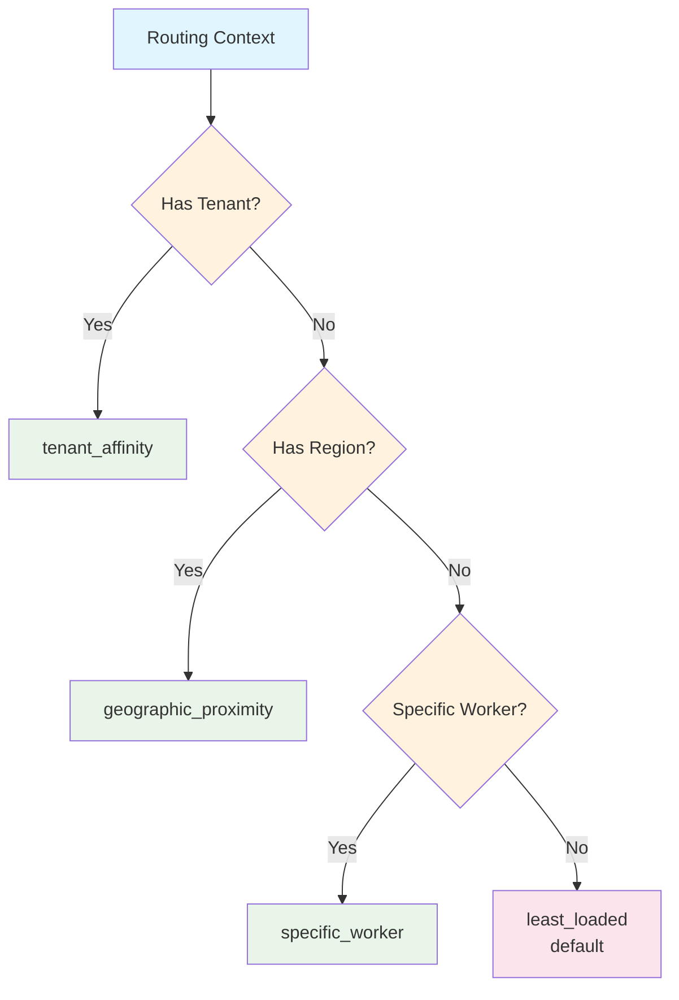
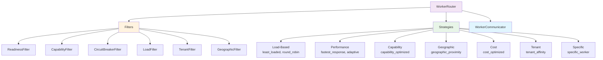

# Motet - Routing System

The routing system is the core component responsible for intelligently distributing commands across available workers in the distributed AI stack. It implements a sophisticated two-phase approach using filters and strategies to ensure optimal command execution.

## Table of Contents

- [Architecture Overview](#architecture-overview)
- [Routing Pipeline](#routing-pipeline)
- [Filters vs Strategies](#filters-vs-strategies)
- [Available Filters](#available-filters)
- [Available Strategies](#available-strategies)
- [Usage Examples](#usage-examples)
- [Configuration](#configuration)
- [Monitoring & Observability](#monitoring--observability)
- [Performance Considerations](#performance-considerations)
- [Extending the System](#extending-the-system)

## Architecture Overview

The routing system follows a **filter-then-select** pattern that ensures both correctness and optimality:

```
Command → Filters → Strategies → Selected Worker
```

### Core Components

- **WorkerRouter**: Central routing engine that orchestrates the entire process
- **Filters**: Remove unsuitable workers based on hard constraints
- **Strategies**: Select the optimal worker from remaining candidates
- **RoutingContext**: Contains command requirements and routing preferences

## Routing Pipeline

### 1. Command Reception
```python
# Commands arrive with routing context
context = RoutingContext.from_command(command)
```

### 2. Worker Discovery
```python
# Get all available workers
all_workers = await worker_router._get_all_workers
```

### 3. Filtering Phase
```python
# Apply filters in sequence
filtered_workers = await worker_router._apply_filters(all_workers, context)
```

### 4. Strategy Selection
```python
# Determine and apply routing strategy
strategy = worker_router._determine_strategy(context)
selected_worker = strategy.select_worker(filtered_workers, context)
```

### 5. Decision Return
```python
# Return routing decision with metadata
return RoutingDecision(selected_worker=selected_worker,
 strategy_used=strategy_name,
 decision_time_ms=decision_time,
 #... additional metadata)
```

## Filters vs Strategies

| Aspect | Filters | Strategies |
|--------|---------|------------|
| **Purpose** | Remove unsuitable workers | Select best worker from candidates |
| **Operation** | Binary (pass/fail) | Scoring and ranking |
| **Input** | All available workers | Filtered workers only |
| **Output** | Subset of workers | Single selected worker |
| **Timing** | Applied first | Applied after filtering |
| **Examples** | Readiness, Capability, Circuit Breaker | Least Loaded, Tenant Affinity, Round Robin |

### Filter-Strategy Relationship

```
Available Workers: [W1, W2, W3, W4, W5]
 ↓
ReadinessFilter: [W1, W2, W3, W5] (W4 not ready)
 ↓
CapabilityFilter: [W1, W3, W5] (W2 lacks capabilities)
 ↓
CircuitBreakerFilter: [W1, W3] (W5 has open circuit breaker)
 ↓
Strategy (least_loaded): W1 (load: 0.3 vs 0.7)
```

## Available Filters

### Core Filters

#### ReadinessFilter
- **Purpose**: Ensures commands only route to ready workers
- **Criteria**: Worker state = 'ready' AND warmup_completed = true
- **Location**: `filters/readiness.py`

#### CapabilityFilter
- **Purpose**: Ensures workers have required capabilities
- **Criteria**: Worker capabilities ⊇ required capabilities
- **Location**: `filters/capability.py`

#### CircuitBreakerFilter
- **Purpose**: Excludes workers with open circuit breakers
- **Criteria**: Circuit state ≠ 'OPEN'
- **Features**: Half-open traffic limiting, Prometheus metrics
- **Location**: `filters/circuit_breaker.py`

#### EdgeWorkerAffinityFilter
- **Purpose**: Prevents cross-principal/cross-tenant dispatch to edge workers (`edge_*` worker IDs)
- **Criteria**: For `command_scope="principal"` edges, command `principal_id` must match the worker's `owner_principal_id`; for `"tenant"` scope, `tenant_id` must match `owner_tenant_id`. Cloud workers always pass.
- **Data source**: `owner_principal_id` / `owner_tenant_id` / `command_scope` are copied from `WorkerInfo` into the router's worker dicts in `_get_all_workers` — required for this filter to be effective
- **Location**: `filters/edge_worker_affinity.py`

### Specialized Filters

#### LoadFilter
- **Purpose**: Removes overloaded workers
- **Criteria**: current_load ≤ max_load_threshold
- **Location**: `filters/load.py`

#### TenantFilter
- **Purpose**: Handles tenant isolation and affinity
- **Modes**: Strict isolation vs soft affinity
- **Location**: `filters/tenant.py`

#### GeographicFilter
- **Purpose**: Handles region preferences and data locality
- **Criteria**: Prefers workers in specified regions
- **Location**: `filters/geographic.py`

#### CompositeFilter
- **Purpose**: Applies multiple filters in sequence
- **Usage**: Combines standard filtering operations
- **Location**: `filters/composite.py`

## Available Strategies

### Load-Based Strategies

#### LeastLoadedStrategy
- **Purpose**: Route to worker with lowest current load
- **Best for**: General load balancing
- **Key**: `least_loaded`

#### RoundRobinStrategy
- **Purpose**: Cycle through workers evenly
- **Best for**: Simple load distribution
- **Key**: `round_robin`

#### WeightedRoundRobinStrategy
- **Purpose**: Round robin with load-based weights
- **Best for**: Heterogeneous worker capacities
- **Key**: `weighted_round_robin`

### Performance Strategies

#### FastestResponseStrategy
- **Purpose**: Route to historically fastest worker
- **Best for**: Latency-sensitive commands
- **Key**: `fastest_response`

#### StateAwareStrategy
- **Purpose**: Consider worker state for optimal routing
- **Best for**: Stateful operations
- **Key**: `state_aware`

#### AdaptiveStrategy
- **Purpose**: Dynamically adjust based on conditions
- **Best for**: Variable workloads
- **Key**: `adaptive`

### Capability Strategies

#### CapabilityOptimizedStrategy
- **Purpose**: Prefer workers with exact capabilities
- **Best for**: Specialized workloads
- **Key**: `capability_optimized`

#### SpecializedWorkerStrategy
- **Purpose**: Route to most specialized worker
- **Best for**: Complex capability requirements
- **Key**: `specialized_worker`

#### MultiCapabilityStrategy
- **Purpose**: Balance multiple capability requirements
- **Best for**: Multi-faceted commands
- **Key**: `multi_capability`

### Geographic Strategies

#### GeographicProximityStrategy
- **Purpose**: Route to nearest region
- **Best for**: Latency optimization
- **Key**: `geographic_proximity`

#### DataLocalityStrategy
- **Purpose**: Consider data location
- **Best for**: Data-intensive operations
- **Key**: `data_locality`

#### RegionalStrategy
- **Purpose**: Route within specific regions
- **Best for**: Compliance requirements
- **Key**: `regional`

### Cost Strategies

#### CostOptimizedStrategy
- **Purpose**: Minimize execution cost
- **Best for**: Budget-conscious operations
- **Key**: `cost_optimized`

#### BudgetAwareStrategy
- **Purpose**: Stay within budget constraints
- **Best for**: Cost-controlled environments
- **Key**: `budget_aware`

#### SpotInstanceStrategy
- **Purpose**: Prefer cheaper spot instances
- **Best for**: Fault-tolerant workloads
- **Key**: `spot_instance`

### Tenant Strategies

#### TenantAffinityStrategy
- **Purpose**: Prefer workers with tenant history
- **Best for**: Multi-tenant environments
- **Key**: `tenant_affinity`

#### TenantIsolationStrategy
- **Purpose**: Strict tenant separation
- **Best for**: Security-critical tenants
- **Key**: `tenant_isolation`

#### MultiTenantStrategy
- **Purpose**: Optimize for multi-tenant scenarios
- **Best for**: Shared infrastructure
- **Key**: `multi_tenant`

### Specific Worker Strategies

#### SpecificWorkerStrategy
- **Purpose**: Route to designated worker
- **Best for**: Debugging, testing, affinity
- **Key**: `specific_worker`

#### SessionAffinityStrategy
- **Purpose**: Maintain session consistency
- **Best for**: Stateful sessions
- **Key**: `session_affinity`

#### AffinityBasedStrategy
- **Purpose**: Route based on affinity rules
- **Best for**: Custom routing logic
- **Key**: `affinity_based`

## Usage Examples

### Basic Routing

```python
from motet.core.eventing.routing import WorkerRouter

# Initialize router
router = WorkerRouter

# Route a command
decision = await router.route_command(command)

if decision.selected_worker:
 print(f"Selected worker: {decision.selected_worker['worker_id']}")
 print(f"Strategy used: {decision.strategy_used}")
 print(f"Decision time: {decision.decision_time_ms}ms")
else:
 print(f"Routing failed: {decision.error_message}")
```

### Complete Example: Multi-Tenant AI Command Routing

```python
import asyncio
from motet.core.eventing.routing import WorkerRouter
from motet.core.commands.distributed import DistributedCommand

async def route_ai_command:
 # Initialize router with custom configuration
 router = WorkerRouter(default_strategy="tenant_affinity",
 enable_caching=True,
 cache_ttl_seconds=30)

 # Create a command with tenant context
 command = DistributedCommand(command_id="ai-inference-123",
 tenant_id="enterprise-customer-a",
 required_capabilities={"gpu", "high_memory", "ai_inference"},
 priority=8, # High priority
 timeout_seconds=120)

 # Route the command
 decision = await router.route_command(command)

 if decision.selected_worker:
 worker = decision.selected_worker
 print(f"✅ Command routed successfully!")
 print(f" Worker: {worker['worker_id']}")
 print(f" Strategy: {decision.strategy_used}")
 print(f" Decision time: {decision.decision_time_ms:.2f}ms")
 print(f" Available workers: {decision.available_workers}")
 print(f" Filtered workers: {decision.filtered_workers}")
 print(f" Selection reason: {decision.selection_reason}")

 # Check worker metadata
 if worker.get('tenant_affinity'):
 print(f" ✅ Tenant affinity: {worker.get('tenant_preference_score', 0):.2f}")
 if worker.get('capability_check_passed'):
 print(f" ✅ Capability score: {worker.get('capability_match_score', 0):.2f}")
 if worker.get('load_check_passed'):
 print(f" ✅ Load headroom: {worker.get('load_headroom', 0):.2f}")

 else:
 print(f"❌ Routing failed: {decision.error_message}")
 print(f" Available workers: {decision.available_workers}")
 print(f" Filtered workers: {decision.filtered_workers}")

# Run the example
asyncio.run(route_ai_command)
```

### Advanced: Custom Filter and Strategy

```python
from motet.core.eventing.routing import WorkerRouter
from motet.core.eventing.routing.filters import CompositeFilter, LoadFilter
from motet.core.eventing.routing.strategies import get_strategy

async def advanced_routing_example:
 # Create custom composite filter
 custom_filter = CompositeFilter([
 LoadFilter(max_load_threshold=0.7), # More conservative load threshold
 # Add other custom filters here
 ])

 # Get custom strategy
 custom_strategy = get_strategy("capability_optimized")

 # Initialize router
 router = WorkerRouter

 # Override default filter (if needed)
 # router.custom_filter = custom_filter

 # Route with custom strategy
 decision = await router.route_command(command,
 strategy_override="capability_optimized")

 return decision
```

### Custom Strategy Override

```python
# Force specific strategy
decision = await router.route_command(command,
 strategy_override="tenant_affinity")
```

### Specific Worker Targeting

```python
# Route to specific worker
decision = await router.route_command(command,
 target_worker_id="worker-123")
```

### Tenant-Aware Routing

```python
# Command with tenant context
command.tenant_id = "tenant-abc"
command.required_capabilities = {"gpu", "high_memory"}

decision = await router.route_command(command)
# Will automatically use tenant_affinity strategy
```

## Configuration

### WorkerRouter Configuration

```python
router = WorkerRouter(default_strategy="least_loaded",
 enable_caching=True,
 cache_ttl_seconds=30,
 max_retries=3)
```

### Filter Configuration

```python
# Custom circuit breaker filter
circuit_breaker_filter = CircuitBreakerFilter(default_failure_threshold=5,
 default_reset_timeout_seconds=180.0,
 half_open_traffic_limit=0.2)

# Custom load filter
load_filter = LoadFilter(max_load_threshold=0.8)
```

### Strategy Configuration

```python
# Tenant affinity strategy with custom mapping
tenant_strategy = TenantAffinityStrategy(tenant_worker_map={
 "tenant-a": ["worker-1", "worker-2"],
 "tenant-b": ["worker-3", "worker-4"]
 })
```

## Monitoring & Observability

### Routing Statistics

```python
stats = router.get_routing_stats
print(f"Total requests: {stats['total_requests']}")
print(f"Success rate: {stats['successful_routes'] / stats['total_requests'] * 100:.1f}%")
print(f"Average decision time: {stats['avg_decision_time_ms']:.2f}ms")
```

### Circuit Breaker Metrics

```python
cb_stats = router.circuit_breaker_filter.get_circuit_breaker_stats
print(f"Workers with open circuit breakers: {cb_stats['open_workers']}")
print(f"Cache size: {cb_stats['cache_size']}")
```

### Prometheus Metrics

The system exposes Prometheus metrics for monitoring:

- `motet_routing_requests_total` - Total routing requests
- `motet_routing_decision_time_seconds` - Decision time histogram
- `motet_circuit_breaker_workers_by_state` - Circuit breaker states
- `motet_circuit_breaker_filtered_workers_total` - Filtered workers count

## Performance Considerations

### Caching

- **Strategy instances** are cached to avoid recreation overhead
- **Worker readiness** information is cached for 10 seconds
- **Circuit breaker states** are cached for 10 seconds

### Filtering Order

Filters are applied in order of selectivity:
1. **ReadinessFilter** - Removes non-ready workers (usually few)
2. **CapabilityFilter** - Removes workers without capabilities (moderate)
3. **CircuitBreakerFilter** - Removes workers with open breakers (usually few)

### Strategy Selection

- **Automatic selection** based on context (tenant, region, etc.)
- **Fallback strategy** if primary strategy fails
- **Strategy caching** to avoid instantiation overhead

## Extending the System

### Adding a New Filter

1. Create filter class in `filters/` directory:

```python
# filters/custom_filter.py
from.base import WorkerFilter

class CustomFilter(WorkerFilter):
 async def filter_workers(self, workers, context):
 # Filter logic here
 return filtered_workers
```

2. Add to `filters/__init__.py`:

```python
from.custom_filter import CustomFilter
__all__.append('CustomFilter')
```

3. Integrate into WorkerRouter:

```python
# In worker_router.py
from.filters.custom_filter import CustomFilter

class WorkerRouter:
 def __init__(self):
 self.custom_filter = CustomFilter

 async def _apply_filters(self, workers, context):
 # Apply custom filter
 filtered = await self.custom_filter.filter_workers(workers, context)
 return filtered
```

### Adding a New Strategy

1. Create strategy class in `strategies/` directory:

```python
# strategies/custom_strategy.py
from.base import RoutingStrategy

class CustomStrategy(RoutingStrategy):
 def select_worker(self, workers, context):
 # Selection logic here
 return selected_worker

 def get_strategy_name(self):
 return "custom"
```

2. Add to strategy registry:

```python
# In strategies/__init__.py
STRATEGY_REGISTRY['custom'] = CustomStrategy
```

3. Use in routing:

```python
decision = await router.route_command(command, strategy_override="custom")
```

## Architecture Diagrams

### High-Level Routing Flow



### Complete Routing Flow with Data



### Detailed Routing Pipeline



### Filter Pipeline



### Strategy Selection Logic



### Component Relationships



## Best Practices

### Filter Design
- Keep filters focused on single responsibilities
- Use async for I/O operations (Redis, database calls)
- Include proper error handling and logging
- Add Prometheus metrics for observability

### Strategy Design
- Implement both `select_worker` and `score_workers` methods
- Provide clear selection reasoning in metadata
- Handle edge cases (empty worker lists, etc.)
- Consider performance implications of scoring algorithms

### Integration
- Use the standard filter pipeline when possible
- Leverage automatic strategy selection
- Monitor routing statistics and adjust as needed
- Test with various worker configurations

## Troubleshooting

### Common Issues

**No workers available after filtering:**
- Check worker readiness states
- Verify capability requirements
- Check circuit breaker states
- Review filter configurations

**Strategy selection failures:**
- Verify strategy is registered
- Check strategy-specific requirements
- Review fallback strategy configuration

**Performance issues:**
- Monitor decision times
- Check filter efficiency
- Review caching configurations
- Consider worker pool size

### Debugging

Enable debug logging:

```python
import logging
logging.getLogger('motet.core.eventing.routing').setLevel(logging.DEBUG)
```

Check routing statistics:

```python
stats = router.get_routing_stats
print(f"Strategy usage: {stats['strategy_usage']}")
print(f"Tenant usage: {stats['tenant_usage']}")
```

---

For more information, see the [main documentation](../../../docs/).
