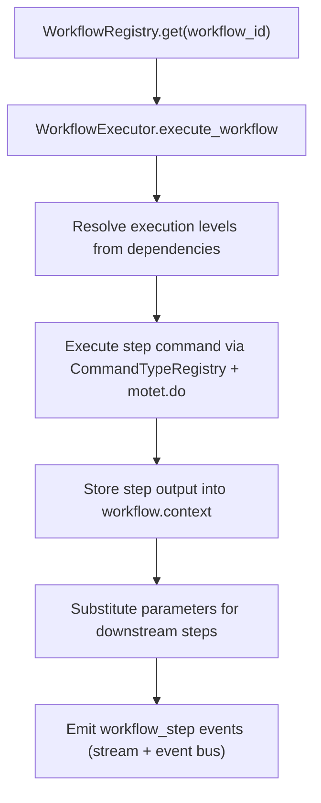

## Package: workflow

Workflow runtime package for. This package exposes a stable public API at
`motet.core.workflow` while keeping internals split across focused modules.

### Purpose
- Define workflow data models (`Workflow`, `WorkflowStep`, status enums). Optional `keywords` plus tokens from the workflow id, name, and step `tool_name`s are indexed for `core.tools_search` (`workflow_discovery_keywords`).
- Execute workflow DAGs with retries, fallbacks, sequential `foreach`, repeat-`until`, and step-level events
- Register/discover workflows with scoped visibility metadata
- Export canonical workflow schemas for LLM tool surfaces
- Register built-in workflow templates at package import

### Module Layout
- `__init__.py`: public facade + model definitions + package-level exports
- `builder.py`: author → validate → register/unregister/export pipeline
 (`run_workflow_builder`; shared by `core.workflow_builder` and HTTP).
 The tool description points at `core.docs_read` (`11-workflow-system`
 YAML structure) rather than embedding the full YAML manual.
- `user_catalog.py`: tenant-prefixed Redis durability for `user.*` workflows
 (`{tid}:user_wf:{id}`, `{tid}:user_wf:index`) + fan-out helpers. List / invoke
 filter fail-closed on caller `tenant_id` via `list_visible_workflows` and
 `resolve_visible_workflow`. Function-discovery docs are `workflow:{tid}:{id}`
 (issue #234).
- `executor.py`: `WorkflowExecutor` facade (`execute_workflow`; composes mixins)
- `executor_suspend.py`: enter-pause mixin (checkpoint, operator control, nested/OAuth)
- `executor_resume.py`: leave-pause mixin (tagged resume, parent–child continue)
- `executor_lifecycle.py`: thin compatibility shim (`WorkflowLifecycleMixin`)
- `executor_steps.py`: level / step / foreach-until / events / conditions mixin
- `checkpoint.py`: `WorkflowCheckpoint` Redis store for mid-graph suspension
- `registry.py`: `WorkflowRegistry` scoped registry and schema export
- `utils.py`: command lookup, validation, and parameter substitution helpers
- `builtins.py`: built-in workflow definitions and registration

Import only `WorkflowExecutor` from the package — the mixins are implementation
detail and keep a single `self` surface.

### Step ownership and suspension (issue #149)

Workflows may pause mid-graph without holding a Celery worker. Resume uses a
claim (`resume_epoch`) so replayed payloads cannot re-run Motet side effects.

| Mechanism | How to author | Resume | Agent / OpenAI facade |
|-----------|---------------|--------|------------------------|
| Client handback | `ownership: handback` on a tool step | `resume_workflow` / `POST.../runs/{id}/resume` with `kind=handback_tools` + observations | Supported (surfaces as turn `tool_calls`) |
| Elicitation | `type: elicitation` + `schema` / `prompt` | `kind=elicitation` + `answers` | Not agent-path; use `resume_workflow` or HTTP |
| Confirmation | `requires_confirmation: true` (ownership stays `motet`) | `kind=confirmation` + `decision=approve\|reject` | Not agent-path; use `resume_workflow` or HTTP |
| OAuth | Motet MCP step returns `auth_required` | `kind=oauth` + `auth_status=completed\|failed` | Not agent-path; use `resume_workflow` or HTTP |

Default `ownership` is `motet`. Nested under an agent turn, **only handback** is
consumable; other suspend reasons fail fast with `WorkflowSuspendNotConsumable`
and stay resumable via the command/HTTP surface. List paused runs with
`GET /api/v1/workflows/runs?status=paused` or `workflow_runs_list`.

**Operator control:** `POST.../runs/{id}/pause` and `.../cancel` (or
`workflow_run_control`) write a Redis sticky control signal for running runs
and LPUSH-wake registered waiters (same `{waiter}:wake:cancel` lists as
 task cancel). Cancel also writes the shared
`task:control:{workflow_run_id}` scope key so communicator / dispatch honor
via inherited `cancel_scopes`. The executor still honors at level boundaries.
Task cancel bridges to durable workflow cancel via
`workflow_runs:by_task:{task_id}`. Paused runs cancel immediately to terminal
`cancelled`. Operator pause uses `suspend_reason=operator` and resumes with
`kind=operator`.

### Bounded nesting (issue #189)

A step with `command_type: workflow_execution` (or `core.workflow_execution`) may
invoke another registered workflow — including itself — as a new DAG frame with
its own `workflow_run_id`. Depth is capped by `MOTET_WORKFLOW_MAX_NESTING_DEPTH`
(default 5) or per-workflow `max_nesting_depth`. Child suspend pauses the parent
with `child_workflow_run_id` / `blocked_step_id`; completing the leaf auto-continues
parents. `foreach` / `until` + nested `workflow_execution` remains banned.

### Public API
Import consumers should continue using:

```python
from motet.core.workflow import (Workflow,
 WorkflowStep,
 WorkflowExecutor,
 WorkflowRegistry,
 get_command_by_name,
 list_registered_commands,
 validate_workflow,
 validate_execution_context,
 substitute_parameters,)
```

### Execution Flow


### Sequential foreach
Optional fields on `WorkflowStep` run a command once per item in a context list:

| Field | Default | Meaning |
|-------|---------|---------|
| `foreach` | `None` | Context path to a list (e.g. `parse_plan.chunks`) |
| `loop_var` | `item` | Name bound to the current item in templates |
| `max_loop_iterations` | `20` | Hard cap; exceeding it fails the step |
| `until` | `None` | Break condition checked after each iteration |

Iterations run **sequentially**. Each iteration substitutes `command_data` against an overlay that adds ``, `{{loop.index}}`, `{{loop.previous.*}}` (prior iteration’s unwrapped data; first iteration uses `final_response: ""`), `{{loop.previous_summaries}}` (prompt-ready joined text of **all** prior iterations’ `final_response`/`message`, tagged `[iteration N]`), and `{{loop.all_previous}}` (the raw list of prior unwrapped results). Step result stored in context is `{"results": [...], "count": n, "stopped_reason":...}`. Fail-fast on a failed iteration; `continue_on_failure` / `fallback_step_id` apply to the whole foreach step. Nested foreach via `core.workflow_execution` is rejected by `validate_workflow`.

### Repeat-until (`until`)

`until` is a break condition using the same operators as `skip_condition`, evaluated **after** each iteration against the iteration's unwrapped result bound to the reserved name `result` (e.g. `if_equals:result.passed:True`). It is repeat-until, not while: the body always runs at least once. An unknown operator is rejected by `validate_workflow` rather than silently never breaking.

Set `until` **without** `foreach` to get a counted repeat: the step runs up to `max_loop_iterations` times until the condition holds, with `loop_var` bound to the 0-based attempt number. This is how a step retries until a gate passes.

`stopped_reason` tells dependents how the loop ended — `until_met`, `items_exhausted` (foreach list ran out), `max_iterations` (counted repeat ran out), or `failed`. Gate on it to detect a loop that gave up:

```yaml
fix:
 command_type: core.agent_turn
 until: "if_equals:result.tests_passed:True"
 max_loop_iterations: 3
 loop_var: attempt
 command_data:
 agent_id: "app-builder.engineer"
 messages:
 - role: user
 content: "Attempt {{attempt}}: fix failing tests, then re-run them."

ship:
 command_type: app-builder.open_pr
 skip_condition: "if_equals:fix.stopped_reason:max_iterations"
 dependencies: [fix]
```

Because the enclosing `workflow_execution` task holds its worker for the whole loop and has no mid-loop checkpoint, size its timeout as per-iteration budget × `max_loop_iterations`.

### Template substitution semantics

`substitute_parameters` resolves `{{path}}` placeholders against the workflow context (dot paths + array indexing):

- **Canonical `{{path}}` placeholders resolve strictly.** A missing or `None` path becomes `None` when the placeholder occupies a whole value position (`"{{x}}"`) and empty text when embedded inside a larger string. Consumers see missing data as `None`/`""`, never the literal `{{...}}` template.
- **Single-brace `{path}` placeholders leave the literal text** on a miss, so prose that legitimately contains `{word}` is never deleted.
- Whole-value placeholders keep the value’s native type (bool stays bool, list stays list); embedded non-string values render as escaped JSON text.

`skip_condition` `if_equals` compares typed values: booleans match `True`/`true`/`1` and `False`/`false`/`0` case-insensitively, `None` matches `None`/`null`/`~`, and numbers compare numerically. Strings keep exact comparison.

### Optional dependencies (`continue_on_failure`)

A step declared with `continue_on_failure: true` is treated as an **optional dependency**: dependents run even when the step failed or is missing from context entirely (e.g. dispatch-level errors). Required dependencies keep the strict behavior — a failed or missing required dependency skips the dependent step. Canonical `{{...}}` templates that reference an optional step's missing output (e.g. `{{ingest_refs.attachments}}`) resolve to `None`/empty text per the substitution semantics above.

```yaml
implement:
 command_type: core.agent_turn
 foreach: parse_plan.chunks
 loop_var: chunk
 max_loop_iterations: 8
 command_data:
 agent_id: "app-builder.engineer"
 messages:
 - role: user
 content: |
 Chunk: {{chunk}}
 All previous chunk summaries: {{loop.previous_summaries}}
 dependencies: [parse_plan]
```

### Notes
- Core command names are canonical (`core.tool_execution`, `core.transform`, etc.).
- MCP tool steps store an envelope at `{{step.result}}`. Unwrap with `core.transform` `mcp_text`; Playwright `browser_evaluate` reports also need `playwright_result` before `json_parse`. See `docs/developer_onboarding/11-workflow-system.md` (YAML structure).
- Utility lookup also accepts unprefixed names where possible.
- Built-in templates are registered during package import using `register_builtin_workflows(...)`.
- `navigate_screenshot` declares discovery keywords (`browser`, `playwright`, `url`, …) so `core.tools_search` can surface the composed workflow instead of only the raw Playwright tools.
- Workflow YAML may declare `presentation` metadata for agentic-loop fast-path:
 - `user_facing: true` and `requires_llm: false` allow streaming workflow output directly to the user.
 - `passthrough_field` names the final-step field to stream (defaults to `output_field`).
 - `response_wrap: json_fence` wraps string/JSON output in markdown fences when needed.
 - Applies whether the model calls `workflow_<id>` directly or dispatches it through
 `core.tool_call` after `core.tools_search`. Without the passthrough the whole result
 (every step's full output) goes back to the model, which for large workflows means an
 artifact the model then has to page back in to find the part worth showing.
