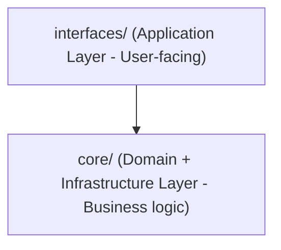

# Interfaces Package

**Application Layer**: User-facing interfaces and protocol adapters that expose the AI stack's capabilities through various channels (HTTP API, CLI, WebSocket, etc.).

## Architecture

The `interfaces` package serves as the **Application Layer** in our clean architecture:

This separation ensures:
- **Protocol-agnostic core**: Business logic independent of interface protocols
- **Multiple interface support**: HTTP, CLI, WebSocket, future GraphQL/gRPC
- **Clean dependencies**: Interfaces depend on core, never the reverse
- **Testability**: Core can be tested independently of interface concerns

## Components

### Core Interfaces
- **`http.py`**: FastAPI application with comprehensive REST API
 - Interactive docs at `/redoc` (also the manage API page). That route
 allows a blob Web Worker so ReDoc search can index the OpenAPI spec.
 - Chat endpoints (`/chat`, `/chat/stream`)
 - Tool execution (`/tool`, `/tools`)
 - Memory management (`/memories/*`)
 - Conversation management (`/api/v1/conversations`)
 - Observability (`/metrics`, `/traces/*`)
 - Identity & tenancy (`/me`, `/tenants/*`)
 - Artifacts (`/api/v1/artifacts`, including metadata/tag patching, derived-text chunk indexing status, reindex task status, and indexing policy)
 - Startup (`_lifespan`) registers core command types in the API process, so
 `/api/v1/commands` can resolve types like `core.agent_turn` on a cold start.
 Bundle commands register only in workers; the command endpoints look those up
 in the Redis bundle catalog.

- **`api/openai_compat/`**: OpenAI-compatible facade, mounted at `/v1` when
 `MOTET_OPENAI_COMPAT_ENABLED=true`
 - `GET /v1/models`, `POST /v1/chat/completions`, `POST /v1/responses`
 - Lets Cursor, Open WebUI, and the OpenAI SDKs use Motet with a base URL and an `sa_*` token
 - Three modes bound per credential: `passthrough` (models only), `hosted_tools` (server-side
 Motet tools), `agent` (full agent stack with memory and artifact RAG)
 - See `api/openai_compat/README.md` for setup, policy, and security posture

- **`cli.py`**: Command-line interface (`motet-cli`) aligned with HTTP APIs
 - Interactive chat mode
 - Batch processing capabilities
 - Configuration management
 - Development utilities

### Supporting Components
- **`sessions.py`**: In-memory session manager
 - Conversation history storage
 - Context window management
 - Session lifecycle management

- **`templates/`**: Supporting HTML templates
 - Trace visualization (`traces.html`, `trace_detail.html`)
 - Auth flow pages (`auth_success.html`, `auth_error.html`, `auth_cli_success.html`)
 - OAuth flow pages (`oauth_success.html`, `oauth_error.html`)

## Key Features

### 🚀 Distributed Architecture Integration
- **Fully distributed execution**: All operations route through distributed workers
- **MCP tool support**: Seamless integration with Playwright and other MCP tools
- **State-aware routing**: Intelligent worker selection based on capabilities
- **Distributed metrics**: Comprehensive observability across all workers

### 🔧 Advanced Capabilities
- **Reasoning-first execution**: Intelligent tool selection and parameter enhancement
- **Streaming responses**: Real-time SSE/WebSocket for chat and planning; stream event JSON may include optional **`agent_id`** (qualified registry id for the turn, e.g. `core.default`) on tokens, lifecycle, tool, and reasoning frames (`POST /api/v1/chat` with `stream=true` or chat WebSocket with streaming)
- **Multi-modal support**: Text, images, and structured data handling
- **Context-aware responses**: Priority-based content management

### 🔐 Security & Identity
- **JWT Authentication**: Production-ready JWT support with Keycloak integration
- **Service Account Tokens**: Long-lived tokens for CLI and automation
- **Principal-based authentication**: Support for users, services, and API keys
- **Multi-tenant architecture**: Tenant isolation and scoping
- **Role-based access control**: Granular permissions system
- **Development headers**: Configurable auth bypass for development (dev mode only)
- **See**: `docs/operations/authentication.md` for complete authentication guide

### 📊 Observability
- **Distributed tracing**: End-to-end request tracking
- **Prometheus metrics**: Performance and usage monitoring
- **Structured logging**: Comprehensive audit trails
- **Health checks**: System status monitoring

## API Endpoints

### Chat & Reasoning
- `POST /api/v1/chat` - Chat completion (SSE when `stream: true`)
- `WS /api/v1/chat/ws` - Bidirectional chat WebSocket
- `GET /api/v1/workflows` - List registered workflows
- `POST /api/v1/workflows/validate` - Validate authored YAML/JSON workflow
- `POST /api/v1/workflows/register` - Register user.* workflow definition
- `DELETE /api/v1/workflows/{workflow_id}` - Unregister user.* workflow
- `POST /api/v1/workflows/execute` - Execute a workflow

### Memory & Sessions
- `GET /memories` - List memory entries
- `POST /memories/tag` - Tag memories
- `GET /api/v1/conversations` - List conversations for principal in tenant
- `POST /api/v1/conversations/{id}/clear` - Clear conversation and associated memory

### Observability
- `GET /metrics` - Prometheus metrics endpoint
- `GET /traces` - Distributed trace listing
- `GET /traces/{id}` - Detailed trace view
- `GET /health` - Liveness (Redis PING and component presence). Docker uses this path.
- `GET /health/vector` - Valkey Search index probe (off the request loop, 2s timeout)

### Identity & Tenancy
- `GET /me` - Current principal information
- `GET /tenants/current` - Current tenant context

## Development

### Frontend Applications
- `/chat-explorer` - Chat Explorer (multi-surface reference chat UI)
- `/manage` - Operations dashboard (Vite/React)

OpenAI-compatible facade (when `MOTET_OPENAI_COMPAT_ENABLED=true`): `/v1` — see `api/openai_compat/`.

See `motet/interfaces/frontend/README.md` for development setup.

### Configuration
Key environment variables:
- `MOTET_ALLOW_INSECURE_PRINCIPAL_HEADERS=true` - Enable dev auth headers
- `MOTET_CONVERSATION_CONTEXT_WINDOW=10` - Session history limit
- `MOTET_MCP_ENABLED=true` - Enable MCP tool discovery

### Headers for Development
When `MOTET_ALLOW_INSECURE_PRINCIPAL_HEADERS=true`:
- `X-Principal-Id` - Override principal identity
- `X-Tenant-Id` - Override tenant context
- `X-Roles` - Override role assignments

## Future Enhancements

- **WebSocket feature parity**: Full real-time capabilities
- **GraphQL API**: Flexible query interface
- **Enhanced UI**: Multi-tab interface with history export
- **Advanced auth**: OAuth2/OIDC integration
- **API versioning**: Versioned `/api/v1` routes